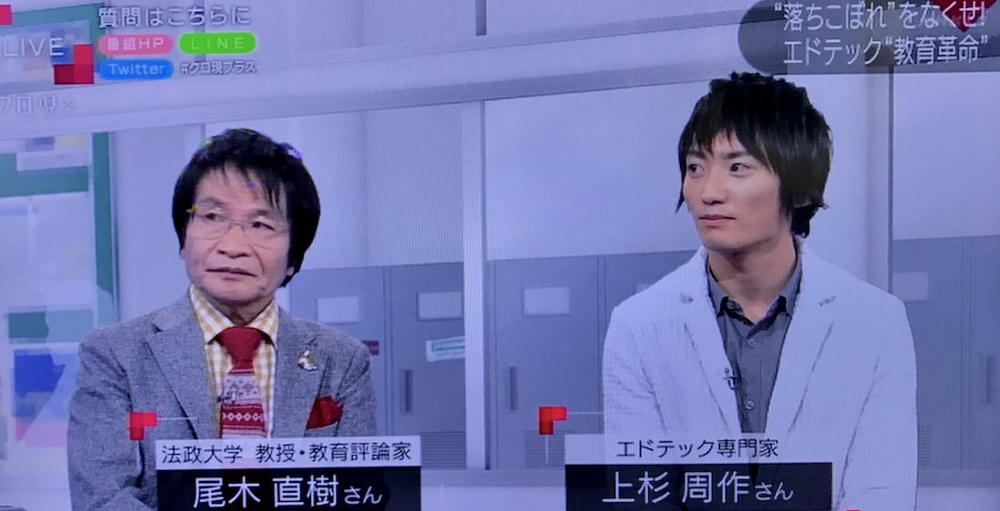

> 貧困の連鎖を止めようとしたら、子どもの学力が下がりました。働き方から変えよう、地方から変えようとしたら、何も変わりませんでした。

### 自己紹介

こんにちは。上杉周作と申します。教育について考えるのが好きな、シリコンバレー在住のエンジニアです。

88年生まれで、中学1年まで日本で暮らし、それからはアメリカ在住です。カーネギーメロン大でコンピューターサイエンスを学び、AppleとFacebookでエンジニアインターンをし、その後シリコンバレーのベンチャーを転々とし、2012年9月よりシリコンバレーの教育ベンチャー・EdSurgeに就職しました。

2017年1月にはNHK「クローズアップ現代+」の教育特集に「教育×IT」の専門家としてお呼びいただき、教育評論家の尾木ママさんと共演しました。

<figure>
  
  <figcaption>
    NHK・クローズアップ現代+ 2017年1月26日放送 「ハーバードはもう古い！？　～エドテック “教育革命”最前線～」より
  </figcaption>
</figure>

そしてこのたび、4年とすこし働いたEdSurge社を退職しました。しばらくはニート生活を楽しみ、その後は教育以外の分野に進もうと考えています。

良い区切りだと思うので、しばらくのあいだ最後になるであろう、教育についての記事を書くことにしました。かなり長いのですが、読んでくださると嬉しいです。

<blockquote cite="https://www.facebook.com/shu/posts/10201008064663620" class="fb-xfbml-parse-ignore">
&#x3010;&#x3054;&#x5831;&#x544a;&#x3068;&#x3001;&#x3057;&#x3070;&#x3089;&#x304f;&#x306f;&#x6700;&#x5f8c;&#x306b;&#x306a;&#x308b;&#x30d6;&#x30ed;&#x30b0;&#x66f4;&#x65b0;&#x306e;&#x304a;&#x77e5;&#x3089;&#x305b;&#x3011;

2017&#x5e74;1&#x6708;31&#x65e5;&#x3092;&#x3082;&#x3061;&#x307e;&#x3057;&#x3066;&#x3001;4&#x5e74;&#x3068;3&#x30f6;&#x6708;&#x52e4;&#x3081;&#x3055;&#x305b;&#x3066;&#x3044;&#x305f;&#x3060;&#x3044;&#x305f;&#x30b7;&#x30ea;&#x30b3;&#x30f3;&#x30d0;&#x30ec;&#x30fc;&#x306e;&#x6559;&#x80b2;&#x30d9;&#x30f3;&#x30c1;&#x30e3;&#x30fc;&#x30fb;EdSurge&#x793e;&#x3092;&#x9000;&#x793e;&#x3057;&#x307e;&#x3057;&#x305f;&#x3002;&#x307e;&#x3060;&#x307e;&#x3060;&#x3084;&#x308b;&#x3053;&#x3068;&#x306f;&#x591a;&#x304b;&#x3063;&#x305f;&#x306e;&#x3067;&#x3059;&#x304c;&#x3001;&#x307c;&#x304f;&#x3082;29&#x6b73;&#x306b;&#x306a;...
Posted by <a href="https://www.facebook.com/shu">Shu Uesugi</a> on&nbsp;<a href="https://www.facebook.com/shu/posts/10201008064663620">Tuesday, February 21, 2017</a></blockquote>

### 目次

1. [第一章: ヒーロー童貞](#chapter-1)
1. [第二章: 1億ドルのご褒美](#chapter-2)
1. [第三章: 10億ドルのご褒美](#chapter-3)
1. [第四章: 民主党と共和党](#chapter-4)
1. [第五章: 住民の集会と金持ちの集会](#chapter-5)
1. [第六章: エイボン校](#chapter-6)
1. [第七章: セントラル校](#chapter-7)
1. [第八章: 学区長](#chapter-8)
1. [第九章: 最終兵器](#chapter-9)
1. [第十章: チャータースクールの光](#chapter-10)
1. [第十一章: チャータースクールの闇](#chapter-11)
1. [第十二章: 四面楚歌](#chapter-12)
1. [第十三章: 反省会](#chapter-13)
1. [第十四章: 地に足がついている取り組み](#chapter-14)
1. [おわりに: 議論の質を上げよう](#chapter-15)
