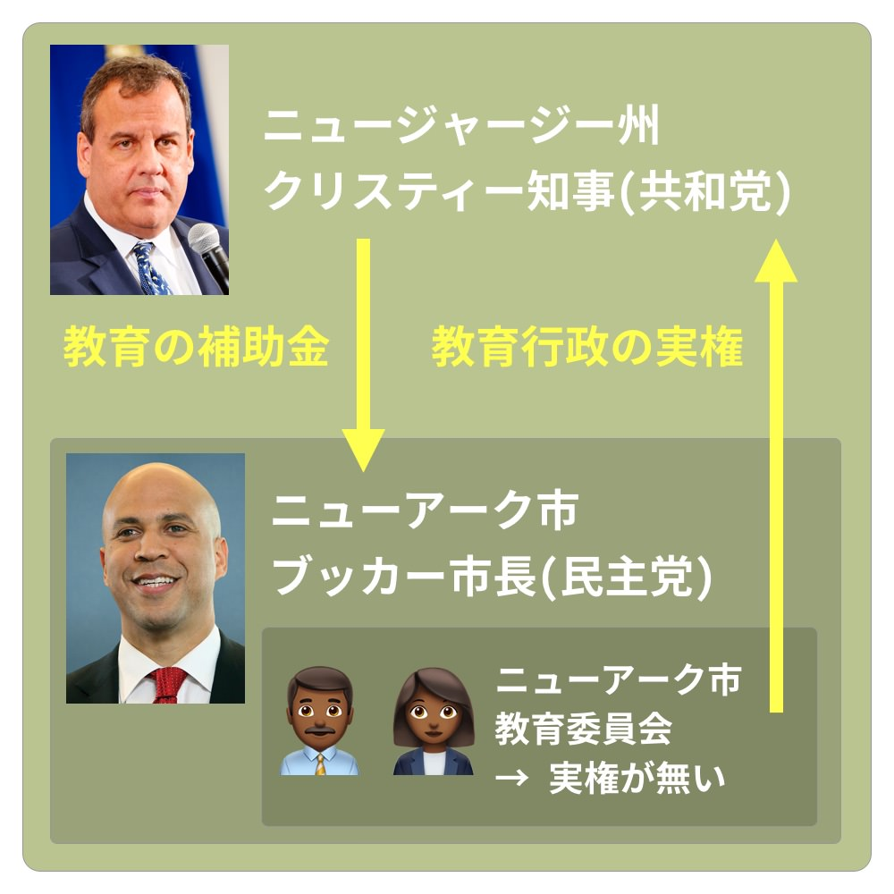
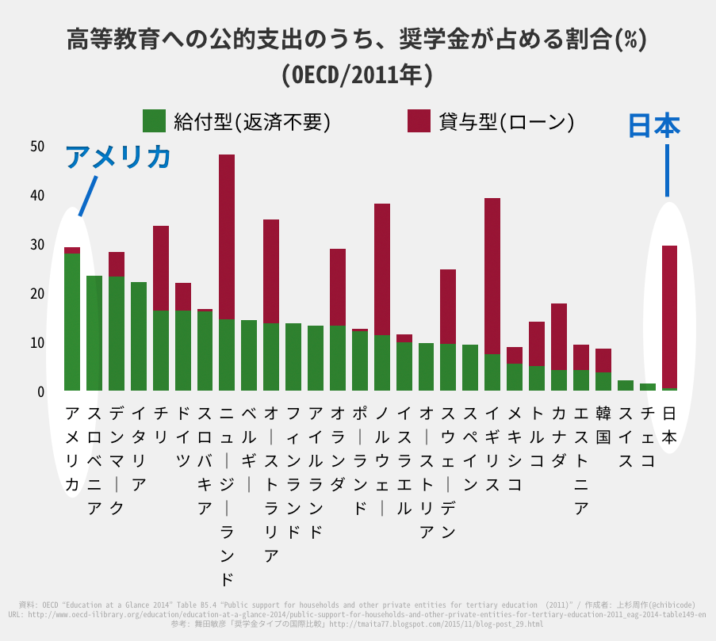
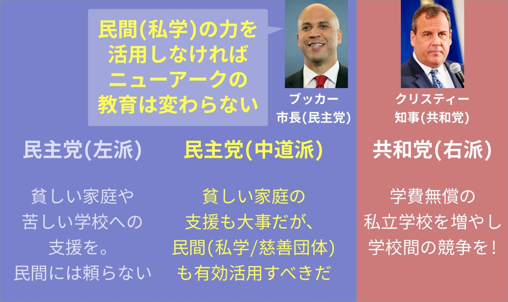
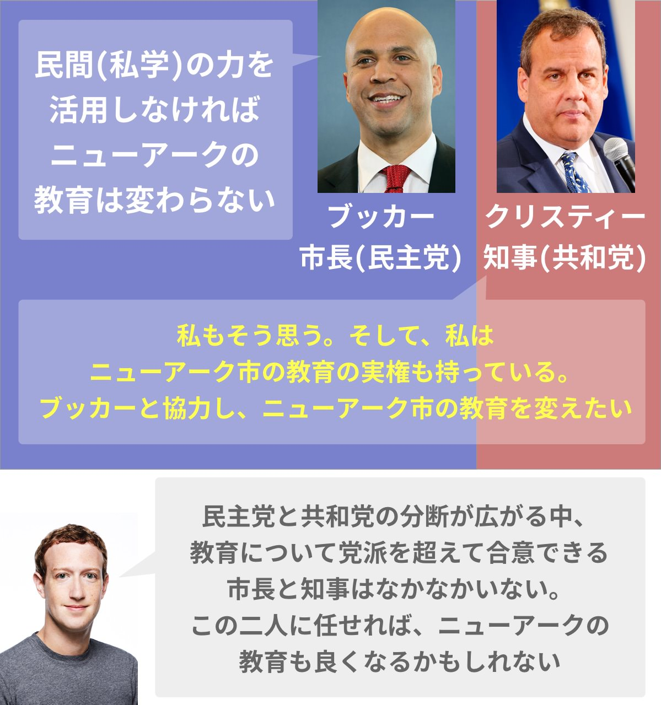

## 第四章: 民主党と共和党

<figure>
  
  <figcaption>
    ドナルド・トランプ(左)とクリス・クリスティー(右)。
    Gage Skidmore [<a href="http://creativecommons.org/licenses/by-sa/3.0">CC BY-SA 3.0</a>], <a href="https://commons.wikimedia.org/wiki/File%3ADonald_Trump_by_Gage_Skidmore.jpg">via Wikimedia Commons</a> / By Michael Vadon (Own work) [<a href="http://creativecommons.org/licenses/by-sa/4.0">CC BY-SA 4.0</a>], <a href="https://commons.wikimedia.org/wiki/File%3AChris_Christie_April_2015_(cropped).jpg">via Wikimedia Commons</a>
  </figcaption>
</figure>

— お前はクビだ!

ドナルド・トランプ大統領は、彼が司会を務めたテレビ番組「[アプレンティス](https://ja.wikipedia.org/wiki/%E3%82%A2%E3%83%97%E3%83%AC%E3%83%B3%E3%83%86%E3%82%A3%E3%82%B9)」で人気を博した。参加者がトランプの部下見習いとして課題に取り組み、トランプ氏が毎回一人ずつ決め台詞を言ってクビにし、最後まで生き残った者が勝者となる。

2016年のアメリカ大統領選でトランプ氏が勝利したとき、ゴール目前で「お前はクビだ!」と言われた手下がいた。2010年から、ニューアーク市があるニュージャージー州の知事を務めている、クリス・クリスティーである。

クリスティーもトランプと同じく共和党から大統領選に出馬したが、[早々に脱落した](https://www.nytimes.com/2016/02/11/us/politics/chris-christie.html)。その後クリスティーはトランプ陣営につき、選挙中はトランプの右腕となる。トランプのスピーチ中になぜか、彼の後ろで一言も発さずに突っ立っていたこともあった。

<blockquote class="twitter-tweet" data-lang="en">
UPDATE: Chris Christie is still standing motionless and expressionless behind Trump <a href="https://t.co/E4Wyc9Mmvf">pic.twitter.com/E4Wyc9Mmvf</a>
&mdash; NowThis (@nowthisnews) <a href="https://twitter.com/nowthisnews/status/704859667244191745">March 2, 2016</a></blockquote>

クリスティーは恥も外聞も捨ててトランプに忠誠を尽くしたが、トランプは大統領当選後、クリスティーに何もご褒美を与えなかった。クリスティーは、一時は政権移行チームのトップを任されたがすぐ解任され、[長年の夢](http://www.vanityfair.com/news/2017/01/chris-christie-trump-administration)だった司法長官のポストも与えられず、事実上のクビになった。スキャンダルや人間関係の問題が[理由だったらしい](http://www.vanityfair.com/news/2017/01/chris-christie-trump-administration)。

### ブッカー市長とクリスティー知事

ここで、第二章で紹介したコーリー・ブッカーの話に戻る。

2010年から2013年にかけて、クリスティーはニュージャージー州の知事、ブッカーはニュージャージー州最大都市のニューアーク市長として、二人はタッグを組んでいた。

<figure>
  
  <figcaption>
    2013年9月25日。クリス・クリスティー・ニュージャージー州知事(左)とコリー・ブッカー・ニューアーク市長(右)。(写真は<a href="http://www.state.nj.us/governor/media/">州知事の公式メディアページ</a>より。By <a href="http://www.state.nj.us/governor/media/photos/2013/20130925a.shtml">Governor's Office/Tim Larsen</a>)
  </figcaption>
</figure>

クリスティーは共和党、ブッカーは民主党に属していたが、二人は党派を超えた盟友だった。

二人の仲を強固なものにした出来事がある。ブッカーが市長選で勝利した直後、市長選のライバルだった前ニューアーク市長が、市有地を個人で転売していたことがバレて[逮捕された](http://www.nj.com/news/index.ssf/2008/04/newark_ex_mayor_sharpe_james_convicted.html)。クリスティーは政治家になる以前、カリスマ検事として有名だったのだが、じつは、この前市長を牢屋にブチ込んだ検事はクリスティーだったのである。相対的に、新市長であるブッカーの人気が上がり、ブッカーはクリスティーに感謝した。

ブッカーもクリスティーも「腐敗と戦う」という気概があり、その点において二人は気が合ったのだ。

### クリスティー知事は、ザッカーバーグの寄付におけるキーパーソン

そして2010年、ザッカーバーグがニューアークに1億ドルの寄付を決めたとき、彼が最終的にGOサインを出した理由のひとつに、クリスティーの存在があった。

言い換えると、ザッカーバーグを直接口説いたニューアーク市長のブッカーだけでなく、ニュージャージー州知事のクリスティーがいなかったら、ザッカーバーグは1億ドルの寄付を取り止めていたかもしれない。

そしてザッカーバーグがブッカーと寄付をテレビ番組で発表したとき、クリスティーもその場にいた。下の動画のサムネイルで、一番左に座っているのがクリスティーである。

<blockquote cite="https://www.facebook.com/shu/posts/10200898172756391" class="fb-xfbml-parse-ignore">(オプラ・ウィンフリー・ショーにて)</blockquote>

なぜ、クリスティーがザッカーバーグの寄付において、キーパーソンとなったのだろうか。

### 教職員組合の敵・クリスティーが、ニューアークの教育行政の実権を掌握した

2006年にニューアーク市長となったブッカーは、教育改革をしようにも孤軍奮闘だった。

なぜか。ニューアークと、ニュージャージー州の他地域の教育格差があまりにも大きすぎたため、1995年に司法が介入して教育に[州の補助金がついた](http://www.nytimes.com/1995/04/14/nyregion/judge-orders-a-state-takeover-of-the-newark-school-district.html)。この補助金の代償として、ニューアーク市の教育行政の権限の大部分が、市の教育委員会から州に委譲された。つまり、ニューアークの教育を変えようにも、ニュージャージー州知事が首を縦に振らなければいけなかったのだ。

しかし、2006年から2010年までの州知事は、教育改革に消極的だった。彼は民主党・左派、すなわち「労働者の味方」側の人間で、教職員組合を[票田としていた](https://goo.gl/B7k68n#0pLbLynt)。だから、既得権益側である組合が嫌がるような改革はできなかったのだ。

ブッカーも同じ民主党員だが、彼は「必要な改革を既得権益が拒むのはおかしい」という立場を取っていた。

そんな中、2010年に共和党・右派のクリスティーが州知事になる。これによって、市の教育委員会に代わり、クリスティーがニューアークの教育行政の実権を掌握した。

<figure>
  
</figure>

「企業の味方」を党是とする共和党員として、クリスティーは選挙期間中から[教職員組合を叩きまくった](https://goo.gl/B7k68n#h2CIT8Zc)。教職員組合はニューアーク最大の集票装置だったが、カリスマ検事として芸能人並に名を馳せていたクリスティーにとっては、組合の抵抗は痛くも痒くもなかった。どこか、弁護士出身である橋下氏時代の大阪を彷彿させる話だ。

クリスティーは、既得権益の組合と真っ向から対峙することを厭わない。つまりブッカーにとって、ニューアークの教育を変える千載一遇の[チャンスがやってきたのだ](https://goo.gl/B7k68n#0pLbLynt)。

<figure>
  
  <figcaption>
    2010年7月28日。コリー・ブッカー・ニューアーク市長(左)とクリス・クリスティー・ニュージャージー州知事(右)と。(写真は<a href="http://www.state.nj.us/governor/media/">州知事の公式メディアページ</a>より。By <a href="http://www.state.nj.us/governor/media/photos/2010/20100728.shtml">Governor's Office/Tim Larsen</a>)
  </figcaption>
</figure>

### アメリカの教育と政治イデオロギー

ここで、アメリカの教育と政治イデオロギーについて、詳しくない方向けに説明しておく。

アメリカは二大政党制を採用していて、大雑把に言うと、「再分配を大事にし、大きな政府を求める民主党」と、「競争を大事にし、小さな政府を求める共和党」がある。トランプ大統領は共和党、ヒラリー・クリントンは民主党、オバマ前大統領は民主党、ブッシュ元大統領は共和党だった。

<figure>
  
</figure>

ここで質問なのだが、「アメリカの初等・中等教育レベルを上げるにはどうすれば良いか」と民主党・共和党それぞれに問うたとき、どのような答えが返ってくるだろうか。

(ちなみに、「初等 = 小学校」「中等 = 中学・高校」という意味である。)

「再分配を大事にし、大きな政府を求める民主党」は、おそらくこう答えるだろう。

— 貧しい家庭や、苦しい学校への支援を充実させるべきだ。

では、「競争を大事にし、小さな政府を求める共和党」はどう答えるか。アメリカはよく「自己責任の国」と言われるから、以下のような返事が返ってきてもおかしくない。

— 子どもの教育は親の自己責任。良い教育にはカネがかかって当然。 
— というわけで、学費も高いが質も高い私立学校をもっと増やすべきだ。 
— 私学だけでは足りないかもしれない。ならば、日本の東大理IIIの[合格者の6割以上を占める](http://president.jp/articles/-/17359)塾「鉄緑会」のように、質の高い塾をもっと増やすべきだ。

しかし、実際は共和党はそう考えず、かわりに次のように答える。

— 学費無償の私立学校をたくさん作り、学校間の競争を促進すべきだ。

つまり、運営は民間が行うが、学費は補助金ですべて賄う私学をたくさん作れということである。「所得が何万円以下なら無償」ではなく、はじめから全員に学費無償の私学を作るということだ。

共和党が、教育において大事にする「競争」とは、「教育熱心な親同士が、私立校や塾に子を入れたりと、金にものを言わせて競争する」という意味の競争ではない。「学校同士が、無償というルールのもとで、民間・公立ともに競争する」という意味での競争なのだ。

すなわち、民主党も共和党も、「初等・中等教育においては、良い教育を無償で受けられるべき」と考えているのだ。

<figure>
  
</figure>

### 日本と比べてみると

アメリカにおいて、「初等・中等教育においては、良い教育を無償で受けられるべき」という考え方は、大戦後に世論を味方につけ、関連法の「[初等中等教育法](https://en.wikipedia.org/wiki/Elementary_and_Secondary_Education_Act)」が1965年に成立し、それから普遍的な価値観となった。

(再度言うが、「初等 = 小学校」「中等 = 中学・高校」という意味である。)

これの価値観の変遷は、日本より遥かに早い。

日本の場合、「初等・中等教育においては、良い教育を無償で受けられるべき」という価値観が政治で争点になったのは、大戦後、[2009年の衆議院選挙が初めて](https://goo.gl/B7k68n#h2CIT8Zc)だ。そう、自民党から当時の民主党へと「政権交代」が起きたときである。

それまで、公立小・中学校は日本では無償だったが、高校はそうではなかった。民主党が政権を担ったことで、「子ども手当」とセットで公立高校が無償化された。アメリカに半世紀遅れでようやく価値観が追いついたのだが、その後また自民党にバトンタッチした際、無償化には所得制限が[設けられた](https://allabout.co.jp/gm/gc/426291/)。

### 日本のほうがアメリカよりも「教育費は自己責任」

日本のほうがアメリカよりも「教育費は自己責任」という価値観が強いといえる理由は他にもある。

高等教育の話になるが、日本では最近、大学の学費高騰と奨学金制度が[問題になった](http://toyokeizai.net/category/355)。

大学生が仕送りから生活費に使える金額が2000年は一日2000円だったのが、2015年は[一日850円](http://www.tfpu.or.jp/2015kakeihutan-chousa-essence20160406.pdf)まで下がったり、国立の女子医大生ですら[カラダを売らないと生活が成り立たない](http://toyokeizai.net/articles/-/154834)ことが話題になったりする。女性の貧困について詳しいライター・中村淳彦さんによれば、頭の良い女子大生ほど、Fラン大学の女子大生よりも早く「今のうちから稼がないと奨学金を返すのは困難になる」と気づき、[少しでも若くて付加価値が高い学生のうちに裸になる](http://toyokeizai.net/articles/-/130756?page=3)という。

学費が高いこと以上に、日本では諸外国に比べ、返済不要な「給付型」の奨学金が、アメリカと比較どころか世界的に見ても[圧倒的に少ない](http://tmaita77.blogspot.com/2015/11/blog-post_29.html)。最近やっと、給付金奨学金が[2018年から制度化](http://www.nikkei.com/article/DGXLZO10862290Z11C16A2CR8000/)することが決まったばかりだ。

<figure>
  
  <figcaption>
    注:<a href="http://tmaita77.blogspot.com/2015/11/blog-post_29.html">舞田敏彦氏が作成されたグラフ</a>を参考に作成した。
  </figcaption>
</figure>

制度化が遅れた理由のひとつは、日本では国際的に見ても「教育費、とくに高等教育費は自己責任」という価値観が強いからだ。

たとえば、国際比較調査プログラムISSPが2006年に行った調査によると、「貧しい家庭の大学費用を政府が援助すべきか」という質問にたいし、アメリカを含むほとんどの国で賛成が反対を大幅に上回ったが、日本だけ一定数が反対した。

<figure>
  
  <figcaption>
    出典: ISSP(2006)/中澤 渉 (2014)『<a href="https://www.amazon.co.jp/なぜ日本の公教育費は少ないのか-教育の公的役割を問いなおす-中澤-渉/dp/4326653884?tag=chibicode-22">なぜ日本の公教育費は少ないのか</a>』勁草書房:12
  </figcaption>
</figure>

高齢者向けの政策と比べてみると、差は一目瞭然だ。日本版総合社会調査(JGSS)の2010年のデータによれば、日本だと、高齢者にかかる費用は政府の責任と考える人が多数派なのに対し、教育や保育は家庭の責任と考える人が最も多い。

<figure>
  
  <figcaption>
    出典: JGSS(2010)/参考: 中澤 渉 (2014)『<a href="https://www.amazon.co.jp/なぜ日本の公教育費は少ないのか-教育の公的役割を問いなおす-中澤-渉/dp/4326653884?tag=chibicode-22">なぜ日本の公教育費は少ないのか</a>』勁草書房:300
  </figcaption>
</figure>

高齢化が加速すればこの傾向は強まるだろうし、家庭の教育・保育費負担が増えればさらなる少子化に繋がるだろう。

話が逸れてしまったが、何が言いたいかというと、自己責任を重んじるアメリカですら、「教育費に限っては政府の責任」と考えるのにたいし、日本は世界でも突出して「教育費は自己責任」という価値観が残っているということである。

### ブッカーとクリスティーは、教育面では完全に合意していた

アメリカの話に戻ると、最近は民主党のなかでも、教育では右派に近い人が出てきた。「貧しい家庭の支援も大事だが、民間(私学や慈善団体)も有効活用すべきだ」と考える、いわゆる「中道派」たちだ。「教育は民間に頼るべきではない」と考える生粋の「左派」とは一線を画した考えを持っている。

<figure>
  
</figure>

ここで、ブッカー市長とクリスティー知事の話に戻る。

ブッカーは民主党(左派)の市長だが、教育に限っては、共和党(右派)に考え方が近い。ニューアークの役所と教育事務局にうんざりしていた彼は、「民間(私立)の力を活用しないと、何も変わらない」と考えたのである。

<figure>
  
</figure>

ブッカー市長はクリスティー知事と違う党に属しながら、教育面では完全に合意していた。いっぽう、教育の実権を握ったクリスティーも、ブッカーの「ニューアークの教育を良くしたい」という思いに共感していた。

この二人の絆を、ニューアークへの寄付を検討していたザッカーバーグは[高く評価していた](https://goo.gl/B7k68n#rSjypp4L)。

2016年の大統領選でも垣間見えたことだが、アメリカは民主党と共和党の分断が広がっている。「民主党が嫌い」と答える共和党支持者、「共和党が嫌い」と答える民主党支持者は、[50年前は3割しかいなかったが、最近は8割にまで増えた](http://www.vox.com/policy-and-politics/2017/1/20/14339024/trump-inaugural-divisions-obama)。

そんな政治的背景のなか、教育について党派を超えて合意しているブッカーとクリスティーに、ザッカーバーグは惚れ込んだのだ。

<figure>
  
</figure>

ザッカーバーグが1億ドルの寄付を発表したオプラ・ウィンフリー・ショーで、彼はクリスティーとブッカーに目をやり、[こう言った](http://www.oprah.com/oprahshow/mark-zuckerbergs-big-announcement-video)。

— わたしは経営者ですが、経営者がやるべきことは、素晴らしいリーダーになる素質を持った人間を見つけ、応援してあげることです。ニューアークでもやってることは同じ。ここに寄付しようと決めたのは、この二人がいたからです。
