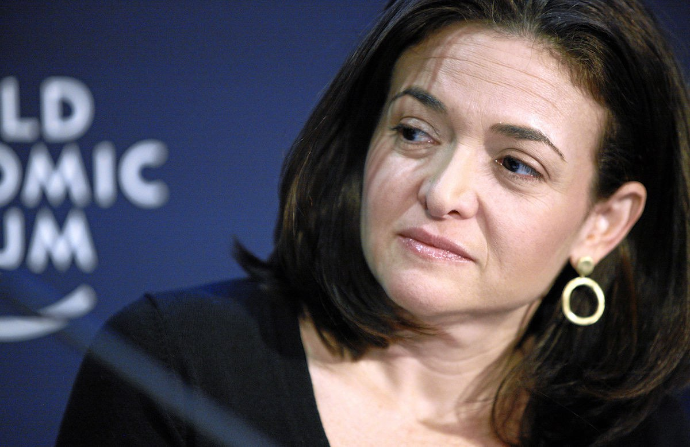
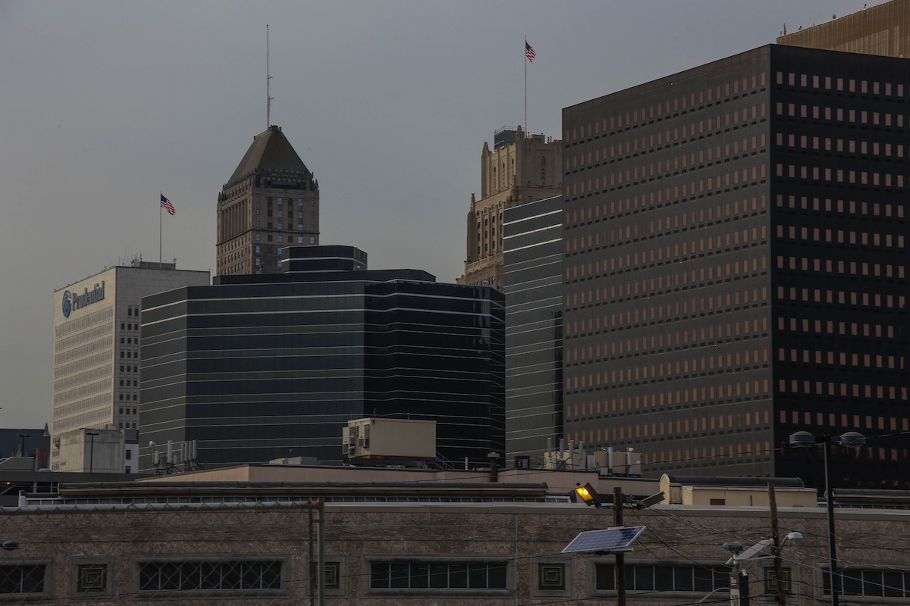
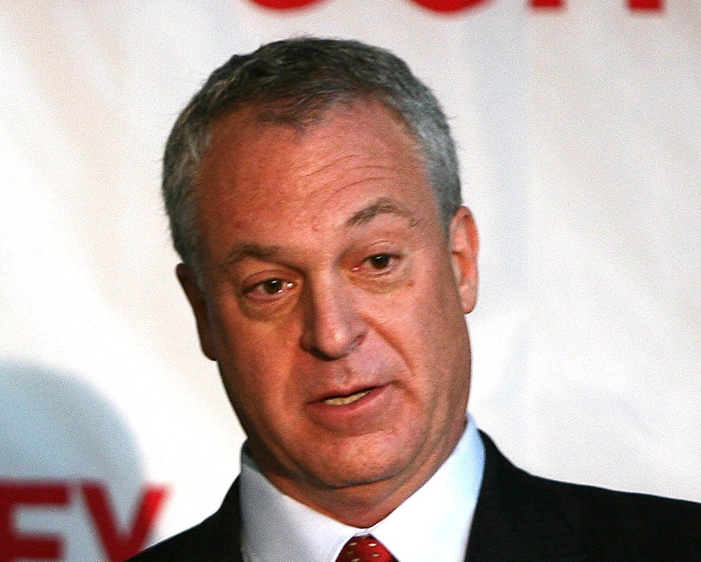
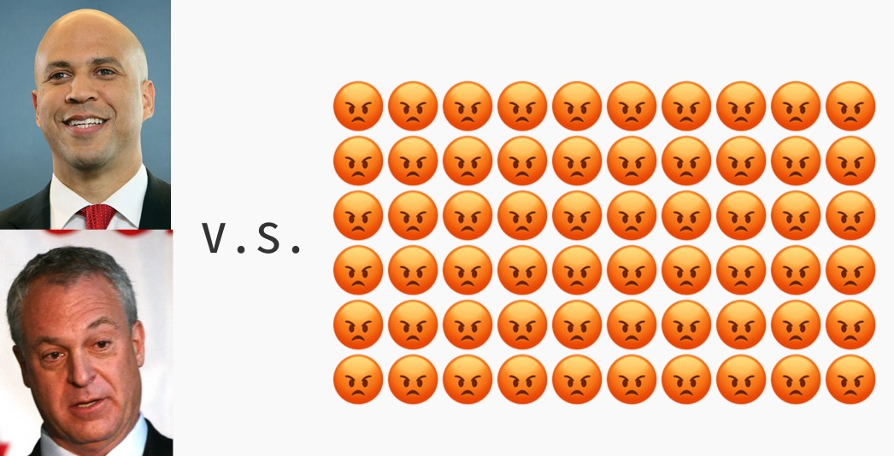

## 第五章: 住民の集会と金持ちの集会

<figure>
  
  <figcaption>
    シェリル・サンドバーグ・フェイスブック最高執行責任者。By World Economic Forum from Cologny, Switzerland [<a href="http://creativecommons.org/licenses/by-sa/2.0">CC BY-SA 2.0</a>], <a href="https://commons.wikimedia.org/wiki/File%3ASheryl_Sandberg.jpg">via Wikimedia Commons</a>
  </figcaption>
</figure>

シェリル・サンドバーグ。フェイスブックの最高執行責任者(COO)としてザッカーバーグCEOを支える女性で、「[リーン・イン](https://www.amazon.co.jp/dp/B00KAUXBNS?tag=chibicode-22)」を著したフェミニストとしても世界的に有名だ。

そのサンドバーグは、「ニューアークへの、1億ドル寄付プラン」を読んだとき、ザッカーバーグに[こう指摘した](https://goo.gl/B7k68n#zyp85jtu)。

— マーク(ザッカーバーグ)、このプランには、「1億ドルは、現場の学校や生徒には直接渡しません」と書いているけれど・・・ 
— そうです。わたしがやりたいのは「教育の仕組み改革」だから、寄付金は学校や生徒の支援には使わないつもりです。仕組みを変えれば、最終的には学校や生徒の状況も良くなると思う。 
— でも、現場は貧困の悪影響で苦しんでいるんでしょう?だったら、なぜ現場の学校や生徒にお金を使わないのか、きちんと説明しないと向こうは納得しないと思いますよ。 
— なるほど。 
— そもそも、このプランからは、地域の協力をどのように得るかがすっぽりと抜け落ちています。このままでは、地域の反発は免れないと思いますよ。 
— わかりました。まず、われわれの取り組みを地域に説明する活動からはじめようと思います。

彼女が感じた不安は、のちに現実のものとなった。

### 住民の集会

ザッカーバーグが1億ドルを寄付したニュースは全米を駆け巡り、ブッカーは連日テレビに[引っ張りだこになった](https://goo.gl/B7k68n#vf7UnKbj)。

一方、ニューアークの住民に寄付のことはあらかじめ知らされておらず、みなテレビを通じて[はじめて知った](https://goo.gl/B7k68n#vf7UnKbj)。「寝耳に水」状態だった住民への説明に、ブッカーは急いで取りかかった。

ブッカーはまずPRコンサルタントたちを雇い、コンサルタントたちは地域の社会活動家を雇い、社会活動家たちは住民を集会に連れてきて寄付の説明をし、[意見を求めた](https://goo.gl/B7k68n#G6Rc8mRx)。

「寄付金を使えるなら、ニューアークの教育をどう変えたいですか?」社会活動家たちは、集会で住民にこう聞いた。[最も多かった意見](https://goo.gl/B7k68n#HM8NSnEg)は、「子どもの心のケアを充実させてほしい」というものだった。住民の一人は集会で[こう語った](https://goo.gl/B7k68n#HM8NSnEg)。

— わたしはニューアークで育ち、幸運にも奨学金で大学に行くことができ、今は弁護士として働いています。一時期、ニューアークでも特に貧しい地域の学校で教師をしていたのですが、クラスの問題児はみな、わたしの昔の同級生の子どもたちでした。昔の同級生はみなギャングになっていて、自分たちの子どもの教育にも無関心だったのです。

彼はこう続ける。

— ある日その子たちに、わたしが運転している高級車を見せてこう言いました。「どうだ、ギャングが持ってるのより良いクルマだろう?サツに取り押さえられることもない。勉強して、成功して、自分の金で買ったやつだからな」と。

貧困や犯罪が子どもたちに及ぼす影響は本物で、それを解決するには、ひとりひとりに心のケアを施し、勉強の大切さを語りかけないといけない。住民たちは、彼の言葉に深く共感した。

### 金持ちの集会

時を同じくして、ニューアーク中心街のオフィスビルでは、住民の裏で「もうひとつの集会」が行われていた。

<figure>
  
  <figcaption>
    ニューアーク中心街のオフィスビル。 By Paul Sableman [<a href="http://creativecommons.org/licenses/by/2.0">CC BY 2.0</a>], <a href="https://flic.kr/p/mR61JK">via Flickr</a>
  </figcaption>
</figure>

そこに集まったのは、ブッカーと、ザッカーバーグの代理人と、ビル・ゲイツ財団をはじめとする、ニューアークに数百万ドル規模の寄付をした団体や会社の[代表たち](https://goo.gl/B7k68n#1uo1EFjG)。ニューアークに金を出した人たちが、その金の使い道に口を出す集会だった。

ザッカーバーグの1億ドルは「上乗せ分」である。つまり、ブッカーはザッカーバーグ以外からも寄付金を募り、その合計が1億ドルに達したら、ザッカーバーグの1億ドルが入金される仕組みだった。「金持ちの集会」に集まった大口寄付者たちは、ブッカーに口説かれてニューアークに寄付を決めた者たちなのである。

この「金持ちの集会」で司会を務めたのは、クリストファー・サーフ教育長官。クリスティーに任命された、州の教育行政のトップである。ブッカー・クリスティー・ザッカーバーグが夢見る教育改革を任された男だ。

<figure>
  
  <figcaption>
    クリストファー・サーフ。2010年にニュージャージー州の教育長官に<a href="http://www.nytimes.com/2010/12/18/nyregion/18cerf.html">就任</a>。(写真は<a href="http://www.state.nj.us/governor/media/">州知事の公式メディアページ</a>より。2011年11月16日。By <a href="http://www.state.nj.us/governor/media/photos/2011/20111116a.shtml">Governor's Office/Tim Larsen</a>)
  </figcaption>
</figure>

サーフは以前、教育のコンサルティング会社を興し、隣町のニューヨーク・マンハッタンで「教育の仕組み改革」に関与していた。富豪たちの前で、彼は[持論を展開する](https://goo.gl/B7k68n#1uo1EFjG)。

— ニューアークほど崩壊した教育システムを立て直す方法は、いままでの延長線上にはありません。現場は「国語の補習講師がもっと必要だ」とか「図書室を充実させねば」とか言いますが、そんなのでは良くて「最悪」が「まし」になるくらいでしょう。

大口寄付者たちは頷いた。では、どうすればいいのか。

— 第一に、従来の公立校の数を大幅に減らし、かわりに無料の私学を増やし、民間の競争の原理を使って多様な学校を集めること。第二に、ビジネスの現場で使われている手法を導入すること。校長をCEOとして扱い、予算・採用・目標設定における権限を増やす。組合を弱体化させ、成果を出した先生には報酬を増やせるように、成果を出さない先生はすぐクビにできるようにする。生徒からは学習データを収集し、データに基づいた経営判断を行う、などです。そうすれば、全米から優秀な教職員がニューアークに集まってくるでしょう。

[そう語る](https://goo.gl/B7k68n#1uo1EFjG)サーフ教育長官は正義感に溢れていた。コンサル時代に比べ、給料は[10分の1以下](https://goo.gl/B7k68n#dSxHsqr9)になったと予想されるが、社会の欺瞞に虐げられている子どもたちに比べたら些細なことだ。

ひとつ問題だったのは、この「金持ちの集会」で決まったことは事実上の決定事項だったが、住民には一切それが伝えられていなかったことだ。そもそも、「仕組み改革にお金を使うため、現場にはお金を使わない」ということすら、住民にはハッキリと[伝えられていなかった](https://goo.gl/B7k68n#hbr1jHRe)。

地域から意見は広く募るが、けっきょくは内輪で決めた結論を押し通すなら、それは「地域との協力」と呼べるのだろうか。

### 住民、激おこ

時が経つにつれ、住民は違和感を感じるようになった。

まず、集会を組織した社会活動家たちはPRコンサルタント会社に雇われていたのだが、そのコンサルタント会社は「私学を増やすため、公立校はもっと閉鎖すべき」という立場を[公言していた](https://goo.gl/B7k68n#hbr1jHRe)。しかも、そのコンサルタント会社はブッカーと100万ドルの契約を交わしており、コンサルタントには「一日1000ドル」のご褒美が支払われていたが、社会活動家は「週に600ドル」しか[支払われなかった](https://goo.gl/B7k68n#hbr1jHRe)。

「ドラッグ中毒の親を持つ子たちの、心のケアを充実させるべき」と集会で訴えた住民は、市から「後で意見交換させてください」と打診されたが、その後市から連絡は[来なかった](https://goo.gl/B7k68n#hbr1jHRe)。住民の集会も、予定された半分以下の回数で中止されることが[決まった](https://goo.gl/B7k68n#hbr1jHRe)。

そして2011年2月23日、ついに事が動いた。「金持ちの集会」で決まった「公立校を多く閉鎖して無料の私立校を大量に作る」という計画を、ニューアークの地方紙が[すっぱ抜いたのだ](http://www.nj.com/news/index.ssf/2011/02/secret_plan_to_close_newark_sc.html)。

唐突に一大事を知らされた住民は激怒した。

— ウチの学校が閉鎖されたら、息子や娘は先生や友だちと離れ離れになり、わたしは他の親御さんとの付き合いが無くなる!地域のつながりが分断されてしまう! 
— 公立校が閉鎖されたらそれだけ教育事務局の仕事も減る。ニューアークでは教育事務局は最大の雇用主だ。みんなクビを切られて再就職のあてもなかったら、子どもの貧困なんか解決するか! 
— さては、金持ちのやつらが俺たちの子どもを売って儲けようとしてるんだな! 
— いったいどういうことだ!

その夜の集会には、なんと600人もの怒れる住民が[押し寄せた](https://goo.gl/B7k68n#dqq7gRhd)。一人や二人のモンスターペアレントが出没するのとは訳が違う。

<figure>
  
  <figcaption>
    600人の住人、<a href="http://www.nj.com/news/index.ssf/2011/02/secret_plan_to_close_newark_sc.html">激おこ</a>。絵文字の数は60個。
  </figcaption>
</figure>

会場はリークされた資料で「閉鎖予定」になっていた[公立校](https://goo.gl/B7k68n#dqq7gRhd)で、集まった住民は声が枯れるまでヤジを飛ばした。ブッカーら「金持ちの集会」の参加者はみな敵前逃亡していて、代行の人間が住民を必死に[なだめた](https://goo.gl/B7k68n#dqq7gRhd)。

### 話せば分かる?

その後も抗議の電話は途絶えず、ブッカーとサーフは焦った。「面と向かって話せば分かってくれるだろう」と考えた二人は、住民の代表たちと[意見交換会を開いた](https://goo.gl/B7k68n#kfmQkORf)。

<figure>
  
</figure>

— みなさん、ブッカーです。この度は説明不足で申し訳ない。しかしこの計画は、金持ちが子どもたちを売って儲けようとしているのではありません。新しく設立する私立校は営利目的ではないし、そもそも学費は税金で賄われるため、私立校を運営して稼げる金額は限られています。 
— ブッカーさん、ニューアークは昔から腐敗がはびこってきた。そんな所に長く住んでると、みんな陰謀論を信じるようになっちまうんです。たとえ証拠がなくても、「これは金持ちの策略だ」と考えてしまうんですよ。 
— しかし、子どもたちは本当に苦しんでいる。思い切った改革をしないのは、現状に甘んじるのと同じです。 
— われわれの目には、「住民を敵に回すのは上等」というあなたたちの本音しか映りませんが。 
— 時間がないんです。クリスティー知事の任期はあと3年。別の誰かが知事になったら、改革も足止めされてしまう。その間にも、子どもたちは落ちこぼれていくんです。 
— 長年ニューアークに関わってきた我々から見ても、3年でそんなに学校が変わるとは思えませんよ。

サーフが[口をはさむ](https://goo.gl/B7k68n#kfmQkORf)。

— 多くの教育改革がうまくいかない理由は、全員の合意を尊重しすぎるからです。ひとりひとりの意見を聞いている時間はない。短期間で教育を変えるには、一部から嫌われ者呼ばわりされることや、相応の犠牲を払うことも覚悟しなければならないんです。

住民の一人は[驚いた顔をした](https://goo.gl/B7k68n#kfmQkORf)。

— サーフさん、「犠牲を払う」とか言うの、やめてくれませんか。犠牲になるのはあんたじゃなくて、わたしの子どもたちなんですよ。
