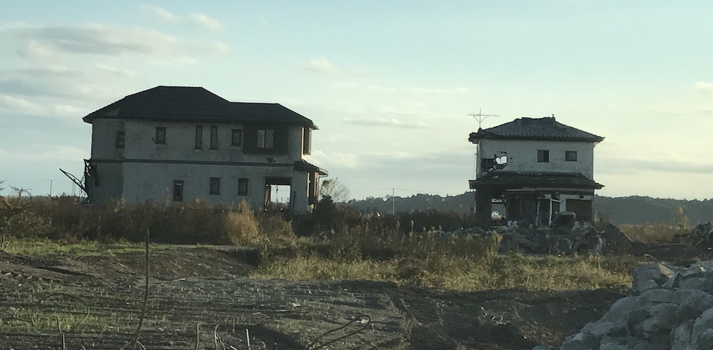
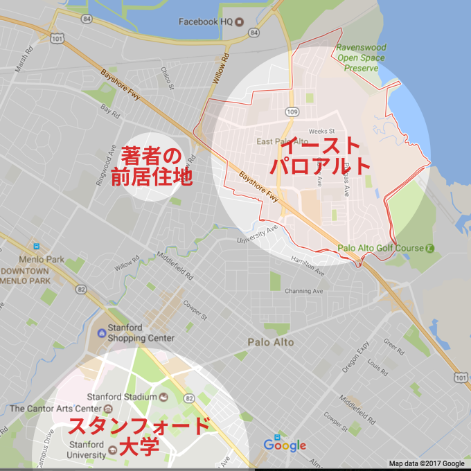
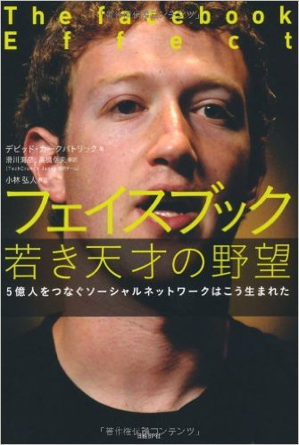
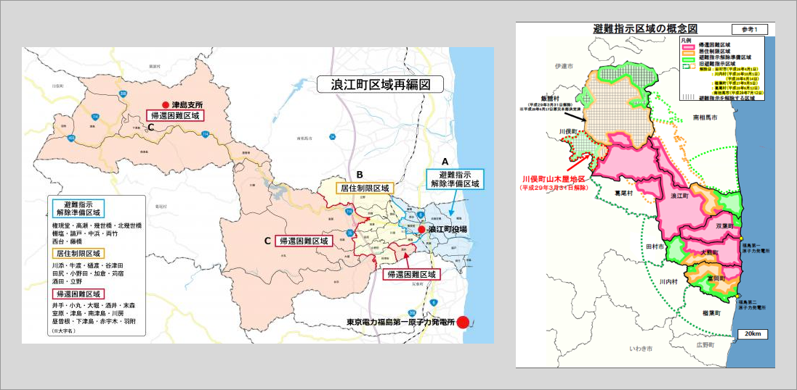
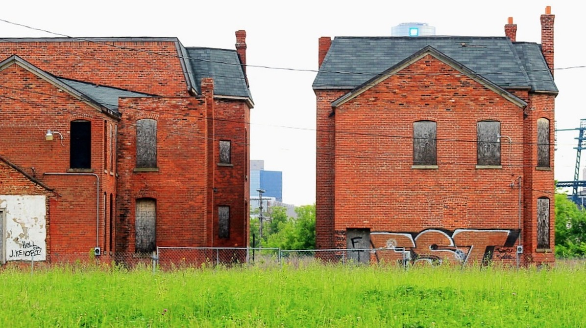

## 第一章: ヒーロー童貞

— 震災後にここに戻ってきたときは、生まれて初めて、解けない問題に直面したような感じでした。

原発10キロ圏内にある福島県・浪江町を案内してくれた友人は、車を走らせながらそう言った。震災から5年半が経った今でも、津波の爪痕がまざまざと残る。すれ違うのは工事のトラックばかり。ぼくが訪れた2016年11月の時点では、いまだに居住禁止のゴーストタウンとなっている。

<figure>
  
  <figcaption>福島県・浪江町の、津波で破壊された家。撮影:上杉周作。以後、ぼくが著作権を持っている画像はその旨の表記を省く。</figcaption>
</figure>

— 南相馬には東京の方々も視察に来るのですが、その人たちには「ここは未来の日本なんですよ」って言ってます。

震災前の2010年、南相馬の高齢者人口は[約27%]( http://www.city.minamisoma.lg.jp/index.cfm/8,26123,c,html/26123/20151228-111539.pdf
)と、日本全体でみると2015年に到達した数字だった。

しかし、震災後に南相馬の高齢化は一気に進み、2015年には高齢者人口が[約34%]( http://www.city.minamisoma.lg.jp/index.cfm/8,26123,c,html/26123/20151228-111539.pdf
)になった。これは日本全体でみると[2035年](http://www8.cao.go.jp/kourei/whitepaper/w-2016/html/zenbun/s1_1_1.html)に到達するであろう数字である。本来20年かかる高齢化が、南相馬にはたった5年でやってきたのだ。

— 介護の現場はそうとう大変なんでしょうね。 
— 仰るとおり、ベッドも人手もまったく足りてませんよ。

南相馬の20年後はどうか。推計によれば、2035年には高齢者人口が約45%になり、生産年齢人口の約46%と並ぶ。

もしぼくが今日、南相馬に生まれたとしたら、そのぼくが大学に進学するころには、市の約2人に1人が高齢者になっている。

はたして、南相馬で育つぼくは希望を持てるのだろうか。映画「君の名は。」に登場する、飛騨の田舎育ちの主人公・三葉のように、「もうこんな町いややー！こんな人生いややー！来世は東京のイケメン男子にしてくださーい！」と、ふと叫んだりしないだろうか。

それとも、映画「シン・ゴジラ」に登場する主人公・矢口のように、「諦めず、最後までこの町を見捨てずにやろう」と決意するのだろうか。

### 相双神旗ディネード

そんな南相馬で育つ子どもたちに、希望を届けるヒーローがいる。

[フロンティア南相馬](http://frontier-minamisoma.org/)という、震災後に福島県で最初に認定を受けたNPOがある。設立メンバーは震災で集まったボランティアの有志たちで、子どもの支援・生活の支援・産業の支援を行っている。([寄付はこちらから](http://frontier-minamisoma.org/supports/index/)。)

このフロンティア南相馬は、ご当地ヒーロー「相双神旗ディネード」の立ち上げも支援した。ディネードは南相馬近郊を守る正義の味方で、ヒーローショーで悪と戦いながら、子どもたちを「震災や放射能に負けるんでねーど(福島弁)」と鼓舞している。実写映画化もされ、制作の様子はめざましテレビが全国に放映した。

<figure>
  
  <figcaption>「相双神旗ディネード」の<a href="https://www.youtube.com/watch?v=ooExRI4NSco">予告動画より</a>。<a href="images/denade-permission.png">転載の許可も頂いた</a>。</figcaption>
</figure>

悪役は、住んでいた海や山を放射能で汚された動物の化身という設定だ。人間のせいで帰る場所が無くなったという点では、ディネードを観る子どもたちと悪役たちの境遇は変わらない。

フロンティア南相馬の方はこう語る。

— とにかくお金が足りなくて、ヒーローショーを続けるのも大変なんですよ。コスチュームの維持費だってバカにならない。 
— そんなに大変なのに、なぜ続けてるんですか? 
— そりゃあ、好きだからですよ。そして、子どもたちは、ヒーローの言うことには耳を傾けるんです。 
— というと・・・ 
— たとえば「多様性を尊重しよう、相手の立場を理解しよう」って大人が口酸っぱく言うよりも、ディネードが悪役にたいして「きみたちが怒る理由も分かるよ」と言うほうが、子どもにとってはよっぽど説得力があるんですよ。

<figure>
  
  <figcaption>ぼくとディネード。</figcaption>
</figure>

子どもにとって、ヒーローには説得力がある。

ぼくも幼稚園児のころ、5人の色違いのヒーローが悪と戦う「スーパー戦隊シリーズ」の「[忍者戦隊カクレンジャー](https://ja.wikipedia.org/wiki/%E5%BF%8D%E8%80%85%E6%88%A6%E9%9A%8A%E3%82%AB%E3%82%AF%E3%83%AC%E3%83%B3%E3%82%B8%E3%83%A3%E3%83%BC)」が好きだった。

とくに印象に残っていたのは、「鶴姫」という女性が5人のリーダーを務めていたことだ。カクレンジャーはシリーズ18年目の作品なのだが、女性メンバーが登場したのは初めてだったらしい。たまたまカクレンジャーが、スーパー戦隊シリーズにとって女性の社会進出元年だったのである。

「女性のリーダーは当たり前」と思うようになるきっかけは人それぞれだが、ぼくにとってはカクレンジャーがそうだった。ヒーローには町を守る力だけでなく、子どもの当たり前をつくる力があるのだ。

### ヒーロー初体験

当たり前だが、ヒーローがヒーローでいられるのは「中の人」がいるからだ。映画のディネードの「中の人」は高野伸博さんという方だった。

<figure>
  
  <figcaption>ディネード役の高野伸博さん。「相双神旗ディネード」の<a href="https://www.youtube.com/watch?v=ooExRI4NSco">予告動画より</a>。</figcaption>
</figure>

この高野さん、なんとそれまで演技経験「ゼロ」だった。

ディネードの企画ができたとき、「地元の人間を配役したい」という制作陣の意向により、原発事故のせいで自宅に戻れなくなった高野さんに声がかかった。彼はド素人の大根役者だったが、ルックスの良さを買われたという。「※ただしイケメンに限る」とはまさにこのことだ。

高野さんは慣れないセリフ回しに苦労したが、最終的に映画は大盛況に終わった。

恵まれない地域にはいつかヒーローが現れる。そんなヒーローの多くは、ヒーローになるのが初体験の人たちだ。ディネードでヒーロー童貞を捨てた高野さんの、今後の活躍に期待したい。

### イースト・パロアルト

続いて、海の向こうの「恵まれない地域」の話をさせてほしい。後に、そこに現れたヒーローを紹介する。

アメリカ西海岸・カリフォルニア州シリコンバレーの中心付近に、イースト・パロアルトという都市がある。南相馬が東北でも特に苦労している町であるように、イースト・パロアルトもシリコンバレーの中では特に苦労している町だ。

<figure>
  
  <figcaption><a href="https://goo.gl/maps/tmWTyNbyMd82">Google Maps</a></figcaption>
</figure>

イースト・パロアルトの隣に2010年から2014年住んだぼくから見て、イースト・パロアルトの治安は微妙だった。しかし、90年代や2000年代はもっと治安が悪かったらしい。

ギャング抗争のせいで、イースト・パロアルトは[1992年に市内での殺人率が全米最高](http://articles.latimes.com/1993-01-05/local/me-833_1_east-palo-alto)を記録した。人口あたりの殺人発生率は[同時期の日本](https://ja.wikipedia.org/wiki/%E6%97%A5%E6%9C%AC%E3%81%AE%E7%8A%AF%E7%BD%AA%E3%81%A8%E6%B2%BB%E5%AE%89)の「175倍」というとんでもない数字である。1992年といえば、シリコンバレー発祥のインテルが[世界最大の半導体企業になった年](http://www.intel.com/content/www/us/en/history/history-1992-annual-report.html)だ。

スタンフォード大学の目と鼻の先にありながら、イースト・パロアルトはまさに別世界だったのである。

2000年代に入ると、イーストパロアルトの治安はましになったが、シリコンバレーの他の地域と比べるとまだまだ悪かった。

<figure>
  
  <figcaption>デビッド・カークパトリック(著)、小林弘人(解説)、滑川海彦 (翻訳)、高橋信夫(翻訳)。日経BP社出版(2011/1/13)。 (<a href="http://amzn.to/2iTMQUx">Amazonリンク</a>)</figcaption>
</figure>

2005年の春のこと。フェイスブックの創業者、84年生まれ・21歳のマーク・ザッカーバーグは運転中、イースト・パロアルトのガソリンスタンドに寄った。セルフサービスで給油していると、酔っ払いがやってきて彼に[銃を突きつけた](https://goo.gl/RLu2aP)。ザッカーバーグはとっさの判断で車に飛び乗り、そのまま運転して難を逃れたという。

ザッカーバーグ率いるフェイスブックは当時、ベンチャーキャピタルから最初の投資を受けたばかりだった。投資家は、イースト・パロアルトの治安がリスクになるとは夢にも思わなかっただろう。

### 政府主導の差別政策

イースト・パロアルトはなぜそんな危険地帯になったのか。その理由は、「レッドライン」というアメリカの悪しき慣習にさかのぼる。

まずはこの地図を見てほしい。

<figure>
  
  <figcaption>画像ソース: <a href="http://www.town.namie.fukushima.jp/soshiki/2/namie-factsheet.html">浪江町</a> / <a href="http://www.pref.fukushima.lg.jp/site/portal/list271-840.html">福島県</a></figcaption>
</figure>

左は冒頭で書いた福島県浪江町の避難マップ(2016年12月)、右は福島県全体の避難マップ(2016年10月)である。

まるで信号のように、青(緑)・黄・赤の三色で居住が制限されている地区が示されている。青(緑)のエリアにはもうすぐ人が住めるが、赤のエリアには当分だれも住めない。放射能汚染のせいである。

次にこの地図を見てほしい。

<figure>
  
  <figcaption>画像ソース: <a href="http://salt.umd.edu/T-RACES/mosaic.html">Redlining Archives of California's Exclusionary Spaces</a></figcaption>
</figure>

これはシリコンバレーの北にあるサンフランシスコの、1930年ごろの地図だ。こちらも信号のように青・緑、黄色、赤色が使われている。それぞれの色は何を意味するのだろうか。

答えを言うと、地図上の色は、「その地域に黒人がどれだけ住んでいるか」を示している。緑の地域はもっとも黒人が少なく、青、黄色と続き、赤の地域には黒人が最も多く住んでいた。

このような地図は、1930年代に全米で作られたのだが、なぜ必要だったのか?

アメリカでは1929年に大恐慌が起き、不動産市場が崩壊しかけていた。そこで連邦政府が不動産融資をする銀行を支援をしたのだが、そのとき政府は銀行に「支援をする代わりに、融資の審査を厳しくしなさい」と[条件をつけた](http://www.bostonfairhousing.org/timeline/1934-FHA.html)。

ではどう融資を厳しくすればいいのか。政府系機関の[HOLC](https://en.wikipedia.org/wiki/Redlining)は銀行に、「黒人が多い地域に不動産融資をするのはやめなさい。黒人が多い地域には裕福な白人が住み着かず、発展しないだろうから」と伝えた。

これを受けて、アメリカ中の都市で先ほどのような地図が作られた。黒人が多い地域は赤線で囲まれたことから、この施策は「レッドライン」と呼ばれた。裕福な黒人が多かろうが、貧乏な白人が多かろうが関係なく、[単純に肌の色だけで](http://powerreporting.com/color/)地図の色は決められた。

当時のアメリカで、黒人差別は[合憲](https://ja.wikipedia.org/wiki/%E3%83%97%E3%83%AC%E3%83%83%E3%82%B7%E3%83%BC%E5%AF%BE%E3%83%95%E3%82%A1%E3%83%BC%E3%82%AC%E3%82%BD%E3%83%B3%E8%A3%81%E5%88%A4)だった。政府主導の差別政策がまかり通っていたのである。

### レッドラインの呪い

レッドラインは二つの結果をもたらした。第一に、赤の地域では、新しくお店を開こうにもビルを建てようにも銀行の融資に頼れなくなったり、資金繰りが厳しくなった既存のテナントも撤退して、地域全体が衰退した。第二に、赤の地域に賃貸で住む黒人たちにも銀行は住宅ローンを貸し渋るようになり、その人たちは家を保有することが困難になった。

日本と違い、アメリカでは基本的に住宅の価値は年々上がるため、家を持つことが資産を増やす最善手なのだが、多くの黒人はその機会を奪われた。また、既にレッドライン地域に持ち家があった黒人も、地域が荒れるにつれ持ち家の価値が下がり、財を失った。

アメリカの大都市を訪れたことがある方は、[貧乏な層に黒人が多いこと、また黒人が多く住む地域が軒並み廃れていること](http://www.vox.com/2016/6/6/11852640/cartoon-poor-neighborhoods)に気づくかもしれない。レッドラインこそが[その元凶](http://www.theatlantic.com/business/archive/2014/05/the-racist-housing-policy-that-made-your-neighborhood/371439/)なのである。20世紀中盤にアメリカを豊かにした資本主義のレールに、黒人の多くは乗ることができなかったのだ。

レッドラインは[1964年の公民権法成立](https://en.wikipedia.org/wiki/Civil_Rights_Act_of_1964)を経て、[1977年に完全に廃止されるまで](https://en.wikipedia.org/wiki/Community_Reinvestment_Act)30年以上続いた。その間、全米で黒人と白人の資産格差が大きく広がり、赤の地域はゲットーへと変貌した。

<figure>
  
  <figcaption><a href="https://pixabay.com/en/slum-rundown-abandoned-urban-946786/">デトロイトにある廃墟</a> (CC0)</figcaption>
</figure>

1980年代に入ると、ゲットー化した地域で今度はドラッグ売買が広がった。

アメリカでは、学校の予算は地価に比例する税収で賄われる。ゆえに、ゲットー化した地域ではまともな教育が受けられなくなる。低学歴でも以前なら工場に雇用があったが、アメリカの製造業は[1979年をピークに衰退している](http://www.cnsnews.com/news/article/terence-p-jeffrey/7231000-lost-jobs-manufacturing-employment-down-37-1979-peak)。ゲットーの路上には無職の若者が溢れるようになった。

「もうこんな町いややー！こんな人生いややー！」と叫んだ黒人貧困層にとって最後の希望は、女性なら売春、男性ならアメリカ中で流行りだしたドラッグ売買だった。

男性は、ギャングに入団してコカインやヘロインを売れば一日何百ドルも稼げる。廃墟になった建物はアジトとして利用され、ギャングの銃撃戦で治安が悪化し、「赤の地域」は「血塗られた地域」になった。1984年から1994年にかけて、[14歳から24歳の黒人男性が殺人で死ぬ確率は全米で倍増した](http://scholar.harvard.edu/files/fryer/files/fhlm_crack_cocaine_0.pdf)。

### マーク・ザッカーバーグ

先ほどの話に戻ると、シリコンバレーにあるイースト・パロアルトも典型的な「赤の地域」だった。ゆえに、町はいつまでたっても豊かにならなかったのだ。

90年代、あまりの治安の悪さに黒人の多くはここを脱出したが、代わりにメキシコからの移民がイースト・パロアルトに住み着いた。しかし、住民が貧しいことに変わりはない。

そんなイースト・パロアルトに2012年、変化が訪れた。

<figure>
  
  <figcaption>Facebook本社前にて。</figcaption>
</figure>

同年のシリコンバレーは、フェイスブック社が[世界最大規模の上場](https://en.wikipedia.org/wiki/Initial_public_offering_of_Facebook)を果たした話題で持ちきりだった。そして、飛ぶ鳥を落とす勢いのフェイスブック社は、土地が余っていたイースト・パロアルトの真横に本社を移転したのである。

7年前にイースト・パロアルトで命の危険に晒された、フェイスブック代表のマーク・ザッカーバーグは、矢継ぎ早に地域への貢献をはじめた。

<figure>
  
  <figcaption><a href="http://newsroom.fb.com/media-gallery/executives/mark-zuckerberg/">Facebookのコーポレートサイトより</a>。</figcaption>
</figure>

フェイスブック社がイースト・パロアルトにやってきた2年後、ザッカーバーグは[1億2000万ドル](http://www.mercurynews.com/2014/05/29/mark-zuckerberg-and-dr-priscilla-chan-why-were-committing-120-million-to-bay-area-schools/)をイースト・パロアルトを含む近郊の貧しい学区に寄付することを決定。[寄付の一部](https://techcrunch.com/2015/01/10/east-of-palo-altos-eden/)は、イースト・パロアルトの学生たちにタブレット端末を配るために使われた。

(注: 1ドル=約100円として考えてほしい。1億ドル=約100億円。)

イースト・パロアルトに新しいクリニックが出来た際、ザッカーバーグは妻のプリシラと5万ドルを[寄付](http://www.paloaltoonline.com/news/2014/01/23/zuckerberg-wife-give-5-million-to-build-east-palo-alto-health-center)した。二人はさらに、イースト・パロアルトに低所得者層の児童向けの学校を2016年に[設立](http://forbesjapan.com/articles/detail/10743)。3歳から入学でき、学費は無料で保育・医療サービスも提供する。

ザッカーバーグの貢献はカネやハコモノだけに留まらない。たとえばフェイスブックは毎年夏、イースト・パロアルトの高校生を何人かインターンで雇っている。

また、ザッカーバーグは2013年、イースト・パロアルトの中学生に10週間、[週一で起業についての授業を教えた](https://techcrunch.com/2015/01/10/east-of-palo-altos-eden/)。中学生たちは製品のプロトタイプを作り、それらをフェイスブック本社で販売した。なかでも特に優秀だった4人は、高校に進学してもザッカーバーグの指導を受け続けたという。

ザッカーバーグは裕福な家の出身で、イースト・パロアルトの子たちとは共通点が少ない。しかし、世界を代表する起業家が直接指導してくれるのなら、みな彼の話を聞きたいと思うだろう。南相馬の子たちがディネードの言葉に耳を傾けたように。

こうしてザッカーバーグは、瞬く間にイースト・パロアルトのヒーローになった。

### ザッカーバーグのヒーロー初体験

ここで質問だ。

南相馬にはディネードというヒーローが現れ、イースト・パロアルトにはザッカーバーグというヒーローが現れた。ディネードを演じた高野さんは、ヒーローになるのが初めてだった。

では、ザッカーバーグも同じく、ヒーローになるのが初めてだったのだろうか?

<figure>
  
  <figcaption>ザッカーバーグ。<a href="http://newsroom.fb.com/media-gallery/events/qa-with-mark-zuckerberg-at-facebook-headquarters/">Facebookのコーポレートサイトより</a>。</figcaption>
</figure>

答えはNOである。ザッカーバーグは、地域のヒーローになるのが、イースト・パロアルトで二度目だった。

では、ザッカーバーグはいつ、どこでヒーロー童貞を捨てたのか?

じつは、ザッカーバーグのヒーロー初体験での出来事は、「<a href="http://amzn.to/2idlf1u">The Prize</a>」という本にまとめられている(2017年2月時点では未訳)。しかもこの本、なんとニューヨークタイムズのベストセラーに選ばれたのだ。

<figure>
  
  <figcaption>
    Russakoff, Dale. The Prize: Who's in Charge of America's Schools? Boston: Houghton Mifflin Harcourt, 2016. Print. (<a href="http://amzn.to/2idlf1u">Amazonリンク</a>)
  </figcaption>
</figure>

ベストセラーになるほどのヒーロー初体験とは、いったいどれほど強烈なものだったのだろうか。それはディネードのような成功例だったのか、それとも黒歴史だったのだろうか。今回の記事では、「[The Prize](http://amzn.to/2idlf1u)」を[引用しつつ](https://goo.gl/B7k68n)、この話を深掘りしていきたい。

「そんなことを知って何になるんだ」と思うみなさまも、騙されたと思って読んでほしい。これからの日本を考えるヒントが見つかるかもしれないから。
