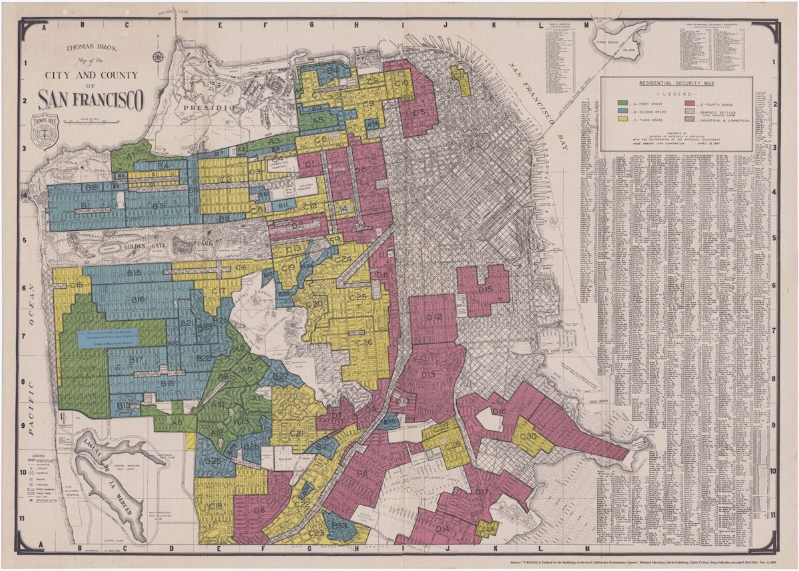
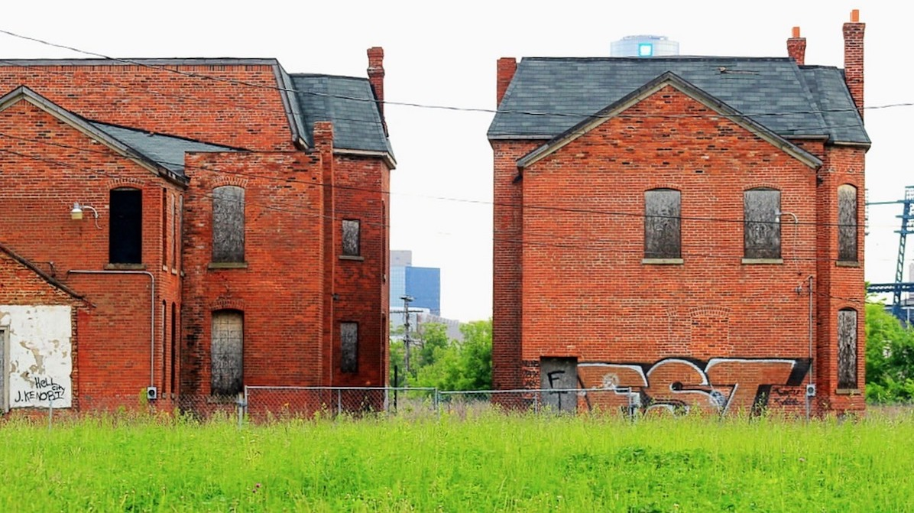
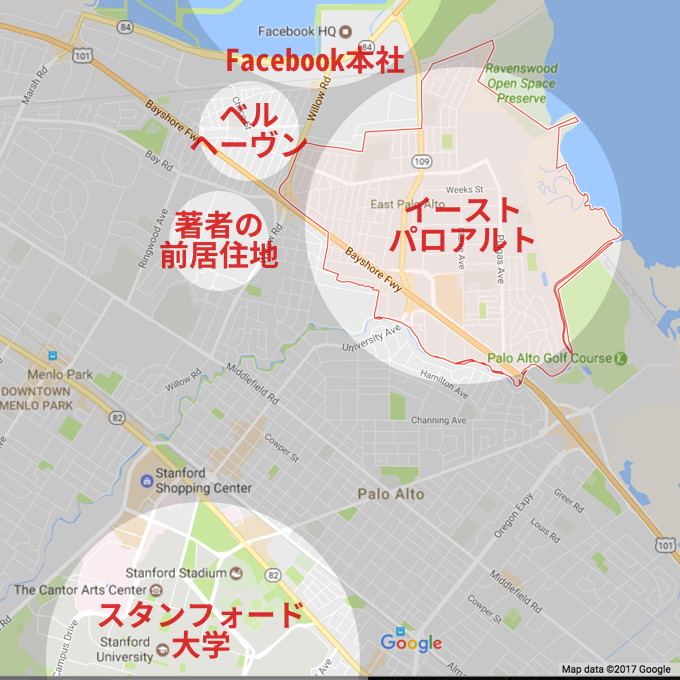

# 第一章・「ヒーロー」

— 震災後にここに戻ってきたときは、生まれて初めて、解けない問題に直面したような感じでした。

原発10キロ圏内にある福島県・浪江町を案内してくれた友人は、車を走らせながらそう言った。震災から5年半が経った今でも、津波の爪痕がまざまざと残る。すれ違うのは工事のトラックばかり。ぼくが訪れた2016年11月の時点では、いまだに居住禁止のゴーストタウンとなっている。

<figure>
  
  <figcaption>浪江町。撮影:上杉周作。以後、ぼくが著作権を持っている画像はその旨の表記を省きます。</figcaption>
</figure>

— 南相馬には東京の方々も視察に来るのですが、その人たちには「ここは未来の日本なんですよ」って言ってます。

震災前の2010年、南相馬の65歳以上人口は26.6%と、日本全体でみると2015年に到達した数字だった。しかし、震災後に南相馬の高齢化は一気に進み、2015年には65歳以上人口が33.6%になった。これは日本全体でみると2035年に到達するであろう数字である。本来20年かかる高齢化が、南相馬にはたった5年でやってきたのだ。<a href="#">※</a>

— 介護の現場はそうとう大変なんでしょうね。 
— 仰るとおり、ベッドも人手もまったく足りてませんよ。

南相馬の20年後はどうか。推計によれば、2035年には65歳人口が44.9%になり、15~64歳人口の46.2%と並ぶ。

もしぼくが今日、南相馬に生まれたとしたら、そのぼくが大学に進学するころには、市の約2人に1人が高齢者になっている。

はたして、南相馬で育つぼくは希望を持てるのだろうか? 映画「君の名は。」に登場する、飛騨の田舎育ちの主人公・三葉のように、「もうこんな町いややー！こんな人生いややー！来世は東京のイケメン男子にしてくださーい！」と、ふと叫んだりしないだろうか。

それとも、物心つくころには「人生なんてそんなもんさ」と思うようになるのだろうか。

## 相双神旗ディネード

そんな南相馬で育つ子どもたちに、希望を届けている人たちがいる。

[フロンティア南相馬](http://frontier-minamisoma.org/)という、震災後に福島県で最初に認定を受けたNPOがある。設立メンバーは震災で集まったボランティアの有志たちで、子どもの支援・生活の支援・産業の支援を行っている。

このフロンティア南相馬は、ご当地ヒーロー「相双神旗ディネード」の立ち上げも支援した。ディネードは南相馬近郊を守る正義の味方で、ヒーローショーで悪と戦いながら、子どもたちを「震災や放射能に負けるんでねーど(福島弁)」と鼓舞している。実写映画化もされ、制作の様子はめざましテレビが全国に放映した。

<figure>
  
  <figcaption>「相双神旗ディネード」の<a href="https://www.youtube.com/watch?v=ooExRI4NSco">予告動画より</a>。<a href="images/denade-permission.png">転載の許可も頂いた</a>。</figcaption>
</figure>

悪役は、原発事故により、住んでいた海や山を汚された動物の化身という設定だ。人間によって、帰る場所を奪われたという点では、悪役たちも、ディネードを観る子どもたちも境遇は同じだ。

関係者の方はこう語る。

— とにかくお金が足りなくて、ヒーローショーを続けるのも大変なんですよ。コスチュームの維持費だってバカにならない。 
— そんなに大変なのに、なぜ続けてるんですか? 
— そりゃあ、好きだからですよ。そして、子どもたちは、ヒーローの言うことには耳を傾けるんです。 
— というと・・・ 
— たとえば「多様性を尊重しよう、相手の立場を理解しよう」って大人が口酸っぱく言うよりも、ディネードが悪役にたいして「きみたちが怒る理由も分かるよ」と言うほうが、子どもにとってはよっぽど説得力があるんですよ。

<figure>
  
  <figcaption>ぼくとディネード。</figcaption>
</figure>

ぼくも、アクションヒーローと共に育った。幼稚園の頃は祖父に連れてもらってウルトラマンのショーを観に行き、小学校1年生のときは、5人の色違いのヒーローが悪と戦う「スーパー戦隊シリーズ」の「[忍者戦隊カクレンジャー](https://ja.wikipedia.org/wiki/%E5%BF%8D%E8%80%85%E6%88%A6%E9%9A%8A%E3%82%AB%E3%82%AF%E3%83%AC%E3%83%B3%E3%82%B8%E3%83%A3%E3%83%BC)」を熱心に見ていた。

カクレンジャーはシリーズ18年目の作品なのだが、18年目にして初めて、5人のうち1人(鶴姫)が女性メンバーとなり、しかもその女性メンバーがチームリーダーを務めた。たまたまぼくが見た年が、スーパー戦隊シリーズにとって女性の社会進出元年だったのである。早計かもしれないが、カクレンジャーは、ぼくと同年代の男性が持つ「男女の価値観」に、少しばかり影響を与えたのではないか。

(ちなみに、[フロンティア南相馬へはこちらから寄付できる](http://frontier-minamisoma.org/supports/index/)。)

## レッドラインの呪い

ここでぼくが住むアメリカ西海岸・サンフランシスコ近郊に舞台を移そう。南相馬とは似ても似つかぬ場所だが、共通点が全くないわけではない。

まずはこの地図を見てほしい。左は冒頭で書いた浪江町の避難指示区域(2016年12月)、右は福島県全体の避難指示区域(2016年10月)である。

<figure>
  
  <figcaption>画像ソース: <a href="http://www.town.namie.fukushima.jp/soshiki/2/namie-factsheet.html">浪江町</a> / <a href="http://www.pref.fukushima.lg.jp/site/portal/list271-840.html">福島県</a></figcaption>
</figure>

もうすぐ人が住めるようになる地域は緑か青、中長期での帰還準備を進めている地域は黄色、そして立ち入りが制限されている帰宅困難地域は赤色で示されている。まるで信号のようだ。

次にこの地図を見てほしい。これは1930年代のサンフランシスコの地図で、同じく信号のように青・緑、黄色、赤色が使われている。それぞれの色は何を意味するのだろうか。

<figure>
  
  <figcaption>画像ソース: <a href="http://salt.umd.edu/T-RACES/mosaic.html">Redlining Archives of California's Exclusionary Spaces</a></figcaption>
</figure>

答えを言うと、地図上の色は、その地域に黒人がどれだけ住んでいるかで決まる。緑の地域はもっとも黒人が少なく、青、黄色と続き、赤の地域には黒人が最も多く住んでいた。

このような地図は、1930年代に全米で作られたのだが、なぜ必要だったのか。いったんサンフランシスコから離れて、アメリカ全体の話をする。

アメリカでは1929年に大恐慌が起き、不動産市場が崩壊しかけていた。そこで連邦政府が介入して連邦住宅局(FHA)を作り、金融機関相手に不動産向けの融資支援を行った。そのとき政府は金融機関に、「支援をする代わりに、融資審査を厳しくしなさい」と[伝えた](http://www.bostonfairhousing.org/timeline/1934-FHA.html)。

1930年代のアメリカでは黒人差別が根強く、「黒人が多い地域は裕福な白人が住み着かないから発展しないだろう」と考えられていた。ゆえに政府は「黒人が多い地域は、これからも地価が上がらないだろうから不動産向けの融資をするべきではない」と金融機関に伝えたのである。その際にアメリカ中の都市で先ほどのような地図が作られたのだ。

黒人が多い地域は赤線で囲まれたことから、この施策は「レッドライン」と呼ばれた。裕福な黒人が多かろうが、貧乏な白人が多かろうが関係なく、[単純に肌の色だけで](http://powerreporting.com/color/)地図の色は決められた。政府主導の経済的な差別政策だったのだ。

レッドラインは二つの結果をもたらした。第一に、赤の地域では、新しくお店を開こうにもビルを建てようにも銀行の融資に頼れなくなったり、資金繰りが厳しくなった既存のテナントも撤退して、街全体が衰退した。第二に、赤の地域に賃貸で住む黒人たちにも銀行は住宅ローンを貸し渋るようになり、その人たちは家を保有することが困難になった。

日本と違い、アメリカでは基本的に住宅の価値は年々上がるため、家を持つことが資産を増やす最善手なのだが、多くの黒人はその機会を奪われた。また、既にレッドライン地域に持ち家があった黒人も、街が衰退したせいで持ち家の価値が下がって苦しんだ。

アメリカの大都市を訪れたことがある方は、[貧乏な層に黒人が多いこと、また黒人が多く住む地域が軒並み衰退していること](http://www.vox.com/2016/6/6/11852640/cartoon-poor-neighborhoods)に気づくかもしれない。レッドラインこそが[その元凶](http://www.theatlantic.com/business/archive/2014/05/the-racist-housing-policy-that-made-your-neighborhood/371439/)なのである。

レッドラインは[1964年の公民権法成立](https://en.wikipedia.org/wiki/Civil_Rights_Act_of_1964)を経て、[1977年に完全に廃止されるまで](https://en.wikipedia.org/wiki/Community_Reinvestment_Act)30年以上続いた。その間、全米で黒人と白人の資産格差が大きく広がり、赤の地域はゲットーへと変貌した。

<figure>
  
  <figcaption><a href="https://pixabay.com/en/slum-rundown-abandoned-urban-946786/">デトロイトにある廃墟</a> (CC0)</figcaption>
</figure>

1980年代に入ると、ゲットー化した地域で今度はドラッグ売買が広がった。

アメリカでは、教育予算は不動産価格に比例する税収で賄われているため、ゲットー化した地域の教育レベルは停滞していた。低学歴でも以前なら工場に雇用があったが、アメリカの製造業は[1979年をピークに衰退している](http://www.cnsnews.com/news/article/terence-p-jeffrey/7231000-lost-jobs-manufacturing-employment-down-37-1979-peak)。ゲットーの路上には無職の若者が溢れるようになった。

「もうこんな町いややー！こんな人生いややー！」と叫んだ黒人貧困層にとって最後の希望は、女性なら売春、男性ならアメリカ中で流行りだしたドラッグ売買だった。ギャングに入団してコカインやヘロインを売れば一日何百ドルも稼げる。廃墟になった建物はアジトとして利用され、ギャングの銃撃戦で治安が悪化し、「赤の地域」は「血塗られた地域」になった。

1984年から1994年にかけて、[14歳から24歳の黒人男性が殺人で死ぬ確率は全米で倍増した](http://scholar.harvard.edu/files/fryer/files/fhlm_crack_cocaine_0.pdf)。

## イースト・パロアルト

舞台をサンフランシスコ近郊に戻そう。シリコンバレーの中心・スタンフォード大学から車で15分の距離にある、イースト・パロアルト。ここも昔は「赤の地域」だった。

<figure>
  
  <figcaption><a href="https://goo.gl/maps/tmWTyNbyMd82">Google Maps</a></figcaption>
</figure>

ギャング抗争のせいで、イースト・パロアルトは[1992年に市内での殺人率が全米最高](http://articles.latimes.com/1993-01-05/local/me-833_1_east-palo-alto)となった。人口あたりの殺人発生率は[同時期の日本](https://ja.wikipedia.org/wiki/%E6%97%A5%E6%9C%AC%E3%81%AE%E7%8A%AF%E7%BD%AA%E3%81%A8%E6%B2%BB%E5%AE%89)の「175倍」というとんでもない数字である。

1992年といえば、シリコンバレー発祥のインテルが[世界最大の半導体企業になった年](http://www.intel.com/content/www/us/en/history/history-1992-annual-report.html)だ。シリコンバレーの隣にありながら、イースト・パロアルトはまさに別世界だった。

取り締まりを強化した結果、イースト・パロアルトの犯罪は[翌年から減った](http://www.csmonitor.com/1994/0214/14081.html)。しかし、すでに堪忍袋の緒が切れてしまった黒人たちは[街を脱出してしまう](http://www.sfgate.com/news/article/TOWN-S-ETHNIC-MAKEUP-SHIFTS-Historically-Black-2982533.php)。空き家が増えたところに、今度はメキシコからの貧しい移民が大挙して[押しよせた](http://www.sfgate.com/news/article/TOWN-S-ETHNIC-MAKEUP-SHIFTS-Historically-Black-2982533.php)。

ぼくは2010年にシリコンバレーに越してきて、イースト・パロアルトから車で5分のところにアパートを借りた。その頃にはイースト・パロアルトの住人の[3人に2人](https://en.wikipedia.org/wiki/East_Palo_Alto,_California)はラテン系アメリカ人になっていて、治安もそこそこ悪かった。

## 若き天才ザッカーバーグ

そのイースト・パロアルトに2012年、変化が訪れた。[同年に世界最大規模の上場](https://en.wikipedia.org/wiki/Initial_public_offering_of_Facebook)を果たし、飛ぶ鳥を落とす勢いのフェイスブック社がイースト・パロアルトの真横に本社を移転したのである。

<figure>
  
  <figcaption>Facebook本社前にて。</figcaption>
</figure>

南相馬に相双神旗ディネードが登場したように、イースト・パロアルトにもFacebookの社長、若き天才マーク・ザッカーバーグが登場した。

<figure>
  
  <figcaption><a href="http://newsroom.fb.com/media-gallery/executives/mark-zuckerberg/">Facebook社の公式サイトより</a>。</figcaption>
</figure>

フェイスブック社がイースト・パロアルトにやってきた2年後、ザッカーバーグは[1億2000ドル](http://www.mercurynews.com/2014/05/29/mark-zuckerberg-and-dr-priscilla-chan-why-were-committing-120-million-to-bay-area-schools/)をイースト・パロアルトを含む近郊の貧しい学区に寄付することを決定。[最初の100万ドル](https://techcrunch.com/2015/01/10/east-of-palo-altos-eden/)はイースト・パロアルトの学生たちにタブレット端末を配布するのに使われたりと、寄付金は学区のニーズを汲む形で運用されている。

また、心や身体の健康問題が深刻なイースト・パロアルトの住民のために、新しい総合クリニックができたのだが、そこにもザッカーバーグは妻のプリシラと[500万ドルを寄付した](http://www.paloaltoonline.com/news/2014/01/23/zuckerberg-wife-give-5-million-to-build-east-palo-alto-health-center)。さらに二人は、イースト・パロアルトに低所得者層の児童向けの学校「The Primary School」を2016年に[設立](http://forbesjapan.com/articles/detail/10743)。3歳から入学でき、学費は無料で保育・医療サービスも提供する。

イースロ・パロアルトに届いたのはカネやハコモノだけではない。フェイスブックは毎年夏、イースト・パロアルトの高校生を何人かインターンで雇っている。さらに、ザッカーバーグは2013年、イースト・パロアルトの中学生に10週間、[週一で起業についての授業を教えた](https://techcrunch.com/2015/01/10/east-of-palo-altos-eden/)。中学生たちはビジネスプランとさまざまな製品を作り、作った製品をフェイスブック本社で販売した。なかでも特に優秀だった4人は、高校に進学してもザッカーバーグのメンタリングを受け続けたという。

ザッカーバーグは裕福な出自で、イースト・パロアルトの子たちとは共通点が少ない。しかし、世界を代表する起業家が直接指導してくれるのなら、みな彼の話を聞きたいと思うだろう。南相馬の子たちがディネードの言葉に耳を傾けたように。

## ディネードとザッカーバーグの違い

compare and contrast: 震災で打撃、行政の黒歴史で打撃、それぞれヒーローが現れた。

疑問 / cliffhanger: ディネードはこの動画をみてもわかるように演技は一回目。ザッカーバーグは2回目。

共通点はこれ。では相違点は？
