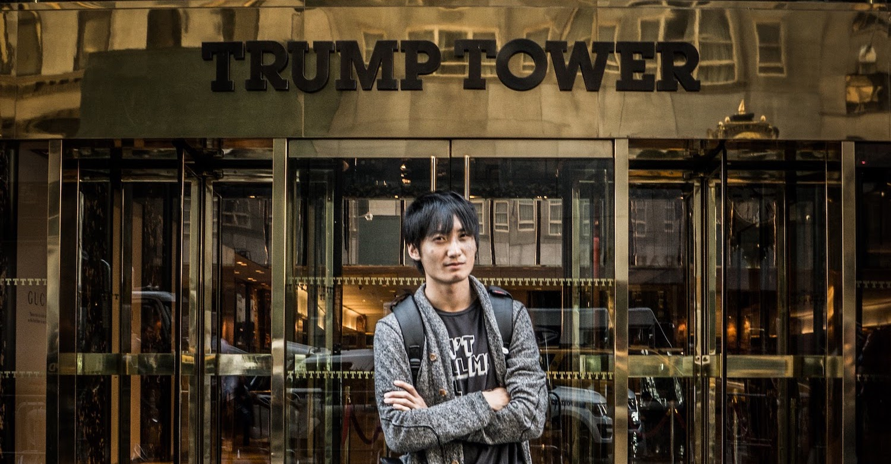

# 第一章・「ヒーローを疑う人たち」

— 震災後にここに戻ってきたときは、生まれて初めて、解けない問題に直面したような感じでした。

原発10キロ圏内にある福島県・浪江町を案内してくれた友人は、車を走らせながらそう言った。震災から5年半が経った今でも、津波の爪痕がまざまざと残る。すれ違うのは工事のトラックばかり。ぼくが訪れた2016年11月の時点では、いまだに居住禁止のゴーストタウンとなっている。

<figure>
  
  <figcaption>浪江町。撮影:上杉周作。以後、ぼくが著作権を持っている画像はその旨の表記を省きます。</figcaption>
</figure>

— 南相馬には東京の方々も視察に来るのですが、その人たちには「ここは未来の日本なんですよ」って言ってます。

震災前の2010年、南相馬の65歳以上人口は26.6%と、日本全体でみると2015年に到達した数字だった。しかし、震災後に南相馬の高齢化は一気に進み、2015年には65歳以上人口が33.6%になった。これは日本全体でみると2035年に到達するであろう数字である。本来20年かかる高齢化が、南相馬にはたった5年でやってきたのだ。<a href="#">※</a>

— 介護の現場はそうとう大変なんでしょうね。 
— 仰るとおり、ベッドも人手もまったく足りてませんよ。

南相馬の20年後はどうか。推計によれば、2035年には65歳人口が44.9%になり、15~64歳人口の46.2%と並ぶ。

もしぼくが今日、南相馬に生まれたとしたら、そのぼくが大学に進学するころには、市の約2人に1人が高齢者になっている。

そんな街に、ぼくは希望を持てるのだろうか? 映画「君の名は。」に登場する、飛騨の田舎育ちの主人公・三葉のように、「もうこんな町いややー！こんな人生いややー！来世は東京のイケメン男子にしてくださーい！」と叫んだりしてしまうのだろうか。それとも、物心つくころにはなんとも思わなくなるのだろうか。

どちらにしろ、イケメンに生まれたかった人生ではあるが。

## 相双神旗ディネード

そんな南相馬で育つ子どもたちに、希望を届けている人たちがいる。

[フロンティア南相馬](http://frontier-minamisoma.org/)という、震災後に福島県で最初に認定を受けたNPOがある。設立メンバーは震災で集まったボランティアの有志たちで、子どもの支援・生活の支援・産業の支援を行っている。

このフロンティア南相馬は、ご当地ヒーロー「相双神旗ディネード」の立ち上げも支援した。ディネードは南相馬近郊を守る正義の味方で、ヒーローショーで悪と戦いながら、子どもたちを「震災や放射能に負けるんでねーど(福島弁)」と鼓舞している。実写映画化もされ、制作の様子はめざましテレビが全国に放映した。

<figure>
  
  <figcaption>「相双神旗ディネード」の<a href="https://www.youtube.com/watch?v=ooExRI4NSco">予告動画より</a>。<a href="images/denade-permission.png">転載の許可も頂いた</a>。</figcaption>
</figure>

悪役は、原発事故により、住んでいた海や山を汚された動物の化身という設定だ。人間によって、帰る場所を奪われたという点では、悪役たちも、ディネードを観る子どもたちも境遇は同じだ。

関係者の方はこう語る。

— とにかくお金が足りなくて、ヒーローショーを続けるのも大変なんですよ。コスチュームの維持費だってバカにならない。 
— そんなに大変なのに、なぜ続けてるんですか? 
— そりゃあ、好きだからですよ。そして、子どもたちは、ヒーローの言うことには耳を傾けるんです。 
— というと・・・ 
— たとえば「多様性を尊重しよう、相手の立場を理解しよう」って大人が口酸っぱく言うよりも、ディネードが悪役にたいして「きみたちが怒る理由も分かるよ」と言うほうが、子どもにとってはよっぽど説得力があるんですよ。

<figure>
  
  <figcaption>ぼくとディネード。</figcaption>
</figure>

ぼくも、アクションヒーローと共に育った。幼稚園の頃は祖父に連れてもらってウルトラマンのショーを観に行き、小学校1年生のときは、5人の色違いのヒーローが悪と戦う「スーパー戦隊シリーズ」の「[忍者戦隊カクレンジャー](https://ja.wikipedia.org/wiki/%E5%BF%8D%E8%80%85%E6%88%A6%E9%9A%8A%E3%82%AB%E3%82%AF%E3%83%AC%E3%83%B3%E3%82%B8%E3%83%A3%E3%83%BC)」を熱心に見ていた。

カクレンジャーはシリーズ18年目の作品なのだが、18年目にして初めて、5人のうち1人(鶴姫)が女性メンバーとなり、しかもその女性メンバーがチームリーダーを務めた。たまたまぼくが見た年が、スーパー戦隊シリーズにとって女性の社会進出元年だったのである。早計かもしれないが、カクレンジャーは、ぼくと同年代の男性が持つ「男女の価値観」に、少しばかり影響を与えたのではないか。

ちなみに、[フロンティア南相馬へはこちらから寄付できる](http://frontier-minamisoma.org/supports/index/)。

## ヒーローを疑う人たち

ヒーローに憧れる子どもたちは背が伸びるにつれ、世の中には「ヒーロー」と「ヒーローの敵」以外にも「ヒーローを疑う人たち」がいることを知る。

たとえば、ディネードが南相馬に現れたのと同じように、ぼくが住むアメリカにも2016年、ドナルド・トランプ氏が現れた。

<figure>
  
  <figcaption>2016年9月、NYのトランプタワーにて。</figcaption>
</figure>

トランプ氏は移民を非難し、多数派という地位を失いかけている多くの白人にとって彼はヒーローとなった。しかし、[それでも白人の42%はトランプ氏を支持しなかった](http://www.nytimes.com/interactive/2016/11/08/us/politics/election-exit-polls.html)。

なぜ一部の白人は、トランプ氏というヒーローの言うことを信じなかったのか?

よく槍玉にあがる理由は学歴だ。高卒以下の白人だと、トランプ氏を支持しなかったのは33%と3人に1人だが、大学を卒業した白人は51%と、2人に1人がトランプ氏を支持していない。高学歴であれば低賃金で働く移民とは競争せずにすむし、トランプ氏のあからさまなウソも見破ることができるから、というのが定説だ。

だが、この話には続きがある。

Morning ConsultとVoxは2016年2月、共和党の予備選挙中、トランプ氏と他の共和党候補のうち誰を支持するか、共和党の有権者(主に白人)にたいし[調査を行った](http://www.vox.com/2016/3/1/11127424/trump-authoritarianism)。支持候補の名前以外にも有権者にいくつか質問をしたところ、やはり「有権者の教育レベルを見れば、トランプ氏を支持するかどうかがある程度予測できる」という結論が出た。

しかし、有権者の教育レベルよりも、トランプ氏を支持するかどうかを効果的に予測できる質問があったという。それはなんと、「子どもを育てるとしたら、どう育てたいか」だったらしい。

具体的には、共和党の有権者(主に白人)は以下の質問に答えた。

1. 子どもにとってどっちが大事? A: 年上を敬うこと B: 自分をしっかり持つこと
2. 子どもにとってどっちが大事? A: 従順であること B: 自立していること
3. 子どもにとってどっちが大事? A: 行儀がいいこと B: 思いやりがあること
4. 子どもにとってどっちが大事? A: 礼儀正しいこと B: 好奇心があること

それぞれの質問で「A」と答えた回数が多い有権者ほどトランプ氏を支持する傾向があり、それは教育レベルよりもトランプ支持との相関が強かったそうだ。

[専門家の分析によれば](http://www.vox.com/2016/3/1/11127424/trump-authoritarianism)、「子どもは伝統やしきたりを重んじるべき」と考える共和党の有権者ほど、伝統やしきたりを脅かす移民たちを恐れるためにトランプ氏支持に傾くらしい。他方で、保守的な共和党にあっても、「子どもは自由奔放に育つべき」と考えた有権者たちの多くは、トランプ氏を選ばなかった。

「移民が嫌いか」と聞くと正直に答えない人もいるだろうが、「子どもを育てるとしたら、どう育てたいか」という質問には本性が現れるようだ。

話を戻すと、

## Test
