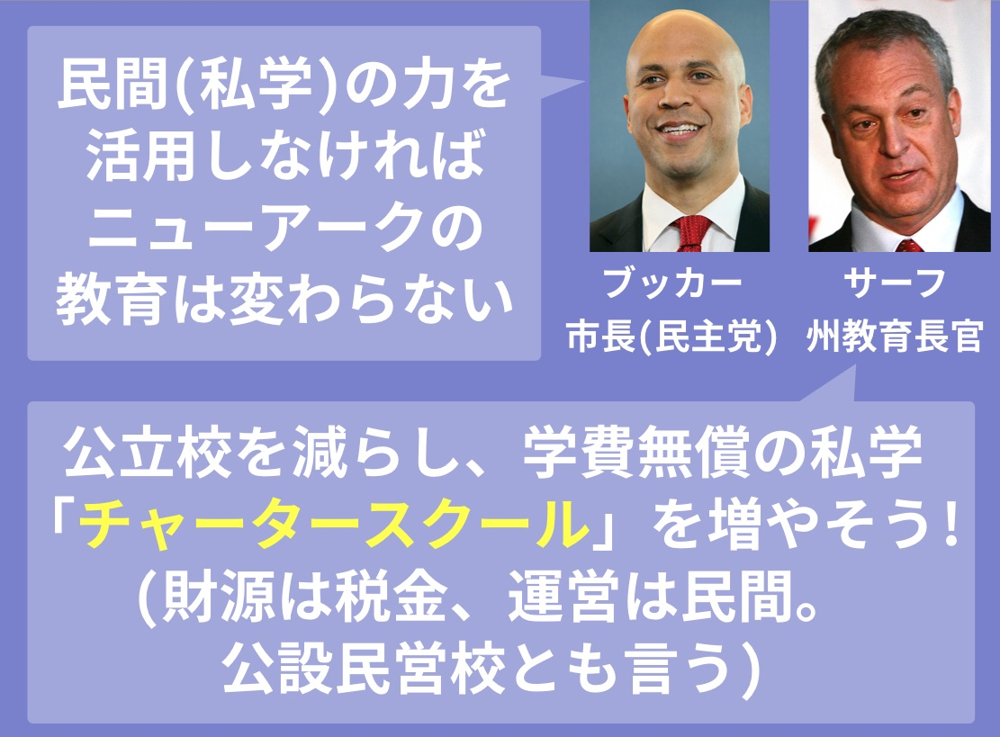
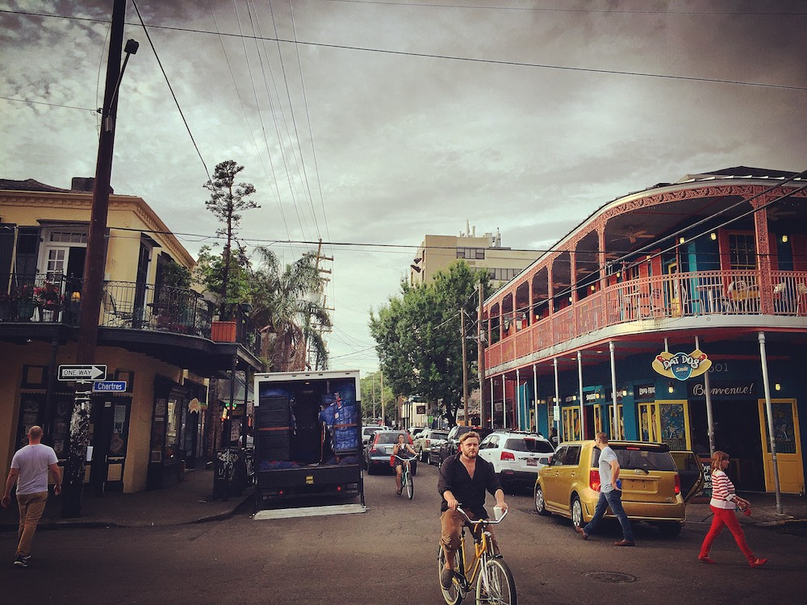
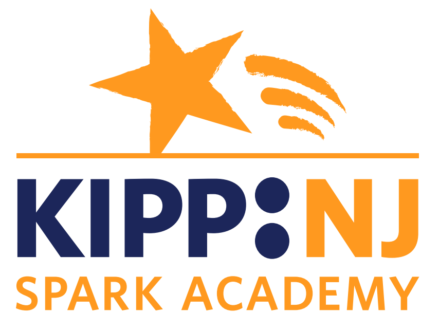

## 第十章: チャータースクールの光

ニューアークでは、雇用制度に加えて、学校のかたちも変貌を遂げた。

ブッカーやサーフは、質が悪い公立校を閉鎖し、かわりに「民間が税金を使って運営する、学費無償の私立校」を増やすことで、学校間の競争を取り入れようとした。以前も述べた、「金持ちの集会」のプランの一つである。

### チャータースクールの拡大

<figure>
  
  <figcaption>
    キャミー・アンダーソン学区長。(写真は<a href="http://www.state.nj.us/governor/media/">州知事の公式メディアページ</a>より。2011年5月4日。By <a href="http://www.state.nj.us/governor/media/photos/2011/20110504.shtml">Governor's Office/Tim Larsen</a>)
  </figcaption>
</figure>

この「民間が税金を使って運営する、学費無償の私立校」は、アメリカでは「チャータースクール」と呼ばれ、日本では「公設民営校」と呼ばれている。

チャータースクールは建前上は私学であるため、学区長のアンダーソンが管轄する公立学区とはまったく関係ない。だから、チャータースクールの誘致、拡大はアンダーソンではなく、サーフ州教育長官が[行っていた](https://goo.gl/B7k68n#mo0kuc8v)。

そしてサーフの指示のもと、ニューアークのチャータースクールは一気に拡大した。それに伴い、公立校の生徒がチャータースクールに流出した。数年もしないうちに、市の3人に1人がチャータースクールに通うようになる[見込みだ](https://goo.gl/B7k68n#chv1aUPC)。

<figure>
  
</figure>

ここで、チャータースクールは従来の公立校と何が違うのか説明しておきたい。端折って解説するので、詳しい方には物足りないかもしれないが。

### なぜ「チャータースクール」と呼ばれているのか

そもそも、「民間が税金を使って運営する、学費無償の私立校」がなぜ「チャータースクール」と呼ばれているのか。

日本語でもあるように、「チャーター」とは「バスをチャーターする」など「借り切る」という意味である。

1988年、アメリカ教育学者の[レイ・ブッデ氏](http://www.nytimes.com/2005/06/21/us/ray-budde-82-first-to-propose-charter-schools-dies.html)、教育者の[アルバート・シャンカー](https://www.nytimes.com/2014/08/31/opinion/sunday/albert-shanker-the-original-charter-school-visionary.html)氏らは、「教育の質をあげるには、公立校の先生が、公立校の枠組みの中で、実験的な取り組みを行えるような仕組みを作らなければいけない」と考えた。

そのためには、一部の先生たちが、学校から教室を借り、そこで一部の生徒たちを相手に実験的な取り組みを行えば良い。学校という資源の一部を、実験的な取り組みをしたい先生たちが「チャーター」し、学校のなかに新しい学校をもう一つ作る。これが、チャータースクールの[発祥である](http://www.nytimes.com/2005/06/21/us/ray-budde-82-first-to-propose-charter-schools-dies.html)。

このような「学校の中にある実験校」は拡大を続け、規制緩和によって民間事業者が参入し始めた。「学校すべてが実験校」であるケースも増え、日本の予備校のようにチェーン展開するチャータースクールも生まれた。

チャータースクールがアメリカで話題になったのは2005年、アメリカ南部の都市・ニューオーリンズでのことだった。

<figure>
  
  <figcaption>
    2016年5月に遊びにいった、ジャズの発祥地・ニューオーリンズ。筆者がアメリカで最も好きな都市のひとつ。ケージャン料理が美味しい。
  </figcaption>
</figure>

2005年、ジャズの発祥地であるニューオーリンズを大型のハリケーン「カトリーナ」が襲った。[1000人以上が亡くなり、町の8割が水没した](https://ja.wikipedia.org/wiki/%E3%83%8F%E3%83%AA%E3%82%B1%E3%83%BC%E3%83%B3%E3%83%BB%E3%82%AB%E3%83%88%E3%83%AA%E3%83%BC%E3%83%8A)。学校も[8割以上が](https://www.nytimes.com/2015/08/23/opinion/sunday/the-myth-of-the-new-orleans-school-makeover.html)破壊され、授業がしばらく行えなくなり、学区の教職員全員が[クビ](http://www.politico.com/magazine/story/2017/01/what-new-orleans-can-teach-betsy-devos-about-charter-schools-214610)になるという非常事態が起きた。

ニューアークと同じく、ニューオーリンズでは以前から生徒の学力が絶望的に低かった。学校がボロボロになったことで、「ちょうどいいから、全部ぶっ壊してイチからやり直そう」という声が出始める。やがて、なんと街のすべての公立学校が公設民営化され、チャータースクールに[なったのだ](https://www.nytimes.com/2015/08/23/opinion/sunday/the-myth-of-the-new-orleans-school-makeover.html)。

ニューオーリンズには全米から民間教育事業者が集まり、次々と新しい学校をオープンさせていった。

### チャータースクールの特徴

事業者の数だけチャータースクールがあるので一概には言えないが、どのチャータースクールにも共通する特徴は「[規制が緩い](https://en.wikipedia.org/wiki/Charter_schools_in_the_United_States)」ということである。税金で賄われてはいるのである程度の規制はあるが、従来の公立校に比べて、民間事業者がより自由に運営できる。

たとえば、従来の公立校だと授業時間が定められているが、チャータースクールなら授業時間を長くしても良い。

従来の公立校だと予算の使い道に制限があるが、チャータースクールなら「デジタル教材に予算の大半を使う」という選択もできる。ぼくはシリコンバレーのチャータースクールを訪問したことがあるが(下の動画)、チャータースクールのほうが教室でのITの活用率が高いと感じる。

<iframe src="https://player.vimeo.com/video/70977120" width="1280" height="720" frameborder="0" webkitallowfullscreen mozallowfullscreen allowfullscreen></iframe>

従来の公立校だと先生には教員免許が必要だが、チャータースクールでは必要ないことも多い。だから、「キャリア教育を充実させたいから、地域のレストラン経営者を1ヶ月先生にする」といったことも可能だ。

従来の公立校だと先生の採用・解雇が自由にできないが、教職員組合がないケースがほとんどのチャータースクールだと、先生の採用・解雇は校長の自由だ。

このように、チャータースクールは、民間が創意工夫し、切磋琢磨して教育の質を上げ、それを税金でサポートしようという取り組みなのである。まさに、アメリカ的新自由主義の象徴ともいえる。

### ニューアークにあるチャータースクール

具体例をあげよう。2009年、全米展開しているチャータースクールチェーン「[KIPP](http://www.kipp.org/)」がニューアークに進出し、「[スパーク](http://kippnj.org/schools/kipp-spark-academy/)」という名前の幼稚園・小学校一貫校が設立された。

<figure>
  
  <figcaption>
    <a href="http://kippnj.org/schools/kipp-spark-academy/">スパーク校の公式サイトより。</a>
  </figcaption>
</figure>

進出したてでまだ小規模なチャータースクールは、従来の公立校の校舎の一部を「チャーター」することが多い。スパーク校も、ニューアークにある公立小学校の校舎に入居していた。

ニューアークのほとんどの公立校と同じく、スパーク校も、貧困が生徒に及ぼす影響と戦った。しかし公立校と違い、スパーク校は予算配分が自由である。

[それを活かし](https://goo.gl/B7k68n#2L7DH3T2)、スパーク校は、幼稚園の全クラスに先生を「二人」配置した。ひとりは授業をすすめ、もうひとりは授業についていけなくなった子の面倒を見る。

また、幼稚園の全クラスに「助手」が配置され、教育以外の雑用をこなした。この「助手」は教員免許を持つどころか、大卒でなくても構わない。従来の公立校では、規制のせいで不可能なことだ。

さらに、スパーク校はソーシャルワーカーを3人配置し、問題行動を起こす生徒の面倒をみた。従来の公立校ではソーシャルワーカーに予算はあまり割かれない。

ニューアークの公立幼稚園から、スパーク校に転職した先生は[こう語る](https://goo.gl/B7k68n#naVC3rdP)。

— 前の職場では、心にトラウマを抱えている生徒がクラスで騒ぎだすと、授業を中断せざるをえませんでした。しかしスパークでは、助手の方がすぐソーシャルワーカーの方を呼んでくださり、別室に子どもを移動させ、何が騒ぎだす原因だったのかを探ってくれるんです。

加えて、スパーク校は「親の援助」のスペシャリストも[雇った](https://goo.gl/B7k68n#dchkBJnD)。不安定な子の親は不安定なことも多い。その親を安定させ、家で子どもの学習を見てくれれば、子どもの学力も上がる。公立校では「教員が授業以外のことをやるなら業務時間外にしろ」という[規制があるが](https://goo.gl/B7k68n#b9XJPGiA)、スパーク校では「親の援助は業務時間の一部」という扱いなのだ。

スパーク校の「親の援助」は下っ端から校長まで徹底されていた。

ある日、生徒の母がDVの被害にあい、全身アザだらけで学校にやってきた。そこで校長が自ら母親を病院に連れていき、次に警察に連れていき、最後には裁判所に連れていき、弁護士を雇う手続きをしてあげた。その弁護士は「裁判所まで生徒の親に付き添う校長は初めて見た」と[感心していた](https://goo.gl/B7k68n#pKUx517s)。

### 結果は

スパーク校は結果も出した。とある幼稚園のクラスでは、入学前に年相応の読解力がついていた子は6人に1人だった。しかし、スパーク校で一年を過ごした子どもたちは、ほぼ全員が年相応の読解力を身につけ、3人に2人は平均以上のスコアを[取ることができた](https://goo.gl/B7k68n#bjqgi6Zw)。

ニューアーク全体のチャータースクールでみるとどうか。スタンフォード大学が2012年に行った調査によれば、ニューアークのチャータースクールに通う生徒はそうでない生徒に比べ、卒業時に平均で半年分から一年分ほど、学力で先行することが[わかった](https://goo.gl/B7k68n#UDbrYmuN)。

しかし、ニューアークでは大失敗するチャータースクールも少なくなかった。あまりに生徒の学力が下がったため、閉鎖されるチャータースクールも[あった](https://goo.gl/B7k68n#UDbrYmuN)。公立校より規制が緩いので、結果がピンキリになるのはある意味当たり前なのだ。

### ちなみに日本では

日本でも、「子どもの貧困」対策という文脈で、ソーシャルワーカーを学校内に増やそうという取り組みがはじまっている。2015年、文科省が発表した「[学校をプラットフォームとした総合的な子供の貧困対策の推進](http://www.mext.go.jp/component/b_menu/other/__icsFiles/afieldfile/2015/01/21/1354606_4.pdf)」という資料によると、スクールソーシャルワーカー向けの予算を、前年の4億円から6.5億円に拡大するという旨が記されている。
