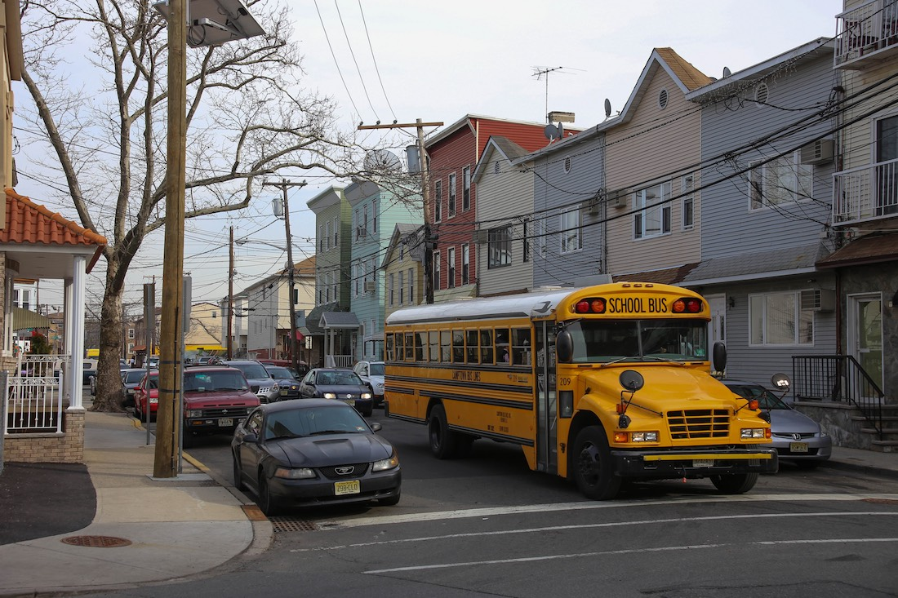
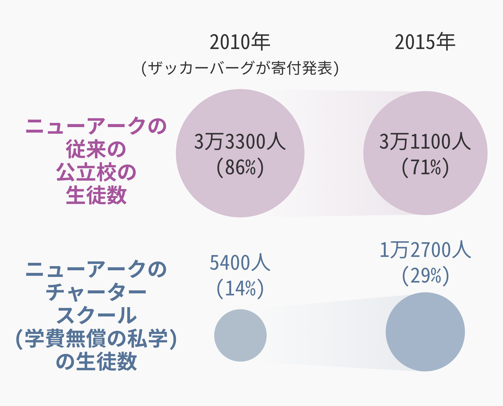
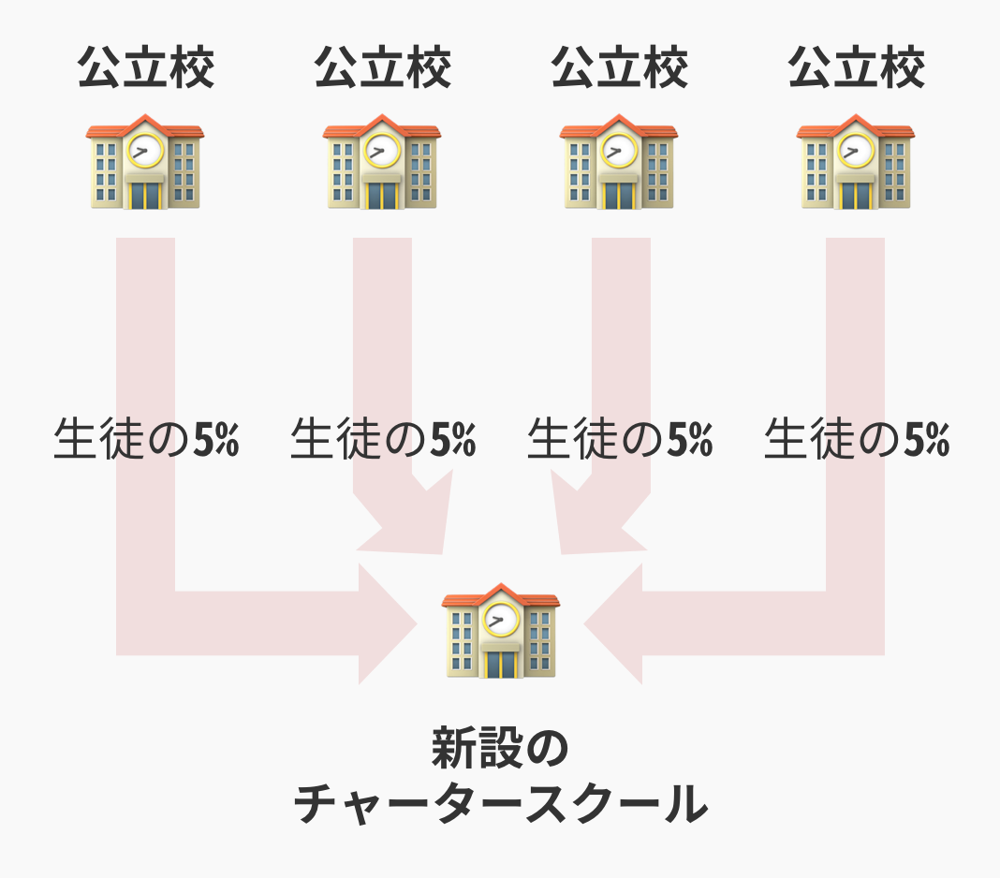
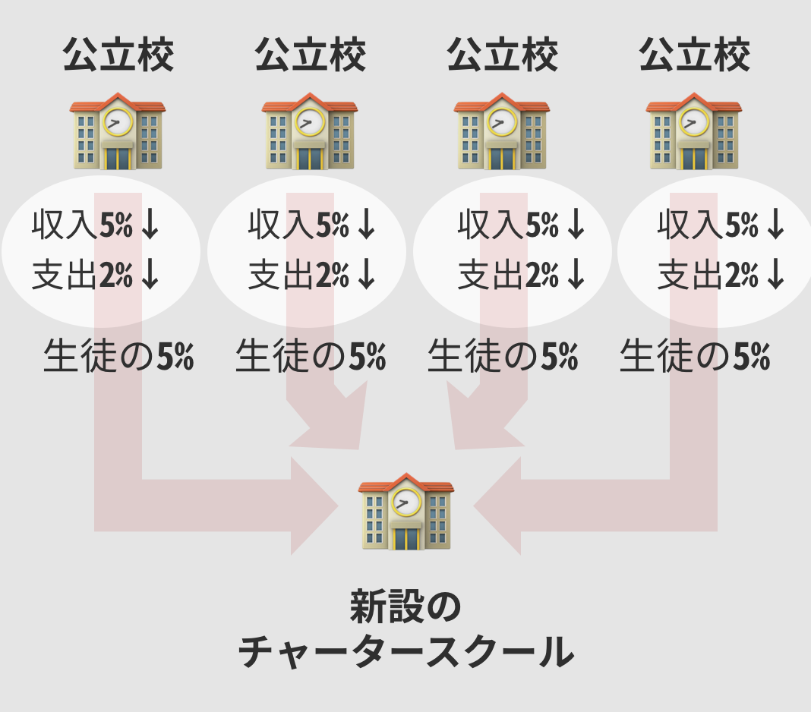

## 第十一章: チャータースクールの闇

ここまで読まれた方は、「チャータースクールは良さそうな取り組みだ」「日本でもやるべきだ」と思ったかもしれない。だがもちろん、チャータースクールは良いことずくめではない。

鋭い読者ならお気づきかもしれないが、ひとつ触れていなかったことがある。

従来の公立校ではなく、チャータースクールに子どもを行かせるには、いったいどうすればいいのだろう。

大前提として、ニューアークのように公立校とチャータースクールが混在する都市だと、子どもはデフォルトでは近所の公立校に通う。チャータースクールは公設とはいえ「民間の実験校」であるから、子どもが自動的にチャータースクールに入学することはない。子どもが、自動的に実験台になってしまったらひとたまりもない。

チャータースクールに子どもを行かせるには、親が申請することが必要になる。もちろん人数制限があるので、ほとんどのチャータースクールは抽選制だ。そして、実はここがチャータースクールの一番の問題点なのである。

### 優良なチャータースクールが必要な子ほど、チャータースクールに行かない問題

さきほどのスパーク校のように、ニューアークには優良なチャータースクールがいくつかある。ソーシャルワーカーが多くいるチャータースクールは、難しい家庭の子どもにとっては貴重な存在だ。

しかし、そんなチャータースクールに入学するには、親がその存在を知らなければいけない。説明会などに足を運ぶ必要もあるし、入学申請の方法もそれぞれの学校で違うことも多い。公立校と違い、学校が徒歩通学圏内にあるとは限らないので、親が車で送迎をしないといけないことも多い。

つまり、いろいろと親にとって面倒くさいのである。

そして、難しい家庭の子の親ほど、そのような面倒くさいプロセスを避け、「デフォルト設定」である近所の公立校を選びがちになる。結果として、優良なチャータースクールが必要な子ほど、チャータースクールに行かない問題が発生してしまうのだ。

<figure>
  
  <figcaption>ニューアークのスクールバス。 By Paul Sableman [<a href="http://creativecommons.org/licenses/by/2.0">CC BY 2.0</a>], <a href="https://flic.kr/p/mR5E9r">via Flickr</a></figcaption>
</figure>

ただ、解決法がないわけではない。ニューアークで展開する優良チャータースクールチェーン「KIPP」は送迎バスを用意し、とくに苦しい家庭を積極的に訪問営業している。

その結果、ニューアークのKIPP校の生徒の[7割は](#MI2FSCyI)、貧困ライン以下で暮らす子たち、すなわち優良校が最も必要な子たちになっている。

また、ニューアークはチャータースクールの入学申請を専用ウェブサイトを用いて[一本化した](#T6JtuAkP)。それぞれの学校に別々に申請を出す必要が無くなり、親にとっての障壁が下がったのだ。

### 悪いプレーヤーの規制は必要

似たような話で、優良なチャータースクールが必要な子ほど、チャータースクールに「嫌われる」問題もある。

チャータースクールの宣伝材料のひとつは「その学校に行くことで、生徒がどれだけ成長したか」である。つまり、「成長が見込みにくい生徒を入れることは、チャータースクールにとってマイナス」というわけだ。

とくに、発達障害などで特別支援学級にいる子たちは、チャータースクールに入学を断られることも多い。

それのせいで、全学校がチャータースクール化したニューオーリンズでは、どの高校にも難癖をつけられて入学できなくなる学生が[続出した](https://www.nytimes.com/2015/08/23/opinion/sunday/the-myth-of-the-new-orleans-school-makeover.html)。ニューオーリンズではやがて政府が介入し、「どんな難しい子でも、抽選に通ったら入学させないと許さん」と[規制が強化された](http://www.politico.com/magazine/story/2017/01/what-new-orleans-can-teach-betsy-devos-about-charter-schools-214610)。

また、ニューアークよりもさらに貧しい都市・デトロイトでは、チャータースクールの[8割](https://www.nytimes.com/2016/06/29/us/for-detroits-children-more-school-choice-but-not-better-schools.html)が営利目的で規制も緩い。その結果、情報弱者の親を騙して生徒を集め、過剰なIT化とアウトソーシングでコストを極限まで削減し、荒稼ぎするチャータースクールが多くなった。現在、デトロイトのチャータースクールの質は[アメリカの中でも悪いことで](https://www.nytimes.com/2016/06/29/us/for-detroits-children-more-school-choice-but-not-better-schools.html)知られている。

チャータースクールの良さは規制が緩いところだが、なんでも自由にさせておけば良いという話ではないのだ。

余談だが、多くの識者は、トランプ政権下で新しくアメリカ教育長官になった[デボス氏](http://www.huffingtonpost.jp/2017/02/07/betsy-devos_n_14636686.html)に警鐘を鳴らしている。彼女はチャータースクール信者で、過剰とも言える[規制撤廃](http://www.politico.com/magazine/story/2017/01/what-new-orleans-can-teach-betsy-devos-about-charter-schools-214610)を支持しているからだ。

ちなみに全米平均で見ると、チャータースクールのパフォーマンスは、公立校のそれとあまり[変わらない](https://goo.gl/B7k68n#vFjfcLdq)。

### 日本における学校選択制

ちなみに、日本でも2000年代に公立校のあいだで学校選択制が流行った。しかし、実情に即しておらず見直し・廃止する自治体が[続出した](http://resemom.jp/article/2012/05/23/7838.html)。そもそも通学圏内にある公立校の数が限られていたり、生徒数の急増・急減に現場が翻弄されたり、地域のつながりが弱まったりした、という理由が挙げられた。

### チャータースクールの、もうひとつの問題

チャータースクールにはもう一つ致命的な問題がある。

さきほども触れたが、ニューアークでは2010年から2015年にかけて、生徒が公立校からチャータースクールへと流出した。

<figure>
  
</figure>

じつは、この流出の仕組みが問題なのである。

かりに公立校が4つあったとして、それぞれから5%の生徒が新設のチャータースクールに流出したとする。

<figure>
  
</figure>

公立校が使える予算、すなわち収入は生徒数に比例して学区から配分される。よって、学校の収入は5%減る。では、それぞれの学校の支出はいくら減るだろうか?

答えは、大抵の場合「5%以下」である。

生徒が5%減って、たとえばクラスの人数が35人から33人になっても、先生の数は変わらないから人件費はそのままだ。校舎の維持費も変わらないし、他にも据え置きになる経費は多い。公立校は生徒数が減ったとき、支出を同じ割合で減らすのは[難しいのだ](http://www.latimes.com/opinion/op-ed/la-oe-roza-charter-fiscal-impact-public-20160519-snap-story.html)。

<figure>
  
</figure>

収入の減少幅が支出の減少幅より大きいと、当然学校は赤字になる。つまり、チャータースクールが公立校の生徒を奪えば奪うほど、公立校の経営が厳しくなるのだ。

もちろん、ニューオーリンズのように全学校をチャータースクールにしてしまえばこの問題は発生しない。しかし、ニューオーリンズがそれを成し遂げたられたのは、ハリケーンでほとんどの学校が破壊され、公立学区の教職員が全員クビになったからだ。

ニューアークや多くの都市にとって、全校チャータースクール化は現実的な話ではない。ニューオーリンズでは、政治的に不可能なことを、自然災害が可能にしたのだ。

### 日本における学校統廃合

ちなみに日本では、チャータースクールのせいではなく、少子化のせいで生徒数が[減っている](https://thepage.jp/detail/20150204-00000010-wordleaf?page=1)。

生徒数が減れば、学校も閉鎖・統合されてゆく。すると教育予算が減る。これは日本の財政にとって良い話だから、財務省は「もっと学校を統廃合するべきだ」と主張した。

ふだんは少人数学級を支持する文科省も、今回は一定の理解を示した。「あまりにも一学校あたりの生徒数が減ると、集団での学習が成り立たなくなるから、その場合は学校を統合していくべきだ」と考えたのだ。

そして2015年、文科省が約60年ぶりに学校統廃合のガイドラインを[新しくした](http://www.mext.go.jp/a_menu/shotou/shugaku/detail/1354768.htm)。このガイドラインにしたがって、今後も学校統廃合は進んでいくだろう。

ただ、地域の存続に学校が必要だったり、統合先の学校が遠すぎて通学が難しくなる可能性もある。よって、「無理な統廃合はしないように」という文科省の配慮が[ガイドラインには記されている](https://thepage.jp/detail/20150204-00000010-wordleaf?page=1)。
