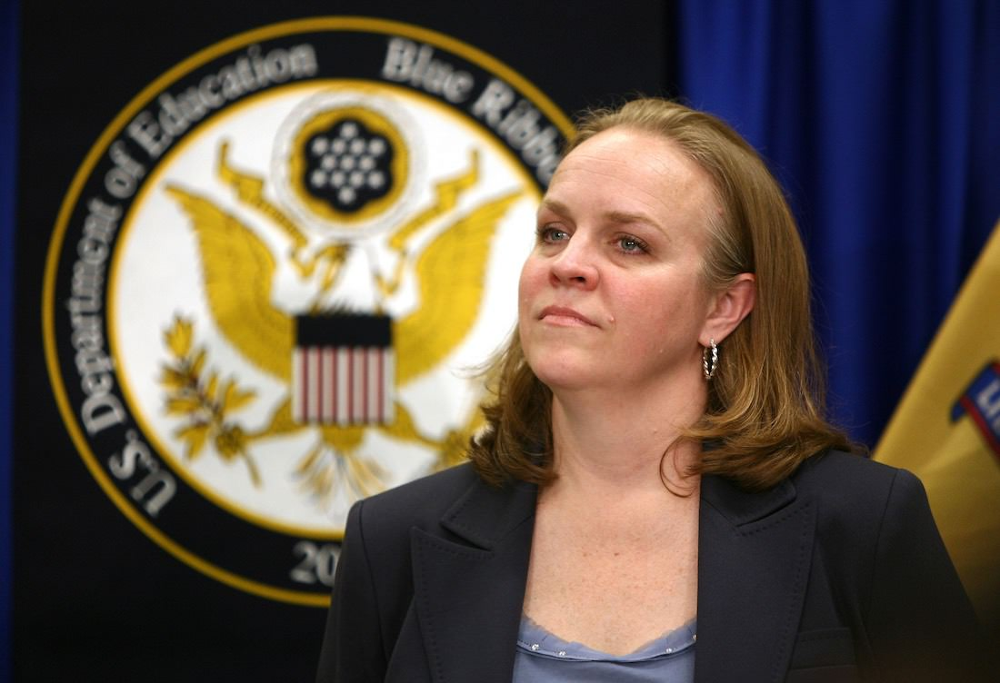

## 第十一章: チャータースクールの闇

ここまで読まれた方は、「チャータースクールは良さそうな取り組みだ」と思ったかもしれない。ここからは、チャータースクールの悪い面について語る。

鋭い読者ならお気づきかもしれないが、ひとつ触れていなかったことがある。従来の公立校ではなく、チャータースクールに子どもを行かせるには、いったいどうすればいいのだろう。

大前提として、ニューアークのように公立校とチャータースクールが混在する都市だと、子どもはデフォルトでは近所の公立校に通う。チャータースクールは公設とはいえ「民間の実験校」であるから、子どもが自動的にチャータースクールに入学することはない。

つまり、チャータースクールに子どもを行かせるには親の申請が必要になる。もちろん人数制限があるので、ほとんどのチャータースクールは抽選制だ。そして、じつはここがチャータースクールの一番の問題点なのである。

### 優良なチャータースクールが必要な子ほど、チャータースクールに行かない問題

さきほどのスパーク校のように、ニューアークには優良なチャータースクールがいくつかある。ソーシャルワーカーが多くいるチャータースクールは、難しい家庭の子どもにとってはありがたい。

しかし、そんなチャータースクールに入学するには、親がその存在を知らなければいけない。説明会などに足を運ぶ必要もあるし、入学申請の方法もそれぞれの学校で違うことも多い。公立校と違い、徒歩通学圏内にあるとは限らないので、親が送迎をしないといけないことも多い。つまり、いろいろと親にとって面倒くさいのである。

そして、難しい家庭の子の親ほど、そのような面倒くさいプロセスを避け、「デフォルト設定」である近所の公立校を選びがちになる。結果として、優良なチャータースクールが必要な子ほど、チャータースクールに行かない問題が発生してしまうのだ。

ただ、解決法がないわけではない。スパーク校をはじめとするチェーン校「KIPP」は送迎バスを用意し、とくに苦しい家庭に向けて積極的に営業をかけたりしている。その結果、ニューアークにあるKIPP校の生徒の[7割は](#MI2FSCyI)、貧困ライン以下で暮らす子たちになっている。

また、ニューアークはのちにチャータースクールの入学申請をオンラインで[一本化した](#T6JtuAkP)。それぞれの学校に別々に申請を出す必要が無くなり、親にとっての障壁が下がったのだ。

### 悪いプレーヤーの規制は必要

似たような話で、優良なチャータースクールが必要な子ほど、チャータースクールに「嫌われる」問題もある。

チャータースクールの宣伝材料のひとつは「その学校に行くことで、生徒がどれだけ成長したか」である。つまり、「成長が見込みにくい生徒を入れることは、チャータースクールにとってマイナス」というわけだ。

とくに、特別支援学級に入らないといけない子たちは、チャータースクールに入学を断られることも多い。それのせいで、全部の学校がチャータースクール化したニューオーリンズでは、どの高校にも難癖をつけられて入れてもらえない学生が[続出した](https://www.nytimes.com/2015/08/23/opinion/sunday/the-myth-of-the-new-orleans-school-makeover.html)。ニューオーリンズではやがて政府が介入し、「どんな難しい子でも、抽選に通ったら入学させないと許さん」と[規制が強化された](http://www.politico.com/magazine/story/2017/01/what-new-orleans-can-teach-betsy-devos-about-charter-schools-214610)。

また、ニューアークよりもさらに貧しい都市・デトロイトでは、チャータースクールの[8割](https://www.nytimes.com/2016/06/29/us/for-detroits-children-more-school-choice-but-not-better-schools.html)が営利目的で規制も緩い。それだからか、情報弱者の親を騙して生徒を集め、過剰なIT化とアウトソーシングでコストを極限まで削減し、荒稼ぎするチャータースクールが多くなった。現在、デトロイトのチャータースクールの質は[全米最悪レベル](https://www.nytimes.com/2016/06/29/us/for-detroits-children-more-school-choice-but-not-better-schools.html)と言われている。

チャータースクールの良さは規制が緩いところだが、なんでも自由にさせておけば良いという話ではないのだ。

### 日本における学校選択制

ちなみに、日本でも2000年代に学校選択制が流行ったが、実情に即しておらず見直し・廃止する自治体が[続出した](http://resemom.jp/article/2012/05/23/7838.html)。そもそも通学圏内にある学校の数が限られていたり、生徒数の急増・急減に現場が翻弄されたり、地域のつながりが弱まったりするという理由が挙げられた。

### チャータースクールの、もうひとつの問題

チャータースクールにはもう一つ致命的な問題がある。それは、ニューアークの新任学区長・アンダーソンの進退を左右する問題だった。

<figure>
  
  <figcaption>
    キャミー・アンダーソン学区長。(写真は<a href="http://www.state.nj.us/governor/media/">州知事の公式メディアページ</a>より。2011年5月4日。By <a href="http://www.state.nj.us/governor/media/photos/2011/20110504.shtml">Governor's Office/Tim Larsen</a>)
  </figcaption>
</figure>

