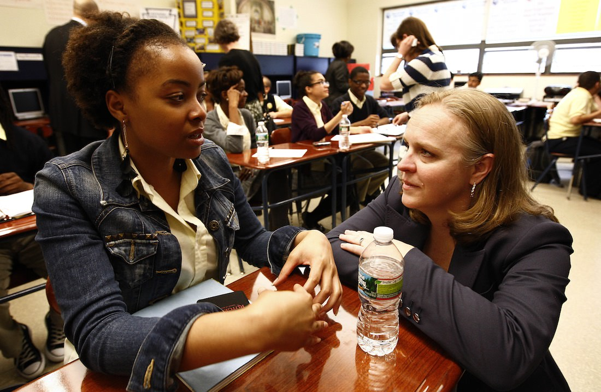
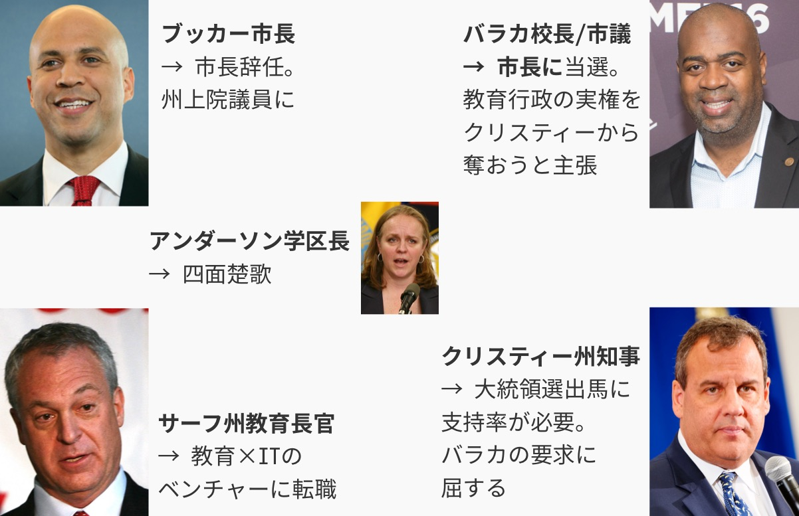

## 第十二章: 四面楚歌

チャータースクールが公立校の生徒を奪えば奪うほど、公立校の経営が厳しくなる。ニューアークの新任学区長のアンダーソンは、まさにその問題と格闘していた。

<figure>
  
  <figcaption>
    キャミー・アンダーソン学区長。(写真は<a href="http://www.state.nj.us/governor/media/">州知事の公式メディアページ</a>より。2011年5月4日。By <a href="http://www.state.nj.us/governor/media/photos/2011/20110504.shtml">Governor's Office/Tim Larsen</a>)
  </figcaption>
</figure>

学区に属さないチャータースクールは、学区長のアンダーソンの管轄ではない。アンダーソンができるのは、チャーター校拡大の悪影響から公立校を守ることだけだ。

### リニュースクール

2012年に入ると、生徒流出による公立校の赤字が止まらなくなり、学校を統廃合しなければ立ち行かなくなった。アンダーソンは苦心の末、最も学力の低い12の幼・小・中一貫校を閉鎖し、あたらしく8つの学校を[作った](https://goo.gl/B7k68n#FwM8JJB2)。それらは「リニュースクール」と呼ばれ、アンダーソンのお眼鏡にかなった校長と先生が配属された。

もちろんのこと、住民は大いに[反対した](https://goo.gl/B7k68n#J1kRbrX2)。

「リニュースクール」はチャータースクールではなく公立校なので、「教育の民営化」ではない。しかし、学校の数は4つ減るので、そのぶん教育事務局の雇用は減る。また、今までより通学距離が長くなる生徒が多く、「登下校中、ギャングにうちの子が襲われたら責任を取れるのか」という親の声が[後を絶たなかった](https://goo.gl/B7k68n#W2xLLxS3)。

なかには、アンダーソンと住民のあいだでこんな[会話もあった](https://goo.gl/B7k68n#65i9mdir)。

— みなさんの懸念はわかります。しかし、閉鎖する12校はどれも上手くいってません。新しくつくる8校の「リニュースクール」では、お子さんにとってより良い教育を約束します。 
— アンダーソンさん、うちの娘は閉鎖される予定の学校に通っていますが、それでも良い成績をとっていますよ。たしかに悪い先生が多いですが、うちの娘が悪い先生のクラスに配属されたと知ったら、わたしがクレームをつけてほかの先生に変えてもらってるんです。

これも、学校選択制が機能しない理由のひとつだ。教育熱心な親には、モンスターペアレントに変身するという技がある。そして子どもの先生を無理やり変えてもらうことによって、悪い学校のマイナス面を最小化することができるのだ。それができれば学校選択制など必要ない。いっぽうで教育熱心でない親は、そもそも学校を選択する気にならない。

また、「ザッカーバーグがあんなにお金を寄付したのに、なぜ予算を削る必要があるのだ」という意見もあった。寄付金の多くは「仕組み改革」とチャータースクールに使われ、学区の予算には回らなかったのだが、それがさらに[住民を怒らせた](https://goo.gl/B7k68n#roC7AGnG)。

### リニュースクールへの期待

最終的に、アンダーソンは住民の反対を押し切って12校を閉鎖し、8校の「リニュースクール」をスタートさせた。

リニュースクールの校長や教員たちは、アンダーソンの期待に応えようと歯を食いしばって頑張った。

チャータースクールと違い、公立校のリニュースクールにはソーシャルワーカーをたくさん雇う余裕はない。その代わり、トラウマを抱えた生徒がリラックスできるようにと、先生が放課後にヨガやダンスの授業を[教えたりした](https://goo.gl/B7k68n#2wFpPfIJ)。

また、リニュースクールはカリキュラムを一新し、同時に教員研修を充実させた。新しく配置された教員支援員たちが、先生たちの授業を観察し、適切なフィードバックを[与えた](https://goo.gl/B7k68n#8yJBcXdd)。校長も、先生を評価する際には建設的な意見を言うように[心がけた](https://goo.gl/B7k68n#fd9xmQpz)。

誰がどう見ても、リニュースクールはその前身より「良い学校」になっていて、[異論の余地はなかった](https://goo.gl/B7k68n#fd9xmQpz)。

### 良い先生に、良い校長を

結果を出さなければというプレッシャーから、リニュースクールではたらく先生の残業時間は増えていった。しかし、ニューアークの公立校では、残業代は時間換算ではなく一律で支払われていた。つまり、リニュースクールで働く先生は、残業が少ない他の学校の先生よりも、給料面で[割を食っていたのだ](https://goo.gl/B7k68n#LiDsN8pL)。

それでも、リニュースクールで働く先生たちは離れようとしなかった。とある先生は[こう言う](https://goo.gl/B7k68n#LiDsN8pL)。

— ニューアークで30年教師をやっていて、こんなに上司(校長)や同僚に恵まれたのは初めてです。今まで働いてきた学校では、校長にいじめられたり、教員研修もあってないようなことが多すぎました。

[とある研究](https://goo.gl/B7k68n#LiDsN8pL)によると、先生に「良い校長がいて、充実した教員支援がある学校」か「良い結果を出せばボーナスが出る学校」のどちらで働きたいか訪ねたところ、「良い校長がいて、充実した教員支援がある学校」を選ぶ先生が圧倒的に多かったという。また、先生へのボーナスの有無は、生徒の学力向上と相関は無いことが[明らかになっている](https://goo.gl/B7k68n#LiDsN8pL)。

筆者の友人にも、アメリカで先生をしている日本人の方がいる。その人の愚痴をたまに聞いてあげたのだが、給料が低いという愚痴よりも、上司(校長)の愚痴を聞くことのほうが圧倒的に多かった。

ザッカーバーグは「良い先生に、良い給料を」を掲げて1億ドルの寄付をした。しかし、「良い先生に、良い校長を」のほうが効果的ならば、ザッカーバーグの寄付には意味があったのだろうか?

### 日本における先生の残業代

もちろん、「良い先生に、良い校長を」のほうが効果的だからといって、残業代を支払わなくてもいいというのは間違っている。「やりがい搾取」のブラック企業とやっていることは同じだ。

ちなみに日本は、先進国(OECD)のなかで教員の平均勤務時間が[最も長い](http://www.nikkei.com/article/DGXNASDG25037_V20C14A6000000/)。そのぶん残業代が出れば少しはマシだが、ニューアークと同じく、日本の教員の残業はすべて「サービス残業」なのである。日本の公務員は残業代を貰えるにもかかわらずだ。

[どうしてそうなったのか](https://goo.gl/B7k68n#h2CIT8Zc)。日本では1960年代に、教員が残業代をめぐって訴訟を起こし、行政側が次々と敗訴した。そこで政府は1971年に法律を定めたのだが、内容は「残業代は支払わない。そのかわり、当時の教員による月の平均残業時間と同じ『8時間』分の給料を、全員に一律に支払う」というものだった。そして、これを教員側は受け入れてしまった。ニューアークのリニュースクールと同じだ。

その後、残業時間は増加の一途をたどった。文科省が約40年後の2006年に再調査を行ったところ、平均残業時間は月『42時間』と5倍以上になっていた。では一律に支払われる金額も5倍以上になったかというと、2~3兆円の予算がかかる見込みということで、「ごめんなさい、払えません」ということに[なったのだ](https://goo.gl/B7k68n#h2CIT8Zc)。

### タイタニック

<figure>
  
  <figcaption>
    ニューアークの生徒と話すキャミー・アンダーソン学区長。(写真は<a href="http://www.state.nj.us/governor/media/">州知事の公式メディアページ</a>より。2011年5月4日。By <a href="http://www.state.nj.us/governor/media/photos/2011/20110504.shtml">Governor's Office/Tim Larsen</a>)
  </figcaption>
</figure>

つぎつぎと押し寄せる公立校閉鎖の波は、アンダーソンを[疲労困憊させていく](https://goo.gl/B7k68n#)。

どうすれば、公立校に取り残された子たちにも良い教育を授けられるか。どうすれば、学校の閉鎖が地域の衰退につながらないようにできるか。どうすれば、先生のクビが次々と切られるなか、良い先生が学区を脱出しないようにできるか。どうすれば、長期的に公立校の財政を安定させることができるか。どうすれば、本当に支援が必要な子をチャータースクールに引き渡せるか。アンダーソンは全てに答えを出さないと[いけなかった](https://goo.gl/B7k68n#ukvTk0md)。

さらに、「教師をクビにするなら、『若い』順からクビにしなければいけない」という法律が守られたせいで、公立校が閉鎖されても先生をクビにはできなかった。学校で雑用をこなすだけの先生の数は、初年度の80人から2年で270人まで増えた。それらの先生に支払う金額は年間2200万ドルを[超えてしまった](http://www.nj.com/essex/index.ssf/2015/03/newark_school_board_tackles_teacher_pay_charter_sc.html)。

ニューアークの公立校は生徒の流出という氷にぶつかり、ゆっくりと沈んでいく。あるとき、アンダーソンはクリスティー知事に[こう伝えたという](https://goo.gl/B7k68n#NVw0PEVh)。

— わたしがニューアークに来たのは、タイタニックのデッキの椅子を並び替えたかったからじゃないんです。

アンダーソンは当初、公立校を閉鎖する際、その都度住民に向けて集会を開いていた。しかし、そのニュースを政治的利用したい反ブッカー市長・クリスティー知事派の活動家たちが邪魔をした。活動家たちはアンダーソンに罵声を浴びせ、住民たちが乗じて一時は暴動騒ぎに[発展した](https://goo.gl/B7k68n#J1kRbrX2)。

それに滅入ったアンダーソンは次第に住民の前から姿を消し、公立校は静かに閉鎖されていった。それは「アウトサイダーが住民を無視して好き勝手やっている」という脚本に沿うもので、住民の不満はさらに増し、負のスパイラルが[止まらなくなった](https://goo.gl/B7k68n#0eNJ9lHg)。

### 学力テストの結果は

犠牲を払っても、成果を見せれば住民はついてくる。そう信じていたアンダーソンは、州の学力テストの結果が出たとき、絶望の淵に[追いやられた](https://goo.gl/B7k68n#4KjJ3szG)。

あれだけ先生が努力したリニュースクールの8校は、それ以外のニューアークの学校より学力テストの点数が悪かった。さらに学区全体の平均点は、アンダーソンが来てからの2年間で、すべての学年において国語・算数ともに[下がったのである](https://goo.gl/B7k68n#XtBrb0TV)。

どうしてそうなったかは分からない。アンダーソンが来てから学校の環境がよくなったことは、疑う余地はない。しかし、環境が良くなったからとはいえ、それが2年間で「学力テストの点数アップ」という形に繋がるとは[限らないということだ](https://goo.gl/B7k68n#JKdf5GdW)。生徒も先生も、新しい環境に慣れるのには時間がかかるのだから。

アンダーソン自身は、「学力テストが、生徒の学力を正しく測るよう設計されていないんだ」と[言い訳をした](https://goo.gl/B7k68n#8lLBHGX9)。

これは、間違った批判ではない。アメリカではブッシュ前大統領の時代から、学力テストの点数が学校閉鎖の基準になることが[多くなった](https://en.wikipedia.org/wiki/No_Child_Left_Behind_Act)。すると学校はなんとしても生徒に点数を取らせるべく、教室で教えるのはテスト対策一辺倒になり、芸術教育や課題型の授業が削られたりしてしまった。

日本で2007年に復活した学力テストでも、最近は学校内で過去問対策が行われるようになり、前文科相がそれを嘆いて「本末転倒だ」と[コメントしたこともある](http://mainichi.jp/articles/20160421/k00/00e/040/205000c)。筆者に言わせれば、それは制度を設計した文科省の責任だと思うのだが。

ふつうの自由競争のもとでは、利益を最大化することを目的にすればいい。しかし学校間の競争となると、学力テストの点数を最大化することを目的にすることで、失われるものが多すぎる。教育の質を測る物差しとしては、学力テストは及第点を取れないし、他に使える物差しも見当たらない。

「成果を出せば住民はついてくる」と考えたアンダーソンは、成果が望ましくないと分かったとたん「成果は測りにくい」と主張したのだ。もちろん、それを聞いた住民はついてこなかった。

### 四面楚歌

2013年10月。改革の旗振り役立ったブッカーはニューアーク市長の座を退き、ニュージャージー州の上院議員に[なった](https://en.wikipedia.org/wiki/Cory_Booker)。将来的に、大統領の椅子を狙うための動きだった。「ニューアークはどうなるんだ」とアンダーソンは心配したが、ブッカーは「サーフ教育長官とクリスティー知事が実権を握っているから大丈夫」と[安心させた](https://goo.gl/B7k68n#eAGs9Blx)。その後しばらく、ニューアーク市長は暫定の人間が務めた。

2014年3月。ブッカーやクリスティーの右腕で、チャータースクールの推進役だったサーフ教育長官が、マンハッタンにある教育×ITのベンチャーに[転職した](https://goo.gl/B7k68n#hKalJzuZ)。アンダーソンにとって、残る味方はクリスティー知事だけになった。

2014年5月。ブッカーのライバルだったバラカ校長・市議が、なんとニューアークの市長に当選した。「教育を取り返す」という掛け声のもと、クリスティー知事からニューアークの教育行政における実権を奪い返そうと[主張した](https://goo.gl/B7k68n#3J6xxPuK)。

クリスティーは2016年の大統領選に出馬する予定で、そのために支持率をキープしないといけなかった。だが、その頃に暴かれたスキャンダルのせいで彼の人気は[下降気味だった](https://goo.gl/B7k68n#T1dqthSz)。ゆえに、住民から絶大な人気を誇るバラカ市長は無視できず、2015年の夏、クリスティーは教育行政の実権をニューアーク市に[明け渡した](https://goo.gl/B7k68n#SKTp2CLh)。

これによってクリスティーではなく、住民の代表である教育委員会が、学区長を任命することができるようになった。

<figure>
  
</figure>

クリスティーは、アンダーソンに[引導を渡した](https://goo.gl/B7k68n#SKTp2CLh)。

— 3時間やる。自ら辞任するか、クビを言い渡されるか、好きな方を選んでくれ。

アンダーソン学区長は、[辞任を選んだ](https://goo.gl/B7k68n#SKTp2CLh)。

ザッカーバーグのヒーロー初体験は、こうして幕を閉じた。
