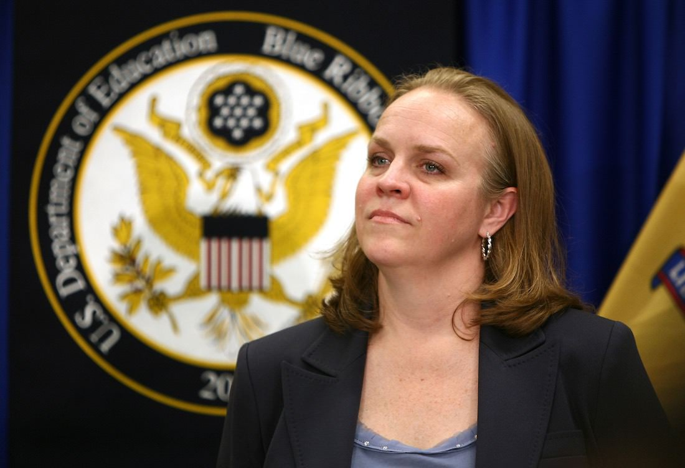

## 第十二章: 四面楚歌

チャータースクールが公立校の生徒を奪えば奪うほど、公立校の経営が厳しくなる。ニューアークの新任学区長のアンダーソンは、まさにその問題と格闘していた。

<figure>
  
  <figcaption>
    キャミー・アンダーソン学区長。(写真は<a href="http://www.state.nj.us/governor/media/">州知事の公式メディアページ</a>より。2011年5月4日。By <a href="http://www.state.nj.us/governor/media/photos/2011/20110504.shtml">Governor's Office/Tim Larsen</a>)
  </figcaption>
</figure>

学区に属さないチャータースクールは、学区長のアンダーソンの管轄ではない。アンダーソンができるのは、チャーター校拡大の悪影響から公立校を守ることだけだ。

### リニュースクール

2012年に入ると、生徒流出による公立校の赤字が止まらなくなり、学校を統廃合しなければ立ち行かなくなった。アンダーソンは苦心の末、最も学力の低い12の幼・小・中一貫校を閉鎖し、あたらしく8つの学校を[作った](#)。それらは「リニュースクール」と呼ばれ、すべてに優秀な校長と先生を配属した。

もちろんのこと、住民は大いに[反対した](#)。

「リニュースクール」はチャータースクールではなく公立校なので、「教育の民営化」ではない。しかし、学校の数は4つ減るので、そのぶん教育事務局の雇用は減る。また、今までより通学距離が長くなる生徒が多く、「登下校中、ギャングの縄張りにうちの子が足を踏み入れたら責任取れるのか」という親の声が[後をたたなかった](#)。

なかには、アンダーソンと住民のあいだでこんな[会話もあった](#)。

— みなさんの懸念はわかります。しかし、閉鎖する12校はどれも上手くいってません。新しくつくる8校の「リニュースクール」では、お子さんにとってより良い教育を約束します。 
— アンダーソンさん、うちの娘は閉鎖される予定の学校に通っていますが、それでも良い成績をとっていますよ。たしかに悪い先生が多いですが、うちの娘が悪い先生のクラスに配属されたと知ったら、わたしがクレームをつけてほかの先生に変えてもらってるんです。

学校選択制が機能しない理由は、ここでも見られる。教育熱心な親は、モンスターペアレントに変身し、子どもの先生を無理やり変えてもらうことによって、悪い学校のマイナス面を最小化することができるのだ。それができれば学校選択制など必要ない。いっぽうで教育熱心でない親は、そもそも学校を選択する気にならない。

また、「ザッカーバーグがあんなにお金を寄付したのに、なぜ予算を削る必要があるのだ」という意見もあった。寄付金の多くは「仕組み改革」とチャータースクールに使われ、学区の予算には回らなかったのだが、それがさらに[住民を怒らせた](#)。

### リニュースクールへの期待

最終的に、アンダーソンは住民の反対を押し切って12校を閉鎖し、8校の「リニュースクール」をスタートさせた。

リニュースクールの校長や教員たちは、アンダーソンの期待に応えようと歯を食いしばって頑張った。

チャータースクールと違い、公立校のリニュースクールにはソーシャルワーカーをたくさん雇う余裕はない。その代わり、トラウマを抱えた生徒がリラックスできるようにと、先生が放課後にヨガやダンスの授業を[教えたりした](#)。

また、リニュースクールはカリキュラムを一新し、同時に教員研修を充実させた。校長も、先生を評価する際には建設的な意見を言うように[心がけた](#)。

誰がどう見ても、リニュースクールはその前身より「良い学校」になっていて、[異論の余地はなかった](#)。

### 良い先生に、良い校長を

結果を出さなければというプレッシャーから、リニュースクールではたらく先生の残業時間は増えていった。しかし、ニューアークの公立校では、残業代は時間換算ではなく一律で支払われていた。つまり、リニュースクールで働く先生は、残業が少ない他の学校の先生よりも、給料面で[割を食っていたのだ](#)。

それでも、リニュースクールで働く先生たちは離れようとしなかった。とある先生は[こう言う](#)。

— ニューアークで30年教師をやっていて、こんなに上司(校長)や同僚に恵まれたのは初めてです。今まで働いてきた学校では、校長にいじめられたり、教員研修もあってないようなことが多すぎました。

[とある研究](#)によると、先生に「良い校長がいて、充実した教員支援がある学校」か「良い結果を出せばボーナスが出る学校」のどちらで働きたいか訪ねたところ、「良い校長がいて、充実した教員支援がある学校」を選ぶ先生が圧倒的に多かったという。また、先生へのボーナスの有無は、生徒の学力向上と相関は無いことが[明らかになっている](#)。

筆者の友人にも、アメリカで先生をしている日本人の方がいる。その人の愚痴をたまに聞いてあげたのだが、給料が低いという愚痴よりも、上司(校長)の愚痴を聞くことのほうが圧倒的に多かった。

ザッカーバーグは「良い先生に、良い給料を」を掲げて1億ドルの寄付をした。しかし、「良い先生に、良い校長を」のほうが効果的ならば、ザッカーバーグの寄付には意味が[あったのだろうか](#)?

### 日本における先生の残業代

もちろん、「良い先生に、良い校長を」のほうが効果的だからといって、残業代を支払わなくてもいいというのは間違っている。

### リニュースクールの結果

Create a diagram of which step each person took (booker became a senator, etc)

