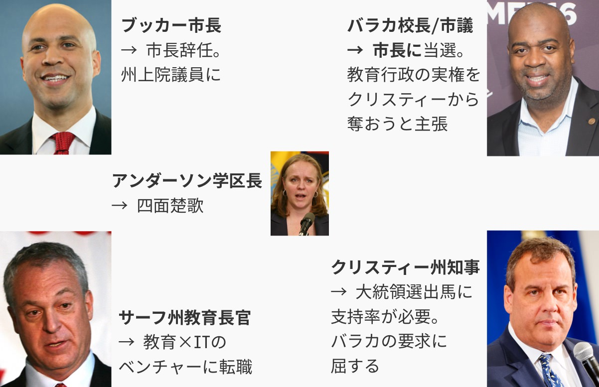
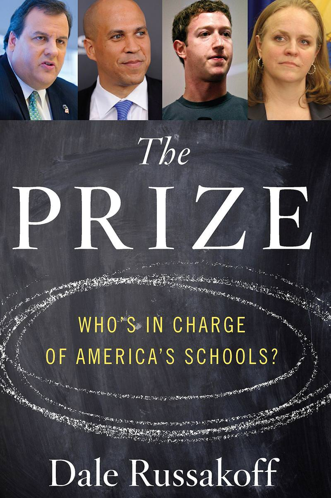

## 第十二章: 四面楚歌

チャータースクールが公立校の生徒を奪えば奪うほど、公立校の経営が厳しくなる。ニューアーク新任学区長のアンダーソンは、まさにその問題と格闘していた。

<figure>
  
  <figcaption>
    キャミー・アンダーソン学区長。(写真は<a href="http://www.state.nj.us/governor/media/">州知事の公式メディアページ</a>より。2011年5月4日。By <a href="http://www.state.nj.us/governor/media/photos/2011/20110504.shtml">Governor's Office/Tim Larsen</a>)
  </figcaption>
</figure>

学区に属さないチャータースクールは、学区長のアンダーソンの管轄ではない。アンダーソンができるのは、チャーター校拡大の悪影響から公立校を守ることだけだ。

### リニュースクール

2012年に入ると、生徒流出による公立校の赤字が止まらなくなり、学校を統廃合しなければ立ち行かなくなった。

アンダーソンは苦心の末、最も学力の低い12の公立校を閉鎖し、あたらしく8つの公立校を[作った](https://goo.gl/B7k68n#FwM8JJB2)。それらは「リニュースクール」と呼ばれ、アンダーソンのお眼鏡にかなった校長と先生が配属された。

もちろんのこと、住民は大いに[反対した](https://goo.gl/B7k68n#J1kRbrX2)。

「リニュースクール」はチャータースクールではなく公立校なので、「教育の民営化」という反対は無かった。しかし、学校の数は4つ減るので、そのぶん教育事務局の雇用は減る。また、今までより通学距離が長くなる生徒が多く、「登下校中、ギャングにうちの子が襲われたら責任を取れるのか」という親の声が[後を絶たなかった](https://goo.gl/B7k68n#W2xLLxS3)。

なかには、アンダーソンと住民のあいだでこんな[会話もあった](https://goo.gl/B7k68n#65i9mdir)。

— みなさんの懸念はわかります。しかし、閉鎖する12校はどれも上手くいってません。新しくつくる8校の「リニュースクール」では、お子さんにとってより良い教育を約束します。 
— アンダーソンさん、うちの娘は閉鎖される予定の学校に通っていますが、それでも良い成績をとっていますよ。たしかに、悪い先生が多いです。だから、うちの娘が悪い先生のクラスに配属されたと知ったら、わたしがクレームをつけてほかの先生に変えてもらってるんです。

これも、学校選択制が機能しない理由のひとつだ。

教育熱心な親には、「モンスターペアレントに変身する」という裏技がある。そして、子どもの先生を無理やり変えてもらうことにより、低迷する学校の悪影響を避けることができるのだ。そうすれば、べつに学校選択制など必要ない。他方で、教育熱心でない親は、そもそも学校を選択する気にならない。

アンダーソンに寄せられた意見には、「ザッカーバーグがあんなにお金を寄付したのに、なぜ予算を削る必要があるのだ」という指摘もあった。寄付金の多くは「仕組み改革」とチャータースクールに使われ、学区の予算には回らなかったのだが、それがさらに[住民を怒らせた](https://goo.gl/B7k68n#roC7AGnG)。

### リニュースクールへの期待

最終的に、アンダーソンは住民の反対を押し切って12校を閉鎖し、8校の「リニュースクール」をスタートさせた。

リニュースクールの校長や教員たちは、アンダーソンの期待に応えようと歯を食いしばって頑張った。

チャータースクールと違い、公立校のリニュースクールにはソーシャルワーカーをたくさん雇う余裕はない。その代わり、トラウマを抱えた生徒がリラックスできるようにと、先生が放課後にヨガやダンスを[教えたりした](https://goo.gl/B7k68n#2wFpPfIJ)。

また、リニュースクールはカリキュラムを一新し、同時に教員研修を充実させた。新しく配置された教員支援員たちが、先生たちの授業を観察し、適切なフィードバックを[与えた](https://goo.gl/B7k68n#8yJBcXdd)。校長も、先生を評価する際には建設的な意見を言うように[心がけた](https://goo.gl/B7k68n#fd9xmQpz)。

誰がどう見ても、リニュースクールはその前身より「良い学校」に[なっていた](https://goo.gl/B7k68n#fd9xmQpz)。

### 良い先生に、良い校長を

結果を出さなければというプレッシャーから、リニュースクールで働く先生は、連日遅くまで残って仕事をした。

しかし、ニューアークの公立校では、残業代は時間換算ではなく一律で支払われていた。つまり、リニュースクールで働く先生は、残業が少ない他の学校の先生よりも、給料面で[割を食っていたのだ](https://goo.gl/B7k68n#LiDsN8pL)。

それでも、リニュースクールで働く先生たちは文句を言わなかった。とあるリニュースクールの先生は[こう語る](https://goo.gl/B7k68n#LiDsN8pL)。

— ニューアークで30年教師をやっていて、こんなに上司(校長)や同僚に恵まれたのは初めてです。今まで働いてきた学校では、校長にいじめられたり、教員研修もあってないようなことが多すぎました。

[とある研究](https://goo.gl/B7k68n#LiDsN8pL)によると、先生に「良い校長がいて、充実した教員支援がある学校」か「良い結果を出せばボーナスが出る学校」のどちらで働きたいか訪ねたところ、「良い校長がいて、充実した教員支援がある学校」を選ぶ先生が圧倒的に多かったという。

また、先生へのボーナスの有無は、生徒の学力向上と相関は無いことが[明らかになっている](https://goo.gl/B7k68n#LiDsN8pL)。

筆者の友人にも、アメリカで先生をしている日本人の方がいる。その人の愚痴を聞くことがあったが、給料が低いという愚痴よりも、上司(校長)の愚痴を聞くことのほうが圧倒的に多かった。

ザッカーバーグは「良い先生に、良い給料を」という「仕組み改革」を掲げて1億ドルの寄付をした。しかし、「良い先生に、良い校長を」のほうが効果的ならば、ザッカーバーグの寄付には別な使い道があったのではないか。

### 日本における先生の残業代

もちろん、「良い先生に、良い校長を」のほうが効果的だからといって、残業代を支払わなくてもいいというのは間違っている。それなら、「やりがい搾取」が得意技のブラック企業と変わらない。

ちなみに日本は、先進国(OECD)のなかで教員の平均勤務時間が[最も長い](http://www.nikkei.com/article/DGXNASDG25037_V20C14A6000000/)。そのぶん残業代が出れば少しはマシだが、ニューアークと同じく、日本の教員の残業はすべて「サービス残業」なのである。日本の他の公務員は、残業時間に応じた残業代を貰えるにもかかわらずだ。

[どうしてそうなったのか](https://goo.gl/B7k68n#h2CIT8Zc)。

日本では1960年代に、多くの教員が「残業代をもっと払え」と訴訟を起こし、行政側が次々と敗訴した。慌てた政府は、1971年に関連法を通した。

その内容は「残業代は支払わない。そのかわり、当時の教員による月の平均残業時間と同じ『8時間』分の給料を、全員に一律に支払う」というものだった。ニューアークのリニュースクールと似ている。

そして、これを教員側は「不服なし」と受け入れてしまった。

その後、残業時間は増加の一途をたどった。文科省が約40年後の2006年に再調査を行ったところ、平均残業時間は月「42時間」と5倍以上になっていた。

では一律に支払われる残業代も5倍以上になったかというと、そうはならなかった。2~3兆円の予算がかかるため、改正しようにも[財源が足りないのだ](https://goo.gl/B7k68n#h2CIT8Zc)。泣き寝入りとは、まさにこのことである。

### タイタニック

<figure>
  
  <figcaption>
    ニューアークの生徒と話すキャミー・アンダーソン学区長。(写真は<a href="http://www.state.nj.us/governor/media/">州知事の公式メディアページ</a>より。2011年5月4日。By <a href="http://www.state.nj.us/governor/media/photos/2011/20110504.shtml">Governor's Office/Tim Larsen</a>)
  </figcaption>
</figure>

つぎつぎと押し寄せる公立校閉鎖の波は、アンダーソンを[疲労困憊させていく](https://goo.gl/B7k68n#)。

どうすれば、公立校に取り残された子たちにも良い教育を授けられるか。どうすれば、学校の閉鎖が地域の衰退につながらないようにできるか。どうすれば、先生のクビが次々と切られるなか、良い先生を引き止められるか。どうすれば、長期的に公立校の財政を安定させることができるか。どうすれば、本当に支援が必要な子をチャータースクールに引き渡せるか。

アンダーソンは全てに答えを出さないと[いけなかった](https://goo.gl/B7k68n#ukvTk0md)。

前にも触れたが、「教師をクビにするなら、『若い』順からクビにしなければいけない」という法律が守られたせいで、公立校が閉鎖されても先生をクビにはできない。そのせいで「窓際族」になっていた先生の数は、初年度の80人から2年で270人まで増えた。それらの先生に支払う金額は年間2200万ドルを[超えてしまった](http://www.nj.com/essex/index.ssf/2015/03/newark_school_board_tackles_teacher_pay_charter_sc.html)。

ニューアークの公立校は生徒の流出という氷にぶつかり、ゆっくりと沈んでいく。あるとき、アンダーソンはクリスティー知事に[こう伝えたという](https://goo.gl/B7k68n#NVw0PEVh)。

— わたしは、タイタニックのデッキの椅子を並び替えるために、ニューアークに来たんじゃない。

### アウトサイダーが住民を無視して好き勝手やっている

アンダーソンは当初、公立校を閉鎖する際、その都度住民に向けて集会を開いていた。しかし、反ブッカー市長・クリスティー知事派の活動家たちも集会に現れ、そのニュースを政治的利用するために邪魔をした。活動家たちはアンダーソンに罵声を浴びせ、住民たちが乗じて一時は暴動騒ぎに[発展した](https://goo.gl/B7k68n#J1kRbrX2)。

それに滅入ったアンダーソンは次第に住民の前から姿を消し、公立校は静かに閉鎖されていった。それは「アウトサイダーが住民を無視して好き勝手やっている」という脚本に沿うもので、住民の不満はさらに増し、負のスパイラルが[止まらなくなった](https://goo.gl/B7k68n#0eNJ9lHg)。

### 学力テストの結果は

犠牲を払っても、成果を見せれば住民はついてくる。そう信じていたアンダーソンは、州の学力テストの結果が出たとき、絶望の淵に[追いやられた](https://goo.gl/B7k68n#4KjJ3szG)。

あれだけ先生が努力したリニュースクールの8校は、それ以外のニューアークの学校より学力テストの点数が悪かった。さらに学区全体の平均点は、アンダーソンが来てからの2年間で、すべての学年において国語・算数ともに[下がったのである](https://goo.gl/B7k68n#XtBrb0TV)。

どうしてそうなったかは分からなかった。

アンダーソンの到来後、ニューアークの学校環境が良くなったことに疑う余地はない。しかし、環境が良くなったとはいえ、それが2年間で「学力テストの点数アップ」という形に繋がるとは[限らない](https://goo.gl/B7k68n#JKdf5GdW)。生徒も先生も、新しい環境に慣れるのには時間がかかるのだから。

### 学力テストは信頼できるのか

アンダーソン自身は、「学力テストが、生徒の学力を正しく測るよう設計されていないんだ」と[言い訳をした](https://goo.gl/B7k68n#8lLBHGX9)。

「成果を出せば住民はついてくる」と考えたアンダーソンは、成果が望ましくないと分かったとたん「成果は学力テストでは測れない」と主張したのだ。さすがに身勝手極まりなく、住民の心はさらに離れてしまった。

ただ、アンダーソンの批判はあながち間違っていない。

アメリカではブッシュ元大統領の時代から、学力テストの点数が学校閉鎖の基準になることが[多くなった](https://en.wikipedia.org/wiki/No_Child_Left_Behind_Act)。すると学校は、なんとしても生徒に良い点数を取らせるべく、教室で教えるのはテスト対策一辺倒になり、芸術や体育などの授業時間が削られた。問題を効率的に解くテクニックばかりが教えられ、本来の教育が行われているとは言い難かった。

日本で2007年に復活した学力テストでも、最近は学校内で過去問対策が行われるようになったらしい。元文科相の馳浩氏がそのことを嘆いて「本末転倒だ」と[コメントしたこともある](http://mainichi.jp/articles/20160421/k00/00e/040/205000c)。筆者に言わせれば、それは学力テスト制度を設計した文科省の責任だと思うのだが。

ふつうの自由競争のもとでは、みなが利益の最大化を目的にすればいい。しかし、学校間で自由競争が行われ、学校が学力テストの点数を最大化を目的にすることで、失われるものは多い。

教育の質を測る物差しとしては、学力テストは及第点を取っているとは言えない。かといって、他に使える物差しも見当たらない。

### 四面楚歌

2013年10月。改革の旗振り役だったブッカーはニューアーク市長の座を退き、ニュージャージー州の上院議員に[なった](https://en.wikipedia.org/wiki/Cory_Booker)。

ブッカーにとっては、将来的に大統領選に出馬するための動きだった。「ニューアークはどうなるんだ」とアンダーソンは心配したが、ブッカーは「サーフ教育長官とクリスティー知事が実権を握っているから大丈夫」と[安心させた](https://goo.gl/B7k68n#eAGs9Blx)。その後しばらく、ニューアーク市長は暫定の人間が務めた。

2014年3月。ブッカーやクリスティーの右腕で、チャータースクールの推進役だったサーフ教育長官が、マンハッタンにある教育×ITのベンチャーに[転職した](https://goo.gl/B7k68n#hKalJzuZ)。

アンダーソンにとって、残る味方はクリスティー知事だけになった。

2014年5月。ブッカーのライバルだったバラカ校長・市議が、なんとニューアークの市長に当選した。「教育を取り返す」という掛け声のもと、クリスティー知事から教育行政の実権を奪い返そうと[主張した](https://goo.gl/B7k68n#3J6xxPuK)。

クリスティーは2016年の大統領選に出馬する予定で、そのためには支持率をキープしないといけなかった。だが、その頃に暴かれたスキャンダルのせいで彼の人気は[下降気味だった](https://goo.gl/B7k68n#T1dqthSz)。ゆえに、住民から絶大な人気を誇るバラカ市長は無視できなかった。

そしてついに2015年の夏、クリスティーはバラカの要求に屈し、教育行政の実権をニューアーク市に[明け渡した](https://goo.gl/B7k68n#SKTp2CLh)。

これによってクリスティーではなく、住民の代表である教育委員会が、学区長を任命することができるようになった。

<figure>
  
</figure>

クリスティーは、アンダーソンに[引導を渡した](https://goo.gl/B7k68n#SKTp2CLh)。

— 3時間やる。自ら辞任するか、クビを言い渡されるか、好きな方を選んでくれ。

アンダーソン学区長は[辞任を選んだ](https://goo.gl/B7k68n#SKTp2CLh)。

ザッカーバーグのヒーロー初体験は、こうして幕を閉じた。

<figure>
  
  <figcaption>
    <a href="http://amzn.to/2idlf1u">Amazonリンクはこちら。</a> Russakoff, Dale. The Prize: Who's in Charge of America's Schools? Boston: Houghton Mifflin Harcourt, 2016. Print.
  </figcaption>
</figure>

