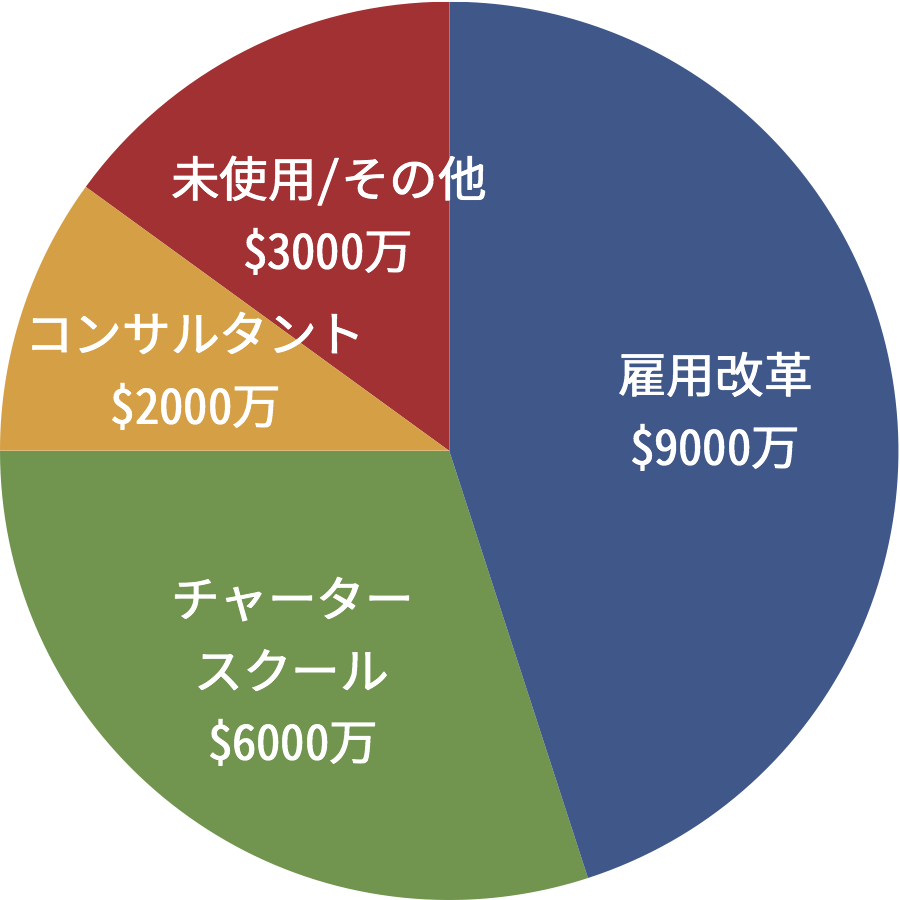
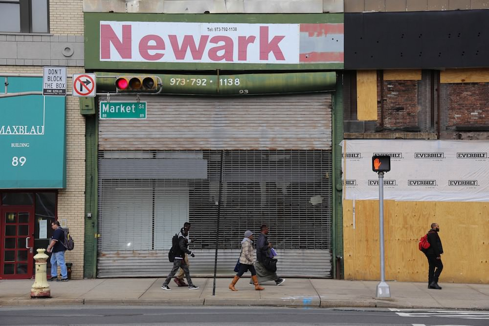

## 第十三章: 反省会

> 貧困の連鎖を止めようとしたら、子どもの学力が下がりました。働き方から変えよう、地方から変えようとしたら、何も変わりませんでした。

<figure>
  
  <figcaption>
    ザッカーバーグと、Facebookのモットーである「ガンガン動いてドンドン壊せ (Move Fast and Break Things)」By Mike Deerkoski from San Francisco, U.S.A. (Move Fast and Break Things) [<a href="http://creativecommons.org/licenses/by/2.0">CC BY 2.0</a>], <a href="https://commons.wikimedia.org/wiki/File%3AMove_Fast_and_Break_Things_(14071866872).jpg">via Wikimedia Commons</a>
  </figcaption>
</figure>

ザッカーバーグは現在、フェイスブック本社があるイースト・パロアルトのヒーローとして、慈善活動に勤しんでいる。

ある日、イースト・パロアルトに1億2000万ドルを寄付したザッカーバーグに、教育ジャーナリストがインタビューを行ったとき、こんな質問が[飛び出した](http://www.edweek.org/ew/articles/2016/03/07/zuckerberg-talks-personalized-learning-philanthropy-and-lessons.html)。

— イースト・パロアルトへ寄付されるとのことですが、ニューアークへの寄付と何が違うんですか? 
— ニューアークでやったこととは、真逆のことをやりたいと思っています。 
— というと? 
— 自治体や住民の意見を聞き、自治体や住民と一緒に教育を良くしていくこと。ニューアークでは敵を作りすぎました。イースト・パロアルトでは、味方を作るところから始めたいと思います。

### 2億ドルはどこへ行ったか

「金持ちの集会」の大口寄付者たちはニューアークに1億ドルを寄付し、ザッカーバーグはその上乗せ分として1億ドルを寄付し、合計2億ドルがニューアークに流れ込んだ。では、そのお金は最終的にどこへ行ったのか。

<figure>
  
  <figcaption>
    <a href="https://goo.gl/B7k68n#PYmtGeZf">ソースはこちら</a>。
  </figcaption>
</figure>

約9000万ドルは、雇用改革に使われた。組合の買収、教員の退職金などである。

しかし、「教師をクビにするなら、『若い』順からクビにしなければいけない」という法律が守られるなど、抜本的な改革はできなかった。そして、組合買収の効力は3年で切れてしまった。

約6000万ドルは、チャータースクールの初期投資に使われた。チャータースクールは充実したが、従来の公立校は逆に衰退した。

約2000万ドルは、コンサルタントの報酬に使われた。

ちなみに日本でも、地方創生の分野でコンサルタント代が無駄になっていると聞く。専門家の[木下斉さんによると](http://toyokeizai.net/articles/-/62102)、悪質なコンサルタントが、「おたくの地域でも、成功した他の地域と同じことをやりませんか」と自治体をそそのかし、補助金をかっさらっていくらしい。地方創生において、成功事例のパクリが成功する確率は少ないにもかかわらず、自治体は「うまい話」に乗ってしまうようだ。

話を戻そう。2億ドルの残りは未使用か、その他の小さなプロジェクトに使われたが、現場に届くことはなかった。

そして2億ドルは、ニューアークの学力向上にほとんど寄与しなかった。寄与するどころか、公立校の学力テストの点数は下がっている。雇用改革も中途半端に終わり、「成功モデルを作り、アメリカ全国に広める」ことも、掛け声に終わった。

もしもこの2億ドルが現場に使われていたら、ニューアークの子どもたちの人生は、いったいどう変わっていたのだろうか。

### ニューアークの反省会

ニューアークの話は、誰にも悪気が無かった話である。しかし、計画は誰にも悪気がなく失敗していくものだ。

では、ニューアークの失敗の本質はどこにあるのだろう。

<figure>
  
  <figcaption>
    By Paul Sableman [<a href="http://creativecommons.org/licenses/by/2.0">CC BY 2.0</a>], <a href="https://flic.kr/p/mNbnXB">via Flickr</a>
  </figcaption>
</figure>

月並みな感想だが、教育を変えるには、やはり時間がかかるものだ。

「達成できるか分からない無茶な目標を立て、それに向かって邁進したところ、ギリギリのところで達成できた」というのは企業経営ではよくある話かもしれない。受験ドラマや部活ドラマでもお決まりのシナリオかもしれない。

しかしニューアークのように、「数万人規模」の子どもを対象に無茶な目標を押し付けて、大多数がついてこれると思ったら大間違いだ。

「こんな劣悪な環境にいては、子どもがかわいそうだ」と思う気持ちは分かる。「一刻も早くなんとかしなくては」と思う気持ちも分かる。でもそれは、「教育を変えるには時間がかかる」ということを忘れていい理由にはならない。

また、教育は経路依存性が高いところがあり、すなわち「過去の負の遺産」を引きずる傾向が強い。それに気づかず、「みんなおかしいと思っているのだから、すぐ変わるだろう」と思い込むのは愚の骨頂だ。

そして、全てが上手くいって教育環境が良くなったとしても、喜ぶのはまだ早い。それが子どもの学力となって現れるのにもまた、時間がかかるからだ。

### 安定が大事

最後にもう一つ。日本ではよく、フィンランドの教育が話題になる。[宿題やテストが少ないのに学力が世界トップクラス](http://www.mag2.com/p/news/159553/2)であることで有名だ。

そのフィンランドの教育学者・パシ・サールバーグ氏が著した本「[Finnish Lessons](https://www.amazon.co.jp/Finnish-Lessons-2-0-Educational-Finland-ebook/dp/B00SZ7L8M4?tag=chibicode-22)」によると、フィンランドの教育が成功した最も大きな理由は、すべての政党が40年近く、教育を政府の最重要課題に[指定したからだという](https://books.google.com/books?id=LQZ6BgAAQBAJ&lpg=PA21&vq=politics&pg=PA8#v=snippet&q=politics&f=false)。

フィンランドでは、教育レベルが低迷していた1970年代から、20以上の政権が生まれ、約30人が教育大臣を[務めた](https://books.google.com/books?id=LQZ6BgAAQBAJ&lpg=PA21&vq=politics&pg=PA8#v=snippet&q=politics&f=false)。だが、全政権・全教育大臣が「公教育の質を向上させよう」と目線を合わせ、教育行政の方向性が安定していた。

教育を変えるには時間がかかるということを、フィンランドは政治と行政レベルで理解していたのだ。世論に揺さぶられて「ゆとり」と「詰め込み」を行ったり来たりし、英語教育やICT化で右往左往する日本の教育行政とは大違いである。

### 刺激的か、地に足がついているか

ニューアークで「金持ちの集会」がお祭りムードだったころ、ブッカーは[こう言った](https://goo.gl/B7k68n#rzsnJIbQ)。

— ニューアークを、全米で最も教師にとって刺激的な都市にしよう。

ザッカーバーグの寄付も、テレビ番組で発表されたり、1億ドルという大金であったり、とにかく刺激的だった。

ザッカーバーグもぼくも、シリコンバレーで働いている。シリコンバレーで働いていると、自動運転・仮想現実・人工知能と、連日のように刺激的な取り組みを耳にする。その多くは地に足がついていないように見えるが、それでもいずれ世の中を変えていくのだ。

けれども教育において、取り組みが「刺激的」であることは重要なのだろうか。

ぼくは、教育においては、刺激的な取り組みよりも、地味だけど地に足がついている取り組みのほうが大事だと思っている。

それは仮説にすぎないが、少なくともニューアークの失敗を見るかぎりは、的外れではないと思う。

というわけで、次の最後の章では、日本でぼくが取材した「地に足がついている」教育の取り組みを紹介しよう。
