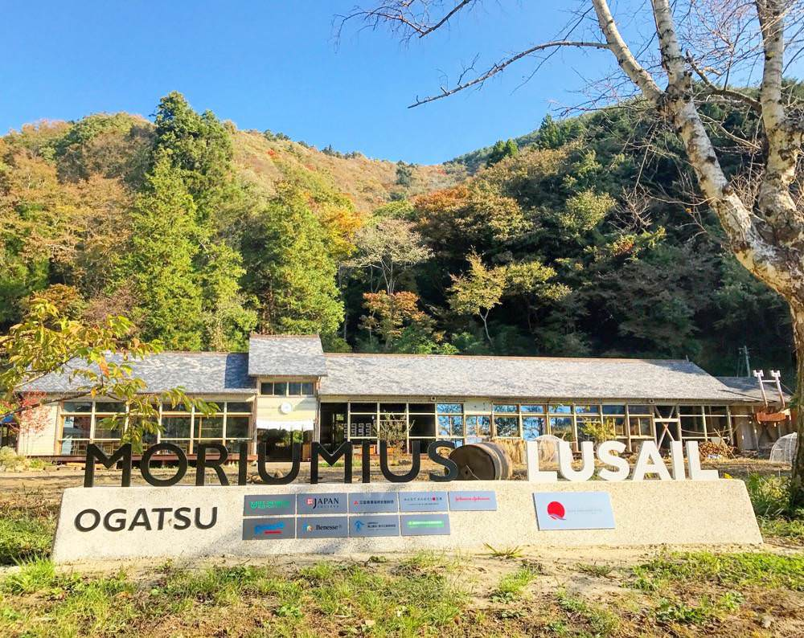

## 第十四章: 地に足がついている取り組み

ヤフーニュース個人の「オーサーアワード2016」を[受賞された](https://news.yahoo.co.jp/staffblog/info/kojin_2016.html)、社会活動家で法政大学教授の湯浅誠さんは、子どもの貧困対策を「1ミリでもいい。動かすことが必要だ」と[説いている](http://bylines.news.yahoo.co.jp/yuasamakoto/20160701-00059361/)。

ぼくが2016年末~2017年始にかけて訪問させてもらった以下の団体も、地に足をつけながら、教育を1ミリでも前に進めている。

- キッズドア
- ティーチ・フォー・ジャパン
- エル・システマ ジャパン
- モリウミアス

### キッズドア

日本では最近になって子どもの貧困が話題になった。しかし、なんと10年前の2007年から子どもの貧困問題を解決しようと活動している団体がある。それが[キッズドア](http://www.kidsdoor.net/)だ。

キッズドアは、学校外の居場所がない子どもたちに居場所を提供したり、お金がなくて塾に通えない子たちに無料の学習塾「タダゼミ」を提供している。足立区などの自治体とも提携済みだ。

「タダゼミ」参加者の[高校進学率は100%](http://www.kidsdoor.net/otona/activity/educational-support.html)と、教育機会が乏しい家庭の子たち相手に、素晴らしい結果を出している。

<figure>
  
  <figcaption>
    キッズドアの渡辺理事長。2017年1月に訪問した。
  </figcaption>
</figure>

理事長の渡辺由美子さんの、こんな言葉が印象に残っている。

— たしかにお金がないとつらい。うちの無料学習塾でも、昼食の予算が100円しかないのでおにぎりも買えず、数十円のうまい棒で腹を満たしていた子もいます。目が悪くてもメガネを買うお金がないので、席替えで後ろの席にならないよう、先生にお願いしている子もいます。 
— なるほど。 
— しかし、家にお金がない子たちは、仕事にたいするイメージを抱けないことも大きな問題です。そういう子たちにとって身近な仕事といえば、「学校の先生」か「パートのお母さん」しかありません。オフィスビルに行って、セキュリティーゲートをくぐって・・・とか、ドラマの中にだけある世界なんです。 
— 「パートのお母さん」・・・母子家庭の問題ですね。 
— 母子家庭の貧困は、男女の賃金格差、正社員と非正規雇用の賃金格差の問題でもあります。パートだったら、ダブルワーク、トリプルワークをしないと暮らしていけない。でも、それって身体を壊したらアウトってことです。身体を壊された方々の話も聞きますが、本当につらい話ばかりです。

キッズドアが運営する、低所得者層の子向けの無料学習塾「タダゼミ」も見学させてもらった。八丁堀のビルの一室で、中学生の子たちが、高校受験に出る問題を大学生ボランティアの子たちに教わっていた。

<figure>
  
  <figcaption>
    山本香苗さん。「タダゼミ」で7年間子どもたちを教えている。
  </figcaption>
</figure>

大学生ボランティアの中には貧しい家庭で育った方々も多く、そういう大学生たちは当事者意識を持って一層熱心な先生になる。しかし、本人たちも貧しい大学生活を送っていることが多く、バイトに追われ、タダゼミでボランティアし続けるのが難しいというジレンマを抱えている。

また、日本は貧困を隠そうとする文化が強いため、日本の子どもの貧困は「[見えない](http://news.livedoor.com/article/detail/12667974/)」という。実際に現場を見て、まさにその通りだと思った。

ぼくが行った日は、中学生の男の子たちが「どのイヤホンが音質が良いか、ノイズキャンセリングの性能が高いか」という話をしていた。「ああ、こういう会話がテレビに取り上げられたら、また[NHKの報道のように](https://www.buzzfeed.com/kotahatachi/behind-nhk-hinkon)バッシングされるんだろうな」と思いながら聞いていた。

ここからはキッズドアではなく、ぼく個人の見解である。

もし、「貧困層の中学生が、ノイズキャンセリングのイヤホンを買うなんて贅沢だ」と思う方がいたら、あなたは平均的な公立中学生が学習塾にかける金額を知っているのかと問いたい。

文科省が2014年に公表した「[子供の学習費調査](http://www.mext.go.jp/b_menu/toukei/chousa03/gakushuuhi/kekka/k_detail/1364721.htm)」によれば、公立校に通う中学3年生の学習塾費は月平均「3万3000円」である。[BOSEのノイズキャンセリングイヤホンの最高機種](https://www.amazon.co.jp/Bose-QuietComfort-Acoustic-Cancelling-headphones/dp/B00YMCA1YC?tag=chibicode-22)が毎月買えてしまう金額だ。そしてタダゼミの子たちは、ふつうの学習塾に来れないから、タダゼミに来ているのである。

貧困層の子が何年かに一度、1~2万円するイヤホンを買うのは「少しの贅沢」かもしれない。しかし、毎月それ以上の金額を支払うのが当たり前の学習塾は、それと比較にならないくらい贅沢品なのだ。難しい家庭で育った子ほど、そういう学習支援を必要としているにもかかわらずである。

[キッズドアのウェブサイトはこちら。](http://www.kidsdoor.net/)

### ティーチ・フォー・ジャパン

[ティーチ・フォー・ジャパン](http://teachforjapan.org/)は、教育への情熱を持った多様な人材を、教師として学校現場へ派遣するNPOである。

ぼくと同い年の池田由紀ちゃんは、早稲田大学を卒業し、伊藤忠商事で3年働いたあと、ティーチ・フォー・ジャパンと文部科学省の非常勤職員を経て、奈良の公立小学校で先生になった。

2017年2月、ぼくは彼女の小学校のクラスを訪れ、今流行りの「プログラミング教育」の実習をさせてもらった。

<figure>
  
  <figcaption>
    ぼくと池田由紀ちゃんとOzobot。
  </figcaption>
</figure>

実習には[Ozobot](http://ozobot.com/)という、ペンで書いた線の上を歩くロボットを使った。ペンの色を変えることでロボットに指示を与えることができ、コードを書かないでプログラミングを学べるのだ。

<figure>
  
</figure>

Ozobotが動いている様子はこちら。

<figure>
  
</figure>

ちなみに、この学校もどちらかというと裕福でない家庭の子が多いのだが、みんな元気いっぱいでロボットと遊んでいた。

「公立校の教室でロボットプログラミングの実習をしたい」という無理を聞いてくれた由紀ちゃんに感謝である。子どもたちと食べた給食も、17年ぶりだったけど、とても美味しかった。

[ティーチ・フォー・ジャパンのウェブサイトはこちら。](http://teachforjapan.org/)

### エル・システマ ジャパン

この記事も終わりに近づいてきた。ここから冒頭で触れた、東北の話になる。

[エル・システマ ジャパン](http://www.elsistemajapan.org)は、東日本大震災の被災地、福島県相馬市で2012年5月にはじまった。41年前に南米ベネズエラで始まった教育プログラム「エル・システマ」の理念に基づき、音楽をはじめとする芸術活動での子どもの自己実現の場を拡充することを目的に活動している。

原発事故の影響で子どもたちの尊厳が失われている福島県相馬市で、オーケストラや合唱など、集団での音楽教育を自治体とのパートナーシップのもとに無償で提供している。将来的には日本各地に展開する予定だ。詳しくは、下の動画を観てほしい。

<iframe width="1280" height="720" src="https://www.youtube.com/embed/2iAk509AbyU" frameborder="0" allowfullscreen></iframe>

相馬では、5〜18歳からなる約180人が参加するオーケストラとコーラスの活動を実施している。2016年3月には、代表メンバー37名がドイツ公演ツアーに参加し、ベルリンフィルハーモニーのメンバーと[共演した](https://miraimanabi.withgoogle.com/project/project-detail-40.html)。

代表理事の菊川穣さんはこう語る。

<figure>
  
  <figcaption>
    エル・システマ ジャパン代表理事の菊川さん。2017年1月に訪問した。
  </figcaption>
</figure>

— 相馬市では家が流されて仮設になり、もともとあった地縁が無くなってしまいました。学校も仮設になって人数が少なくなり、学校で部活をやるのが困難になってきた。そういうときに、オーケストラで地域の横のつながりを生むというのは大事だと思ったんです。 
— なるほど。ぼくは中高とトランペットをやっていたのですが、バイオリンってハードル高くないですか? 
— コンクールで優勝することを目的にするのではなく、楽しむためにやるのであれば、それほどハードルは高くありませんよ。年齢層が幅広いので、高校生の子が幼稚園児の子を教えたりしています。 
— 年上の子が年下の子の面倒を見る。保育という意味でも良いですね。 
— はい。仮設暮らしの子が多いので、練習場所は課題ですが。公園で練習したり、防災備蓄倉庫の会議室で練習している子もいますよ。 

菊川さんは、自治体との関係が大事だとも語ってくれた。ドイツ公演に行ったときも、子どもたちは学校を休まないといけないから、教育委員会に掛け合ったそうだ。ニューアークでも、寄付金でこういう取り組みができたら良かったのかもしれない。

[エル・システマ ジャパンのウェブサイトはこちら。](http://www.elsistemajapan.org/)

### モリウミアス

もう一つ、東北の話を。

[モリウミアス](http://moriumius.jp/)は、宮城県石巻市雄勝町にある子どもの複合体験施設である。豊かな森と海に恵まれた町だが、東日本大震災によって町の8割が壊滅し、人口が3000人から1000人以下まで減ってしまった。

そこで復興への想いから、高台に残る築93年の廃校をリノベーションし、「モリウミアス」という学び舎として再生させた。

学校のすぐ裏は山、目の前は海という自然を活かし、子どもたちはサスティナブルな暮らし方を学ぶ。たくさん写真を撮ったので、百聞は一見にしかずということで見て欲しい。

<figure>
  
  <figcaption>
    モリウミアス。2016年11月に訪問した。ちなみに、近くに津波で多くの子どもが亡くなった<a href="https://ja.wikipedia.org/wiki/%E7%9F%B3%E5%B7%BB%E5%B8%82%E7%AB%8B%E5%A4%A7%E5%B7%9D%E5%B0%8F%E5%AD%A6%E6%A0%A1">大川小学校</a>があり、そちらも訪問した。
  </figcaption>
</figure>

<figure>
  
  <figcaption>
    代表の油井元太郎さん。アメリカ在住歴約20年。キッザニアを日本に導入する株式会社キッズシティージャパンの設立に関わる。ちなみに全員が木で作ったバッジをつける。
  </figcaption>
</figure>

<figure>
  
  <figcaption>
    入り口。
  </figcaption>
</figure>

<figure>
  
  <figcaption>
    廊下。奥が寝室になっている。木造建築を活かしたデザインは<a href="https://ja.wikipedia.org/wiki/%E9%9A%88%E7%A0%94%E5%90%BE">「和の大家」とも称される</a>建築家、隈研吾氏を中心に世界中の建築学生と考えたもの。
  </figcaption>
</figure>

<figure>
  
  <figcaption>
    食堂。
  </figcaption>
</figure>

<figure>
  
  <figcaption>
    裏の山から木を伐採して役立てたり、田んぼを耕したり。使った生活水を田んぼの水に再利用する。
  </figcaption>
</figure>

<figure>
  
  <figcaption>
    収穫した稲を干しているところ。
  </figcaption>
</figure>

<figure>
  
  <figcaption>
    卵を産んでくれるニワトリ。食べ物の残りはニワトリの檻に。
  </figcaption>
</figure>

<figure>
  
  <figcaption>
    子どもたちが大好きな豚さんたち。最後は売りに出し、豚さんたちのお肉を、手を合わせて美味しく頂く。
  </figcaption>
</figure>

<figure>
  
  <figcaption>
    鮭をさばく子どもたち。モリウミアスはすぐ目の前が海で、みんな船に乗って釣りに行く。
  </figcaption>
</figure>

<figure>
  
  <figcaption>
    「アーティスト・イン・レジデンス」プログラムを行っており、世界中からアーティストを招聘し、滞在しながら作品を作ってもらっている。こちらは使い終わった米袋に絵を描くアメリカ出身のエリースさん。
  </figcaption>
</figure>

代表の油井さんによるモリウミアスのツアー動画はこちら。英語でやってもらった。

<iframe width="1280" height="720" src="https://www.youtube.com/embed/aNJ_rjJMs6U" frameborder="0" allowfullscreen></iframe>

ちなみに、モリウミアスは先ほど紹介した[キッズドアの子たち](http://japangiving.jp/p/5070)や、[熊本で被災した子たち](https://www.globalgiving.org/projects/kumamoto-to-moriumius/)も受け入れている。どちらも、クラウドファンディングに少額ながら寄付させてもらった。
