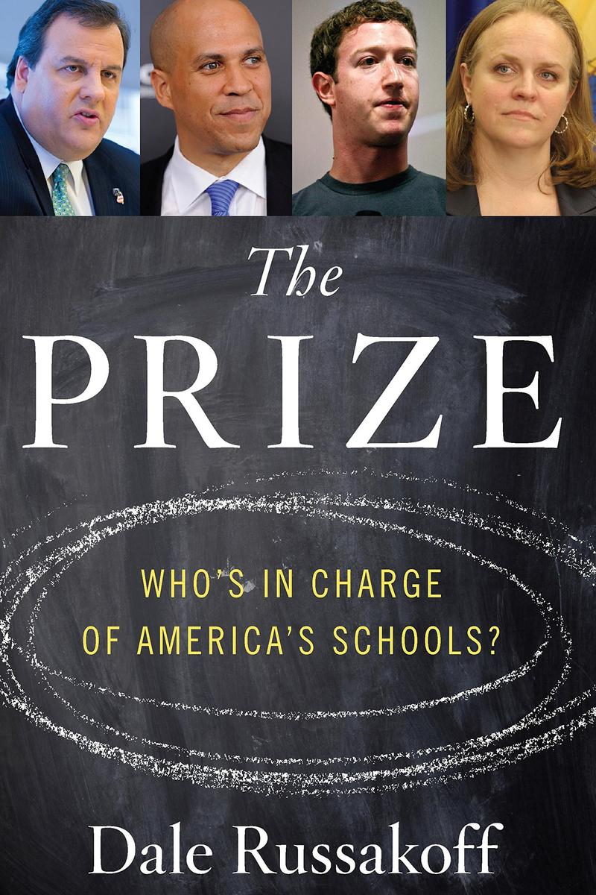

# 第二章: ?

ここからは、さきほど少し紹介した本「[The Prize](http://amzn.to/2idlf1u)」の内容を引用しながら話を進める。脚注はすべて[このページ](https://github.com/chibicode/the-prize-research)にまとめていて、文中で引用した部分にそれぞれリンクを貼っている。

<figure>
  
  <figcaption>
    Russakoff, Dale. The Prize: Who's in Charge of America's Schools? Boston: Houghton Mifflin Harcourt, 2016. Print. (<a href="http://amzn.to/2idlf1u">Amazonリンク</a>)
  </figcaption>
</figure>

繰り返すが、「[The Prize](http://amzn.to/2idlf1u)」は、ザッカーバーグのニュワークへ行った寄付の失敗劇を描いたノンフィクションで、2015年にニューヨークタイムズのベストセラーに選ばれた。著者はデール・ルサコフ氏。ワシントン・ポスト紙で28年働いた敏腕記者である。

## ソーシャル・ネットワーク

ザッカーバーグの過去を語る前に、下の図を見てほしい。日本で「フェイスブック」とGoogle検索された数の推移である。

2011年1月に検索数が急に増えたのだが、これはなぜだろう?

<figure>
  
  <figcaption>
    ソース: [Google Trends](https://www.google.com/trends/explore?date=all&geo=JP&q=%E3%83%95%E3%82%A7%E3%82%A4%E3%82%B9%E3%83%96%E3%83%83%E3%82%AF)
  </figcaption>
</figure>

その直前の2010年は日本でツイッターが大ブームになった年だったが、フェイスブックのユーザー数は「mixi」「GREE」「モバゲータウン」の[1割ほど](http://business.nikkeibp.co.jp/article/manage/20110113/217913/)しかなかった。LINEを[生む原因](http://www.asahi.com/articles/ASJ3C51T9J3CULFA019.html)となった東日本大震災が起きたのは、2011年1月から2ヶ月後だ。

立証はできないが、2011年1月にフェイスブックの検索数が増えた理由で最も可能性が高いのは、その月にフェイブスックを題材にした映画「ソーシャル・ネットワーク」が公開されたことだ。アカデミー賞で3部門を受賞したこの映画は、日本でも公開 2週目の動員数で首位を獲得。マスコミもこぞってフェイスブックを取り上げた。

<figure>
  
  <figcaption>
    デヴィッド・フィンチャー(監督)。ソニー・ピクチャーズエンタテインメント(2011/1/15日本公開)。([Amazonリンク](http://amzn.to/2ivUSBZ))
  </figcaption>
</figure>

ザッカーバーグにとって映画は都合が悪かった。非情な人間と描かれていた。現在ネットの広告業界はグーグルとフェイスブックの二強だが、僕がインターンをしていたとき…

First talk about how Zuck ende up wanting to do philansolophy. Then talk about how he met Booker.

Start w/ Priscilla's story on how Zuck decided to do philansolophy

「スーパーマンを待ちながら」
