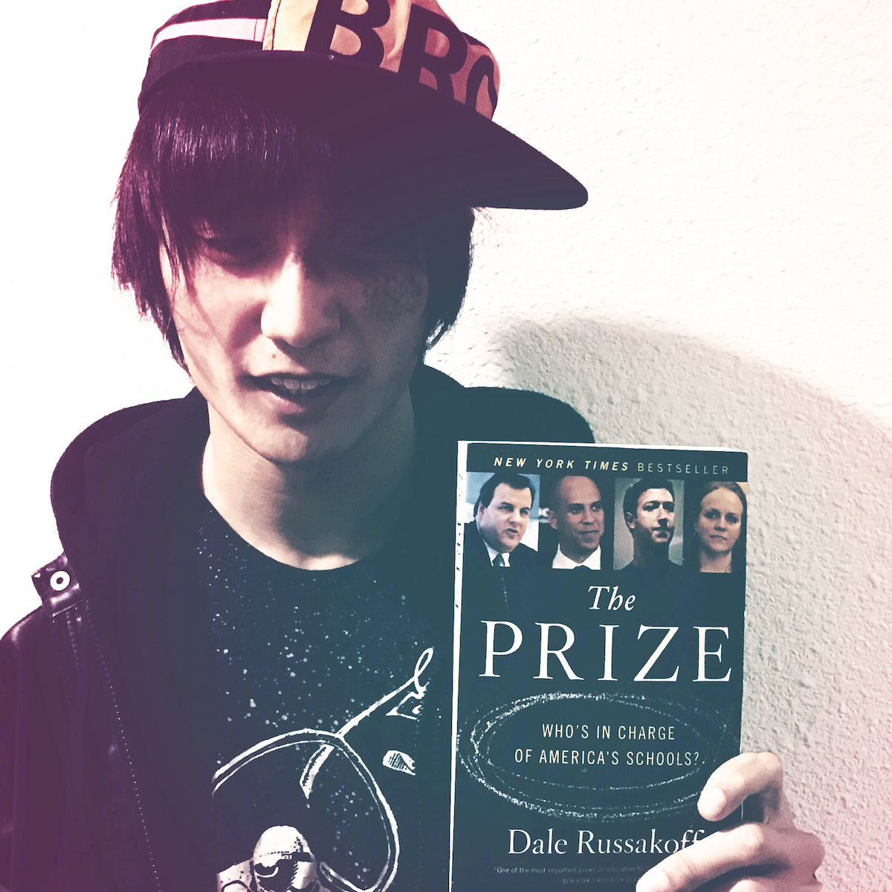
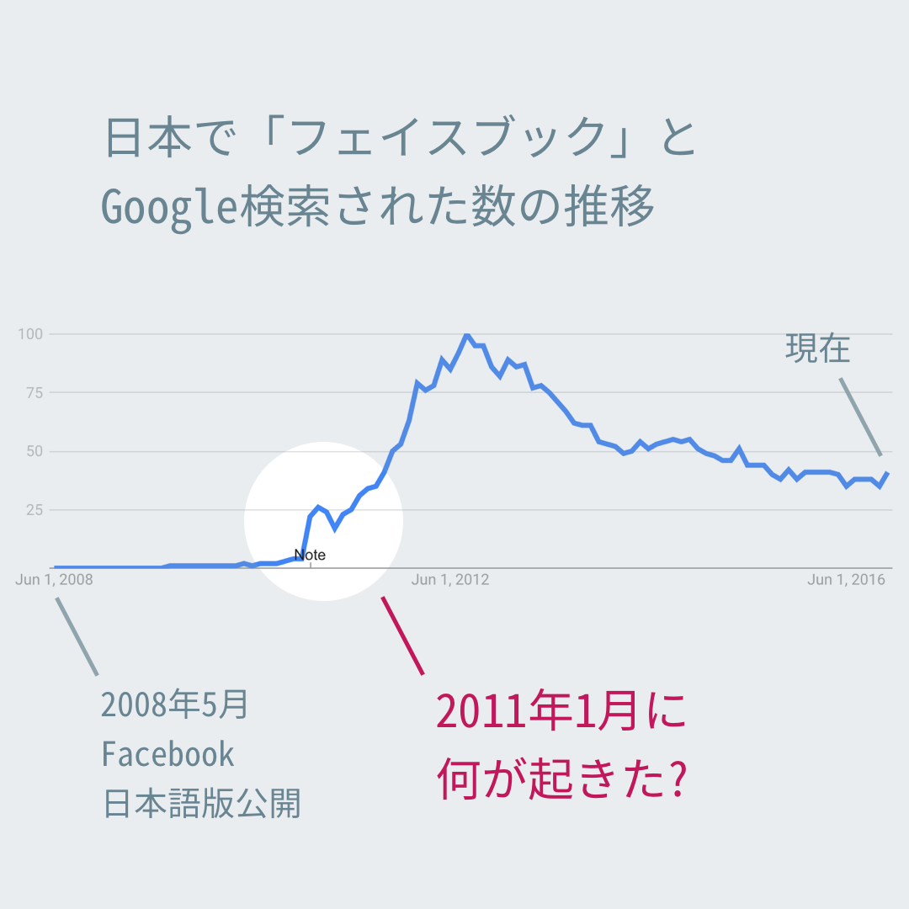
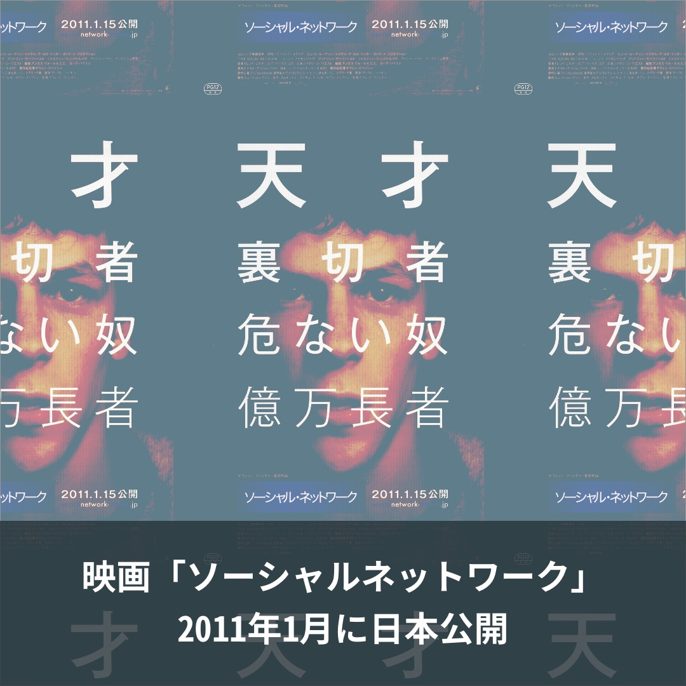

# 第二章: The Prize

ここからは、さきほど少し紹介した本「[The Prize](http://amzn.to/2idlf1u)」の内容を引用しながら話を進める。脚注はすべて[このページ](https://goo.gl/B7k68n)にまとめていて、文中で引用した部分にはそれぞれリンクを貼っている。

<figure>
  
  <figcaption>
    Russakoff, Dale. The Prize: Who's in Charge of America's Schools? Boston: Houghton Mifflin Harcourt, 2016. Print. (<a href="http://amzn.to/2idlf1u">Amazonリンク</a>)
  </figcaption>
</figure>

繰り返すが、「[The Prize](http://amzn.to/2idlf1u)」は、フェイスブック代表のマーク・ザッカーバーグが、ニュワーク市の貧困を解決すべく、2010年に寄贈した1億ドルの行方を追ったノンフィクションだ。2015年にニューヨークタイムズのベストセラーに選ばれている。著者はデール・ルサコフ氏。ワシントン・ポスト紙で28年働いた敏腕記者である。

「The Prize」は邦訳されていないが、日本人にも興味深く思える内容だと思う。

## ソーシャル・ネットワーク

ザッカーバーグの過去を語る前に、下の図を見てほしい。日本で「フェイスブック」とGoogle検索された数の推移である。

2011年1月に検索数が急に増えたのだが、これはなぜだろう?

<figure>
  
  <figcaption>
    ソース: [Google Trends](https://www.google.com/trends/explore?date=all&geo=JP&q=%E3%83%95%E3%82%A7%E3%82%A4%E3%82%B9%E3%83%96%E3%83%83%E3%82%AF)
  </figcaption>
</figure>

その直前の2010年は日本でツイッターが大ブームになった年だったが、フェイスブックのユーザー数は「mixi」「GREE」「モバゲータウン」の[1割ほど](http://business.nikkeibp.co.jp/article/manage/20110113/217913/)しかなかった。LINEを[生む原因](http://www.asahi.com/articles/ASJ3C51T9J3CULFA019.html)となった東日本大震災が起きたのは、2011年1月から2ヶ月後だ。

当時はマイナーだったフェイスブックの検索数が2011年1月に増えたのはなぜか。最も影響を与えたと思われる原因は、その月にフェイブスックの誕生秘話を描いた映画「ソーシャル・ネットワーク」が公開されたことだ。

<figure>
  
  <figcaption>
    デヴィッド・フィンチャー(監督)。ソニー・ピクチャーズエンタテインメント(2011/1/15日本公開)。([Amazonリンク](http://amzn.to/2ivUSBZ))
  </figcaption>
</figure>

アカデミー賞で3部門を受賞したこの映画は、日本でも[公開2週目の動員数で首位を獲得](http://www.cinematoday.jp/page/N0029878)。マスコミもこぞってフェイスブックを取り上げた。

日本展開を目論んでいたフェイスブックにとって、「ソーシャル・ネットワーク」は絶好の追い風になったのだ。

## ザッカーバーグの不都合

いっぽう、「ソーシャル・ネットワーク」が思わぬ向かい風になった人もいる。他ならぬ、フェイスブック代表のマーク・ザッカーバーグだ。

映画は日本に先駆けて、アメリカで2010年10月1日に公開された。その数週間前、ザッカーバーグは頭を抱えていた。

「ソーシャル・ネットワーク」の予告編では、ジェシー・アイゼンバーグが、鬼才かつ非情なザッカーバーグを演じていた。フェイスブックの成功の裏には、彼に裏切られた友がいる。ザッカーバーグにとってはイメージダウンの要素しかない。

<iframe width="1280" height="720" src="https://www.youtube.com/embed/exQjAXAQk1A" frameborder="0" allowfullscreen></iframe>

イメージダウンだけならなんとかなる。しかし厄介なことに、「ソーシャル・ネットワーク」公開日の一週間前、2010年9月24日に、ザッカーバーグはニューワーク市への1億ドルの寄付を発表する予定が入っていたのだ。しかもその発表は、アメリカで最も有名なテレビ番組・「オプラ・ウィンフリー・ショー」で大々的に[行われる](https://goo.gl/B7k68n#dHUZQvLn)。

ザッカーバーグは困った。ニュワークの貧困問題を解決したいという思いから1億ドルの寄付を決めたのに、たまたまザッカーバーグが叩かれる映画の公開と重なってしまったせいで、「どうせ売名行為なんだろう」「映画でイメージダウンするのを払しょくするために寄付をするつもりだ」と二重に[叩かれてしまう](https://goo.gl/B7k68n#dHUZQvLn)。

ザッカーバーグは、ニュワーク側にダメ元で[聞いてみた](https://goo.gl/B7k68n#dHUZQvLn)。

— やっぱり、発表を数ヶ月遅らせることはできませんか。このままでは、せっかくの寄付が金持ちの道楽と捉えられかねない。

しかし、先方からは快い返事を[得られなかった](https://goo.gl/B7k68n#dHUZQvLn)。

— それは厳しい。9月24日はドキュメンタリー映画「スーパーマンを待ちながら」が公開される日でもあります。これは教育改革がテーマで、あなたの寄付の話と相性が良い。我々としては、この映画のプロモーションに乗っかりたい。そうやって話題性を作れば、他の慈善家もニュワークにこぞって寄付してくれるはず。だから、発表を遅らせることはできません。 
— では、わたしが匿名で1億ドルを寄付するというのは? 
— それも却下。ザッカーバーグさん、あなたは今や時の人だ。そのカリスマ性が我々には必要なんです。あなたが先陣を切らないで、他に誰が続くんですか。

ザッカーバーグは[白旗を揚げた](https://goo.gl/B7k68n#dHUZQvLn)。

— 仕方ない。予定通り、9月24日に発表しましょう。

## Test

そもそも、ザッカーバーグはなぜ、ニュワークに1億ドルを寄付することになったのか?それには、彼の妻のプリシラ・チャンさんの[影響があった](https://goo.gl/B7k68n#UZwcT1mh)。

<blockquote cite="https://www.facebook.com/4/posts/10100387011762121/" class="fb-xfbml-parse-ignore">(ザッカーバーグの結婚式の写真)</blockquote>

