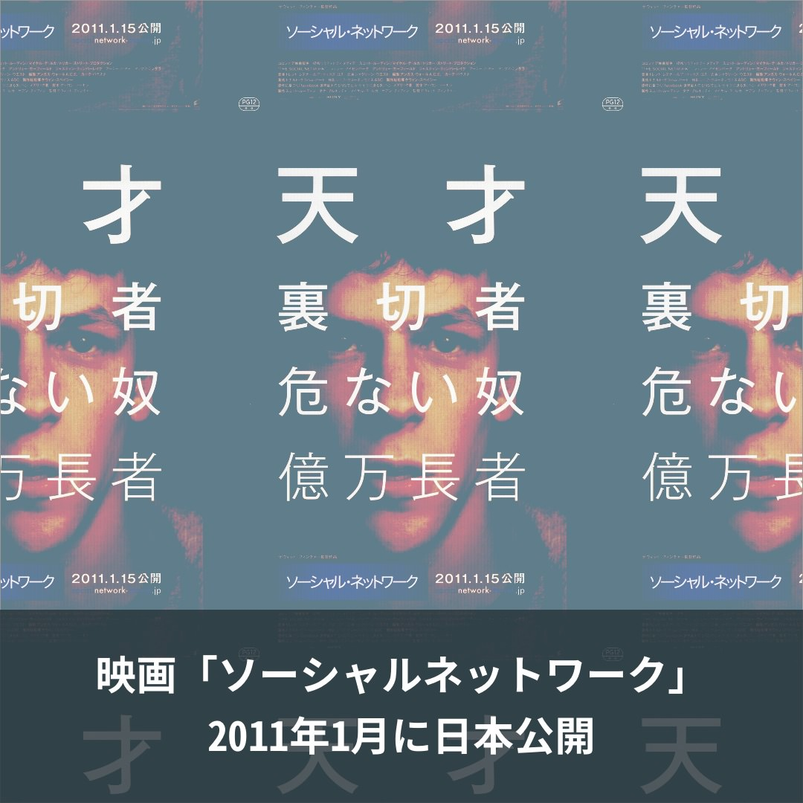
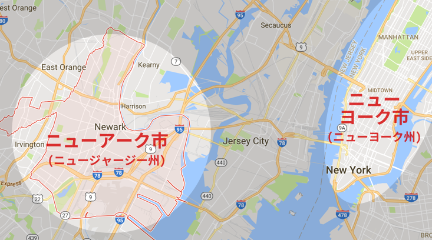
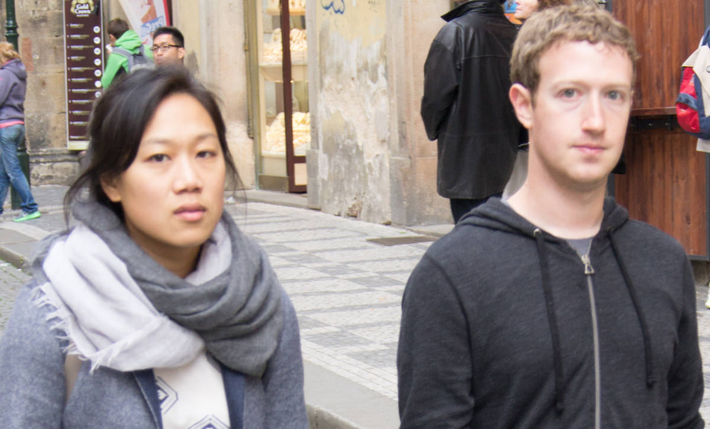

## 第二章: 1億ドル

ザッカーバーグのヒーロー初体験について語る前に、下の図を見てほしい。日本で「フェイスブック」とGoogle検索された数の推移である。

2011年1月に検索数が急に増えたのだが、これはなぜだろう?

<figure>
  
  <figcaption>
    ソース: <a href="https://www.google.com/trends/explore?date=all&geo=JP&q=%E3%83%95%E3%82%A7%E3%82%A4%E3%82%B9%E3%83%96%E3%83%83%E3%82%AF">Google Trends</a>
  </figcaption>
</figure>

その直前の2010年は日本でツイッターが大ブームになった年だったが、フェイスブックのユーザー数は「mixi」「GREE」「モバゲータウン」の[1割ほど](http://business.nikkeibp.co.jp/article/manage/20110113/217913/)しかなかった。LINEを[生む原因](http://www.asahi.com/articles/ASJ3C51T9J3CULFA019.html)となった東日本大震災が起きたのは、2011年1月から2ヶ月後だ。

当時はマイナーだったフェイスブックの検索数が2011年1月に増えたのはなぜか。最も影響を与えたと思われる原因は、その月にフェイブスックの誕生秘話を描いた映画「ソーシャル・ネットワーク」が公開されたことだ。

<figure>
  
  <figcaption>
    デヴィッド・フィンチャー(監督)。ソニー・ピクチャーズエンタテインメント(2011/1/15日本公開)。(<a href="http://amzn.to/2ivUSBZ">Amazonリンク</a>)
  </figcaption>
</figure>

アカデミー賞で3部門を受賞したこの映画は、日本でも[公開2週目の動員数で首位を獲得](http://www.cinematoday.jp/page/N0029878)。マスコミもこぞってフェイスブックを取り上げた。

日本展開を目論んでいたフェイスブックにとって、「ソーシャル・ネットワーク」は絶好の追い風になったのだ。

### ザッカーバーグの不都合

いっぽう、「ソーシャル・ネットワーク」が思わぬ向かい風になった人もいる。他ならぬ、フェイスブック代表のザッカーバーグだ。

アメリカでの「ソーシャル・ネットワーク」公開日は2010年9月24日。その数ヶ月前から公開されていた[予告動画](https://www.youtube.com/watch?v=lB95KLmpLR4)では、ジェシー・アイゼンバーグ演じるザッカーバーグが、親友を平気で裏切る非情な人間として描かれていた。

予告編を観たザッカーバーグは「まずいことになった」と頭を抱えた。「自分のイメージダウンになるから」という理由以外にも、彼には悩みの種があった。

実は、ザッカーバーグは当時、ニューヨーク近郊にあるニューアークという都市の教育機関にたいして、1億ドルの寄付をすると決めていた。

<figure>
  
  <figcaption><a href="https://goo.gl/maps/j365KvLQqQL2">Google Maps</a></figcaption>
</figure>

ニューアークはニュージャージー州最大の都市でありながら、イースト・パロアルトと同じく、[以前は](http://www.pbs.org/pov/revolution67/background/)「赤の地域」だった。現在も、ニューアークは全米を代表するゲットーとして悪名高い。もちろん教育レベルも低かった。

<figure>
  
  <figcaption>ニューアークの路地裏。 By Paul Sableman [<a href="http://creativecommons.org/licenses/by/2.0">CC BY 2.0</a>], <a href="https://flic.kr/p/mNcBWr">via Flickr</a></figcaption>
</figure>

この貧困の連鎖を断ち切ろうと、弱冠26歳のザッカーバーグは、生まれて初めての巨額寄付に踏み切った。個人で1億ドルを贈ることで、ニューアークの教育を良くしようと決めたのだ。

せっかくの巨額寄付なのだから、発表も大々的にやることになった。発表の場は、アメリカで最も人気なバラエティー番組のひとつ・「オプラ・ウィンフリー・ショー」に[決まった](https://goo.gl/B7k68n#dHUZQvLn)。

しかし不運なことに、寄付の発表日が9月24日に決まり、偶然にも「ソーシャル・ネットワーク」の公開日と重なってしまったのだ。

映画ではザッカーバーグは悪く描かれている。寄付と映画の公開が重なったことで、「どうせザッカーバーグは、映画でイメージダウンするのを払しょくするために寄付をしたんだろう」との批判は[避けれないだろう](https://goo.gl/B7k68n#dHUZQvLn)。ザッカーバーグ本人は「貧困問題を解決したい」との思いから寄付を決めたにもかかわらずである。

ザッカーバーグは、ニューアーク側にダメ元で[聞いてみた](https://goo.gl/B7k68n#dHUZQvLn)。

— やっぱり、発表を数ヶ月遅らせることはできませんか。このままでは、せっかくの寄付が金持ちの道楽と捉えられかねない。

しかし、ニューアーク側からは快い返事を[得られなかった](https://goo.gl/B7k68n#dHUZQvLn)。

— それは厳しい。9月24日は「ソーシャル・ネットワーク」以外にも、ドキュメンタリー映画「スーパーマンを待ちながら」が公開される日でもあるのです。 
— それが、なんだと言うんですか? 
— 「スーパーマンを待ちながら」は教育改革がテーマで、あなたの寄付の話と相性が良い。我々としては、この映画のプロモーションに乗っかりたい。そうやって話題性を作れば、他の慈善家もニューアークにこぞって寄付してくれるはず。だから、発表を遅らせることはできません。 
— では、わたしが匿名で1億ドルを寄付するというのは? 
— それも却下。ザッカーバーグさん、あなたは今や時の人だ。そのカリスマ性が我々には必要なんです。あなたが先陣を切らないで、他に誰が続くんですか。

ザッカーバーグは[白旗を揚げた](https://goo.gl/B7k68n#dHUZQvLn)。

— 仕方ない。予定通り、9月24日に寄付を発表しましょう。

### プリシラ・チャン

そもそも、不自由なく育ったザッカーバーグがなぜ、ニューアークに1億ドルを寄付しようと考えたのか?それには彼の妻、プリシラ・チャンの[影響があった](https://goo.gl/B7k68n#UZwcT1mh)。

<figure>
  
  <figcaption>
    チャン(左)とザッカーバーグ(右)。By Lukasz Porwol [<a href="http://creativecommons.org/licenses/by/2.0">CC BY 2.0</a>], <a href="https://commons.wikimedia.org/wiki/File%3AMark_Zuckerberg_in_Prague_2013.jpg">via Wikimedia Commons</a>
  </figcaption>
</figure>

彼女は、ただ玉の輿に乗っただけの女性ではない。

チャンの両親は、アメリカにボートで辿り着いたベトナム戦争の難民だった。父親は中華レストランを経営し、母親は仕事を掛け持ち、一日18時間働いた両親の代わりに、祖父母がチャンと二人の妹の[面倒を見た](https://goo.gl/B7k68n#UZwcT1mh)。普通の公立校に通ったチャンは猛勉強し、彼女の才能を見抜いた先生たちの薦めで大学進学を決意。やがて彼女はハーバードに合格し、そこで将来の夫に出会った。

医者を志したチャンは、ハーバードの南にある貧困地区で4年間、恵まれない子たちのためにボランティアをしていた。医学大学院に入学した後も、サンフランシスコのヒスパニック系移民向けのクリニックで[働いた](https://goo.gl/B7k68n#UZwcT1mh)。

— 貧しい子たちといると[思うんです](https://goo.gl/B7k68n#UZwcT1mh)。この子たちは私と一緒だ。諦めずに助けていれば、どこかで私みたいに幸運を掴めるかもしれないって。

そんなチャンに心を動かされたザッカーバーグは、子どもたちのために慈善活動をすることに乗り気になった。

<blockquote cite="https://www.facebook.com/4/posts/10100387011762121/" class="fb-xfbml-parse-ignore">(ザッカーバーグとチャンの結婚式の写真。)</blockquote>

ただ、ザッカーバーグの動機は、チャンのように「子どもたちの可能性を広げたい」といった純粋なものではなかった。根っからの起業家の彼は、チャンの言葉を「仕組みの問題」として聞いていた。証拠に、ザッカーバーグはチャンとの共同インタビューで[こう語っている](https://goo.gl/B7k68n#UZwcT1mh)。

— プリシラ(チャン)は、ハーバードを卒業してすぐの一年間、医学大学院に入るまで、シリコンバレーで学校の先生をしていました。まわりは「ハーバードの卒業生が学校の先生をやるなんて」と冷ややかだった。しかしわたしは、学校の先生という職業は安月給ながら、それよりも高給な他の職業よりも社会にとって大切だと思う。経済的な観点から見ると、これはとても非効率です。学校の先生の社会的地位を上げるには、どんな仕組みを変える必要があるのか、どんな障壁を取り除く必要があるのか。慈善事業を通じて考えていきたいですね。

チャンは[苦笑いしながら](https://goo.gl/B7k68n#UZwcT1mh)、

— マーク(ザッカーバーグ)はわたしと違うんです。わたしはただ、助けた子どもたちが将来どんな道を歩むのか、想像をふくらませるのが楽しいだけで・・・

### コリー・ブッカー市長

ザッカーバーグとチャンには、フェイスブックの成功で得たカネはあったが、時間が無かった。ザッカーバーグはフェイブスック社の経営で、チャンは医学大学院での勉強で多忙を[極めていた](https://goo.gl/B7k68n#UZwcT1mh)。恵まれない子たちのための慈善事業を行うには、それを実行に移してくれる人が必要だ。

そんな人が、2010年7月に見つかった。当時ニューアークの市長だった、コーリー・ブッカーである。

<figure>
  
  <figcaption>
    コリー・ブッカー・前ニューアーク市長。画像は<a href="https://commons.wikimedia.org/wiki/File:Cory_Booker,_official_portrait,_114th_Congress.jpg">著作権フリー</a>。
  </figcaption>
</figure>

69年生まれのブッカーは黒人でありながら、ニューアーク市の北にある白人だらけの裕福な郊外で育った。その影には、黒人差別が激しい南部を脱出し、IBM社で黒人初の取締役になるまで出世した、彼の両親の努力があった。ブッカーも両親の期待に答え、スタンフォード大、オックスフォード大、エール大を[卒業した](https://goo.gl/B7k68n#4l8Y1hR9)。

しかし、ブッカーはそのままエリートコースを歩まず、ニューアーク市の貧困地区に引っ越してきて社会活動家となった。エール大で学んだ法学の知識を活かし、貧困層を食い物にするスラム街の悪徳大家と戦った。悪徳大家が政治家とのパイプを活かして好き放題やっていることに気づいた彼は、「政治から変えないとダメだ」と政界進出を決意。翌年、市議会議員に立候補し[当選した](https://goo.gl/B7k68n#4l8Y1hR9)。

<figure>
  
  <figcaption>ブッカーの選挙ポスター。 By Paul Sableman [<a href="http://creativecommons.org/licenses/by/2.0">CC BY 2.0</a>], <a href="https://flic.kr/p/mxa7zH">via Flickr</a></figcaption>
</figure>

議員になったブッカーは、持ち前のヒーローぶりを存分に発揮する。惜しみなくメディアに露出し、「恵まれた家に生まれた若い黒人政治家が、ニューアークというアメリカの最貧地区で市民のために戦う」という、アメリカ人が好きそうなストーリーを[披露した](https://goo.gl/B7k68n#4l8Y1hR9)。(ニューアークの貧困については、<a href="#chapter-3">第三章</a>で詳しく述べる。)

ブッカーはさらに、ニューアーク市の公教育の改革を訴えた。「ニューアークでは多くの子どもが高校を卒業できず、貧困の連鎖が続いているというのに、役所は指をくわえて見ているだけだ」と現体制を批判した。2006年、ブッカーは教育を争点に市長選に出馬。5選した現職市長を破り、晴れてコリー・ブッカー・ニューワーク市長が[誕生した](https://goo.gl/B7k68n#4l8Y1hR9)。

危機を救うカリスマ首長が登場するのは、どうやらアメリカでも日本でもよくあることらしい。

### 成功モデルを作り、全国へ広める

ブッカーは市長就任後、ニューアークの教育改革に手をつけようとした。それには大規模な予算が必要だったが、使い道が限られる税収が元手では、思い切った改革はできない。慈善家から寄付金を募れば、役所や教育委員会にがんじがらめにされることはない。ブッカーは早速、興味がありそうな大富豪を[探し始めた](https://goo.gl/B7k68n#XJqeh3GK)。

彼が狙いを定めたのが、若き億万長者・ザッカーバーグだった。

二人の風雲児が出会ったのは2010年7月。アイダホ州のサンバレーで毎年開催され、超大物経営者・芸能人・政治家が集まる[アレン＆カンパニー・カンファレンス](https://en.wikipedia.org/wiki/Allen_%26_Company_Sun_Valley_Conference)での[出来事だった](https://goo.gl/B7k68n#eZQPzY9q)。

<blockquote cite="https://www.facebook.com/corybooker/photos/a.476052537227.282580.36872302227/476067977227/?type=3" class="fb-xfbml-parse-ignore">(ブッカーとザッカーバーグの写真)</blockquote>

ザッカーバーグとブッカーはディナーのあと、二人で歩きながら[語った](https://goo.gl/B7k68n#eZQPzY9q)。

— ブッカーさん、わたしはアメリカの教育を地方から変えたいんです。まずは貧困で苦しんでいる地方都市を選び、教育レベルをV字回復させたい。そしたら、今度はその成功モデルを全国に広めれないかと思っています。そういう計画になら、ぜひとも寄付をさせてほしい。

ザッカーバーグが育てたフェイスブックは、最初に彼の母校・ハーバード大で大流行した。その後、他の名門大学へとブームは飛び火し、一般大学や高校へと広まり、やがて誰もがフェイスブックを使うようになった。「成功モデルを作り、全国へ広める」という手法を、今度は教育でやろうと考えたのだ。

もちろん、ブッカーも[乗り気になった](https://goo.gl/B7k68n#eZQPzY9q)。

— 素晴らしい。その計画、ぜひ我がニューアーク市でやってほしい。ニューアークの教育事情はたしかに苦しい。だが、あなたが協力してくれれば、アメリカ中から最高の先生たち、最先端の教育研究者たちをニューアークに集めることも不可能ではない。そうすれば、街全体、ひいてはアメリカ全体をひっくり返すことだってできますよ。

地方発の改革を、ブッカーならやってのけるかもしれない。ザッカーバーグは直感で[そう確信したという](https://goo.gl/B7k68n#eZQPzY9q)。

### 1億ドル

先に書いたとおり、ザッカーバーグがやりたかったのは教育の「仕組み改革」、なかでも「雇用改革」だった。

ニューアークを含むアメリカの殆どの学区では、先生の給料は学歴と勤続年数で決まる。多くの子どもの人生を変えるほどの良い先生が、役立たずの年寄り先生より給料が低いことなんてザラにある。これでは良い先生ほど辞めてしまう。民間企業のように、良い先生ほど高い給料が支払われなければいけない。ザッカーバーグは[そう確信した](https://goo.gl/B7k68n#9H91SLia)。

年功序列制を無くし、成果報酬制を導入するには、報酬となるカネが必要だった。では、いくらあれば足りるのか。ブッカーは面倒な計算はせず、直感で欲しい寄付額を[決めた](https://goo.gl/B7k68n#9H91SLia)。

— ザッカーバーグさん、1億ドルでどうですか。それだけあれば大抵のことはできるだろうし、わかりやすい数字だから話題性も抜群です。

ザッカーバーグは、ブッカーの提案を条件付きで[受け入れた](https://goo.gl/B7k68n#9H91SLia)。

— わかりました。しかし条件があります。わたしの1億ドルは「上乗せ分」にしてほしい。つまり、ブッカーさんはわたし以外からも寄付金を募り、その合計が1億ドルに達したら、わたしも1億ドルを寄付します。もしも1億ドルが集まらなかったら、わたしは寄付はしません。こうすることで、より多くの人から寄付を集めることができる。 
— ついでに、わたしの力量も問われるということですね。いいでしょう。やってみせますよ。ちなみに、頂いたカネは5年で使い切りたいと思っています。それくらいのスピード感でやらないと、全国に改革を広げることなんてできない。 
— 構いません。では、そういうことで。

### オプラ・ウィンフリー・ショー

その一ヶ月後の、2010年9月24日。ザッカーバーグは寄付を大々的に発表すべく、ブッカーらともに「オプラ・ウィンフリー・ショー」に出演した。さきに話したとおり、9月24日は「ソーシャル・ネットワーク」の公開日でもあった。

<figure>
  
  <figcaption>
    司会のオプラ・ウィンフリー。By aphrodite-in-nyc [<a href="http://creativecommons.org/licenses/by/2.0">CC BY 2.0</a>], <a href="https://commons.wikimedia.org/wiki/File%3AOprah_in_2014.jpg">via Wikimedia Commons</a>
  </figcaption>
</figure>

全米屈指のバラエティ番組のステージで、まずブッカーと当時の州知事が、ニューアークの教育改革の必要性を訴えた。すかさず司会のウィンフリーは、まだ口を開いていないザッカーバーグに[質問する](http://www.oprah.com/oprahshow/Mark-Zuckerbergs-Big-Announcement-Video)。

— じゃあザッカーバーグさん、あなたはニューアークの教育改革と何の関係があるんですか? 
— わたしが新しく設立した慈善団体を通じて、ニューアークに1億ドルを寄付しようと・・・ 
— 1!億!ドル!ですって!すごい!すごい!

ザッカーバーグが台詞を言い終える前に、スタジオは総立ちの拍手に包まれた。弱冠26歳の億万長者は照れながら、座ったままで[感謝した](http://www.oprah.com/oprahshow/Mark-Zuckerbergs-Big-Announcement-Video)。

これが、ザッカーバーグのヒーロー初体験のはじまりだった。

<blockquote cite="https://www.facebook.com/shu/posts/10200898172756391" class="fb-xfbml-parse-ignore">(オプラ・ウィンフリー・ショーにて)</blockquote>

ここで良い知らせと、悪い知らせがある。

まず良い知らせだが、「映画『ソーシャル・ネットワーク』でのイメージダウンを払しょくするために寄付をしたんだろう」というザッカーバーグへの批判は[少なからずあった](http://gawker.com/5647434/zuckerberg-on-oprah-my-100-million-donation-is-about-kids-not-the-social-network)。しかし、それは炎上するほどではなかった。

次に悪い知らせだが、ザッカーバーグがニューアークに寄付をした1億ドルは、後に水の泡になった。彼のヒーロー初体験は、輝かしい彼の経歴において最大級の黒歴史となった。
