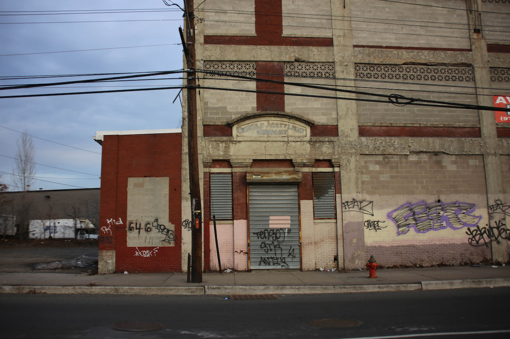
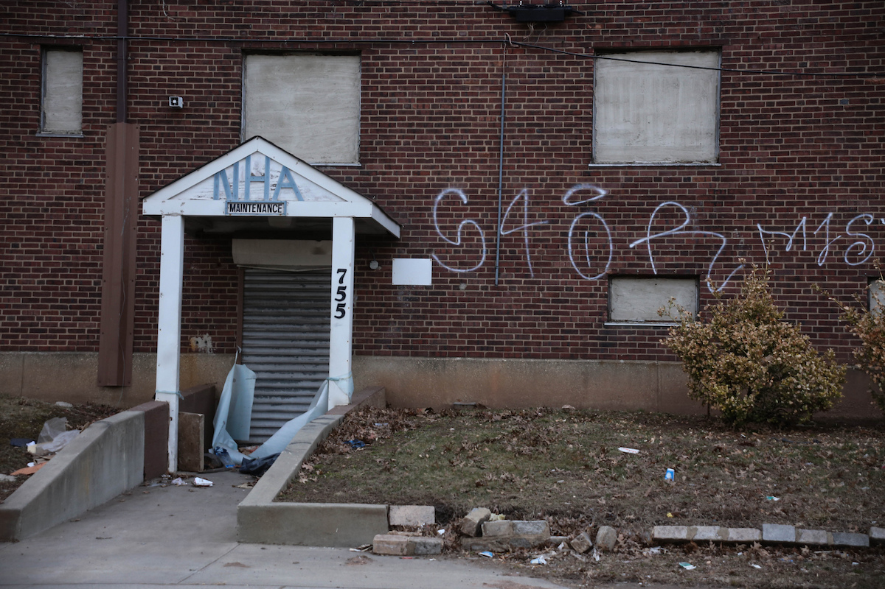

## 第三章: 10億ドルのご褒美

ザッカーバーグやブッカーが「貧困を教育で解決したい」と思う都市・ニューアーク。話をすすめる前に、どれほど厳しい町なのか解説しておきたい。

<figure>
  
  <figcaption>
    閉鎖されたニューアークの工場。By Paul Sableman [<a href="http://creativecommons.org/licenses/by/2.0">CC BY 2.0</a>], <a href="https://flic.kr/p/mzgxP8">via Flickr</a>
  </figcaption>
</figure>

ニューアークはもともとアメリカ東海岸屈指の工場街で、白人が多い裕福な町だった。しかし、大戦後に起きた郊外化、南部の黒人の流入、そして先に述べたレッドライン政策のせいで、60年代には町が貧しい黒人だらけになった。町を照らしていた工場も、郊外移転や製造業の衰退にともない[閉鎖された](http://www.pbs.org/pov/revolution67/background/)。

その後、建設業界が力を握って乱開発が起き、地域のつながりが分断された。気づけば町は公共団地だらけになり、5キロ四方の地区に2万人近くの貧困層が押し込まれ、[アメリカ東海岸最大級のゲットー](https://goo.gl/#0uYUMDXw)が誕生した。

<figure>
  
  <figcaption>
    ニューアークの公共団地(現在は未使用)。By Paul Sableman [<a href="http://creativecommons.org/licenses/by/2.0">CC BY 2.0</a>], <a href="https://flic.kr/p/mzgzY8">via Flickr</a>
  </figcaption>
</figure>

以来、産業と繁栄がニューアークに戻ることはなかった。貧困率、失業率、犯罪率はどれも全米最悪レベルで高止まりしていた。

### 子どもの貧困と教育行政

日本では2012年に子どもの貧困率が「[6人に1人](http://www.nikkei.com/article/DGKKZO95894570Y6A100C1CC1000/)」を突破し話題になった。ザッカーバーグが寄付を発表した2010年、アメリカの子どもの貧困率は「[5人に1人](http://www.pewresearch.org/fact-tank/2015/07/14/black-child-poverty-rate-holds-steady-even-as-other-groups-see-declines/)」だった。

そしてニューアークでは、子どもの貧困率は「[5人に2人](http://acnj.org/downloads/2013_02_01_NewarkReport.pdf)」と、全米平均の倍だった。ちなみに、[95%](http://acnj.org/downloads/2013_02_01_NewarkReport.pdf)の子どもは黒人かヒスパニックだ。

また、ニューアークの新生児のなんと7割がシングルマザーのもとに生まれている。2010年、日本はひとり親家庭の貧困率が[先進国最悪](http://www8.cao.go.jp/youth/whitepaper/h26honpen/b1_03_03.html)だったが、アメリカも[下から四番目](http://www8.cao.go.jp/youth/whitepaper/h26honpen/b1_03_03.html)と大差ない。

<figure>
  
  <figcaption>
    ニューアークの子ども。By Paul Sableman [<a href="http://creativecommons.org/licenses/by/2.0">CC BY 2.0</a>], <a href="https://flic.kr/p/mNKNoH">via Flickr</a>
  </figcaption>
</figure>

教育レベルはどうか。アメリカでは高校は義務教育だが、高校を卒業するのは簡単ではない。日本の大学のように、州ごとに定められた必要単位を取らないと高校を卒業できない。単位を取るには一定以上の成績が必要だ。落第、退学というコンボも十分ありうる。

そしてニューアークの高校卒業率は「[2人に1人以下](https://goo.gl/B7k68n#nuXX6zmd)」。目も当てられない状況だ。小学生と中学生を見ても、州が規定する最低学力水準に達しているのは「[3人に1人以下](https://goo.gl/B7k68n#nuXX6zmd)」である。市の人口における大卒者の割合にいたっては「[8人に1人](https://goo.gl/B7k68n#nuXX6zmd)」しかいない。

低学歴者の仕事がないなかで、子どもたちは希望を求めてギャングに入団し、そのギャングが子どもたちを襲った。子どもの貧困率がなんと「9割」の[ウエストサイド高校](https://goo.gl/B7k68n#y5CLvRpj)の生徒をみてみると、2008年にギャングが無関係の生徒3人を銃殺し、2007年にも生徒2人が銃殺された。子どもは直接殺されなくても、家族が殺されて孤児になるケースも多かった。

ニューアークは教育行政もお粗末だ。教育機関は市で最大の雇用を創出していたが、なぜか「雑用の事務員」が飛び抜けて多く、その比率は州の平均の倍だった。雑用の事務員の仕事は文字通りに雑で、出席データや成績データが正しく入力されないことは[日常茶飯事だった](https://goo.gl/B7k68n#x8FpmUMX)。

また、学校の建物のほとんどは老朽化しており、文字通りに崩壊を始めた。ミシェル・オバマ前大統領夫人がニューアークの学校を2010年に視察した際、建物の一部が崩れて入り口に[落下したほどだ](https://goo.gl/B7k68n#x8FpmUMX)。

<figure>
  
  <figcaption>
    ニューアークの学校。By Paul Sableman [<a href="http://creativecommons.org/licenses/by/2.0">CC BY 2.0</a>], <a href="https://flic.kr/p/my5RiK">via Flickr</a>
  </figcaption>
</figure>

### どうしてこんなになるまで放っておいたんだ

ニューアークの教育は惨憺たる状態だったが、ブッカーが市長に就任するまで誰も何もしてこなかった。それはなぜだろう?

理由のひとつは腐敗である。

市の上層部を見れば、ブッカーが市長に就任するまでの44年間に市長を務めた3人は、全員汚職で逮捕されている。東京都政が可愛く見えるレベルだ。

1962-70年のニューアーク市長はマフィアとグルになっており、建築業者を通じて150万ドルを受け取ったことがバレて[逮捕された](http://www.nytimes.com/1981/02/02/obituaries/hugh-j-addonizio-67-ex-mayor-of-newark-jailed-5-years-dead.html)。1970-86年の市長も校舎建設の予算を数百万ドル単位で横領したことがバレて[逮捕された](http://www.nytimes.com/2002/11/01/nyregion/newark-s-ex-mayor-admits-tax-evasion-and-avoids-prison.html)。1986-2006年の市長も市の所有物を個人で転売していたことが退職後にバレて[逮捕された](http://www.nj.com/news/index.ssf/2008/04/newark_ex_mayor_sharpe_james_convicted.html)。

同じく、下層部にも腐敗は蔓延していた。1994年には、ニューアークの学校の校長ふたりがダミー会社を作り、ネズミ被害やアスベストだらけのビルを安く買った。そのビルを、市議会議員とのパイプを通じて、市に学校の校舎として高く売ろうとしていたことが[発覚した](https://goo.gl/B7k68n#UPn5yDHD)。

教育の民主主義を守るはずの教育委員会も、政治家や組合員といった既得権益者の手先が[掌握していて](https://goo.gl/B7k68n#8aMAAxwa)、誰も何も変えようとしなかった。

### 10億ドル

さらに、補助金が腐敗に拍車をかけた。ニューアークと、ニュージャージー州の他地域の教育格差があまりにも大きすぎたため、1995年に司法が介入して教育に[州の補助金がついた](http://www.nytimes.com/1995/04/14/nyregion/judge-orders-a-state-takeover-of-the-newark-school-district.html)。

ニューアークは人口27万人の都市で、[目黒区の人口](http://www.city.meguro.tokyo.jp/gyosei/tokei/tokei/jinko)とだいたい同じだ。その教育機関は当時、約7000人もの教員や事務員を抱える[最大の雇用主だった](https://goo.gl/B7k68n#LvA5Mpd1)。職員へ給料を払い、そして[約3万3000人](https://goo.gl/B7k68n#vvV23gVW)いる生徒を支えるため、州の補助金を入れて年に10億ドルもの教育予算が組まれた。

この10億ドルは本のタイトルにもある「The Prize」(ご褒美)と[揶揄された](https://goo.gl/B7k68n#ICTEHU7z)。職員や生徒の頭数が多いから予算は大きかったが、実際は役所や組合のふところが潤うだけだった。現場は貧困の悪影響と資金不足に苦しみ、どこも投げやりの状態になっていたが、ホクホクの既得権益者に現状を変えるインセンティブは無かった。

ニューアークにおいては長い間、教育は子どものためではなく、大人のためにあった。そんな問題だらけの教育事情に、ブッカーとザッカーバーグが立ち向かったのである。
