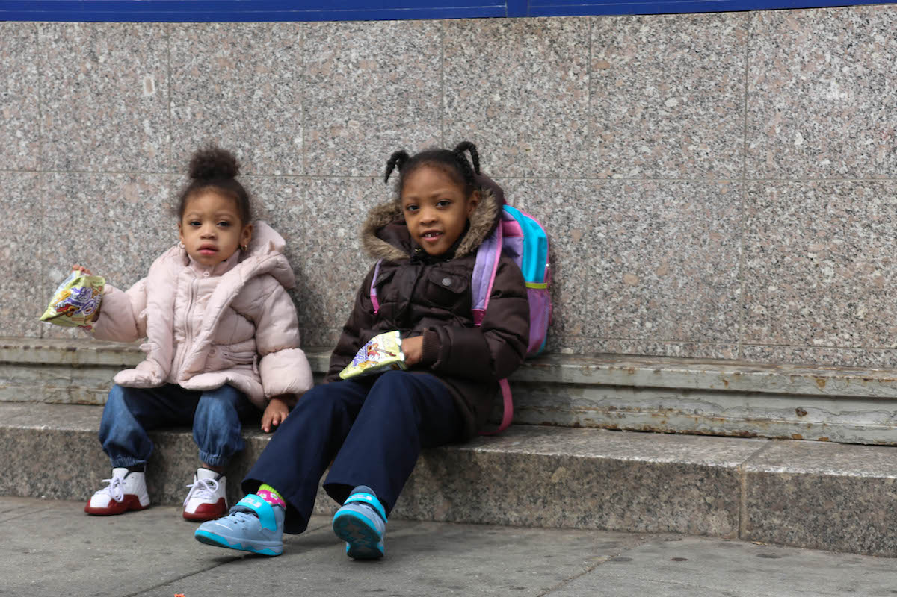
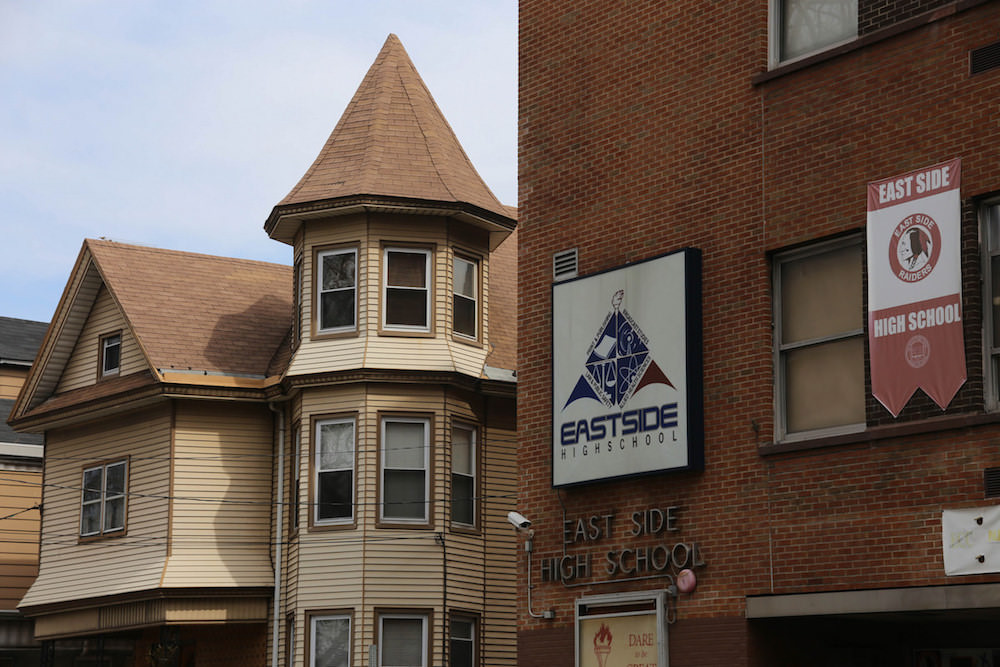

## 第三章

ザッカーバーグやブッカーが「貧困を教育で解決したい」と思う町・ニューアーク。いったい、どれほど厳しい環境なのだろうか。

<figure>
  
  <figcaption>
    ニューアークの子ども。By Paul Sableman [<a href="http://creativecommons.org/licenses/by/2.0">CC BY 2.0</a>], <a href="https://flic.kr/p/mNKNoH">via Flickr</a>
  </figcaption>
</figure>

**Write about newark's history (one and a half mile radius)**

では、子どもの貧困率をみてみよう。

日本では2012年に子どもの貧困率が「[6人に1人](http://www.nikkei.com/article/DGKKZO95894570Y6A100C1CC1000/)」を突破し話題になった。いっぽうで、ザッカーバーグが寄付を発表した2010年、アメリカの子どもの貧困率は「[5人に1人](http://www.pewresearch.org/fact-tank/2015/07/14/black-child-poverty-rate-holds-steady-even-as-other-groups-see-declines/)」だったが、ニューアークの子どもの貧困率は「[5人に2人](http://acnj.org/downloads/2013_02_01_NewarkReport.pdf)」だった。ちなみに、[95%](http://acnj.org/downloads/2013_02_01_NewarkReport.pdf)の子どもは黒人かヒスパニックだ。

また、ニューアークの新生児のなんと7割がシングルマザーのもとに生まれている。2010年、日本はひとり親家庭の貧困率が[先進国最悪](http://www8.cao.go.jp/youth/whitepaper/h26honpen/b1_03_03.html)だったが、アメリカも[下から四番目](http://www8.cao.go.jp/youth/whitepaper/h26honpen/b1_03_03.html)と大差ない。

教育レベルはどうか。アメリカでは高校は義務教育だが、高校を卒業するのは簡単ではない。日本の大学のように、州ごとに定められた必要単位を取らないと高校を卒業できないのだが、単位を取るには一定以上の成績が必要だ。落第、退学というコンボも十分ありうる。

そしてニューアークの高校卒業率は「[2人に1人以下](https://goo.gl/B7k68n#nuXX6zmd)」。目も当てられない状況だ。小学生と中学生を見ても、州が規定する学力水準に達しているのは「[3人に1人以下](https://goo.gl/B7k68n#nuXX6zmd)」しかいない。大卒者の割合にいたっては.「[8人に1人](https://goo.gl/B7k68n#nuXX6zmd)」だ。

製造業が空洞化し、低学歴者の仕事がないなかで、子どもたちは希望を求めてギャングに入団し、そのギャングが子どもたちを襲った。子どもの貧困率がなんと「9割」の[ウエストサイド高校](https://goo.gl/B7k68n#y5CLvRpj)の生徒をみてみると、2008年にギャングが無関係の生徒3人を銃殺し、2007年にも生徒2人が銃殺された。子どもは直接殺されなくても、家族が殺されて孤児になるケースも多かった。

ニューアークは教育行政もお粗末だ。教育機関は市で最大の雇用を創出していたが、なぜか「雑用の事務員」が飛び抜けて多く、その比率は州の平均の倍だった。雑用の事務員の仕事は文字通りに雑で、出席データや成績データが正しく入力されないことは[日常茶飯事だった](https://goo.gl/B7k68n#x8FpmUMX)。

また、学校の建物のほとんどは老朽化しており、文字通りに崩壊を始めた。ミシェル・オバマ前大統領夫人がニューアークの学校を2010年に視察した際、建物の一部が崩れて入り口に[落下したほどだ](https://goo.gl/B7k68n#x8FpmUMX)。

<figure>
  
  <figcaption>
    ニューアークの学校。By Paul Sableman [<a href="http://creativecommons.org/licenses/by/2.0">CC BY 2.0</a>], <a href="https://flic.kr/p/my5RiK">via Flickr</a>
  </figcaption>
</figure>

### どうしてこんなになるまで放っておいたんだ

ニューアークの教育は惨憺たる状態だったが、ブッカーが市長に就任するまで誰も何もしてこなかった。それはなぜだろう?

理由のひとつは腐敗である。

市の上層部を見れば、ブッカーが市長に就任するまでの44年間に市長を務めた3人は、全員汚職で逮捕されている。どこかの首都ほどではないが、ひどい話だ。

1962-70年のニューアーク市長はマフィアとのつながりがあり、建築業者を通じて150万ドルを受け取ったことがバレて[逮捕された](http://www.nytimes.com/1981/02/02/obituaries/hugh-j-addonizio-67-ex-mayor-of-newark-jailed-5-years-dead.html)。1970-86年の市長も校舎建設の予算を数百万ドル単位で横領し、また脱税もバレて[逮捕された](http://www.nytimes.com/2002/11/01/nyregion/newark-s-ex-mayor-admits-tax-evasion-and-avoids-prison.html)。1986-2006年の市長も市の所有物を個人的に転売していたことが退職後にバレて[逮捕された](http://www.nj.com/news/index.ssf/2008/04/newark_ex_mayor_sharpe_james_convicted.html)。

同じく、下層部にも腐敗は蔓延していた。1994年には、ニューアークの学校の校長ふたりがダミー会社を作り、ネズミ被害やアスベストだらけのビルを安く買い、政治家のパイプを通じて、市に校舎として高く買わせようとしていた事実が[発覚した](https://goo.gl/B7k68n#UPn5yDHD)。

教育の民主主義を守るはずの教育委員会も、政治家や組合員といった既得権益者の手先が[掌握していて](https://goo.gl/B7k68n#8aMAAxwa)、誰も何も変えなかった。

そして補助金が腐敗に拍車をかけた。ニューアークと他の地域の教育格差があまりにも大きすぎたため、1995年に司法が介入して教育に[補助金がついた](http://www.nytimes.com/1995/04/14/nyregion/judge-orders-a-state-takeover-of-the-newark-school-district.html)。
ニューアークは人口も州で最も多く、また教育機関が最大の雇用主であることから、補助金を入れた教育行政予算は年に10億ドルにのぼった。

この10億ドルは本のタイトルにもある「The Prize」(ごほうび)と[揶揄された](https://goo.gl/B7k68n#ICTEHU7z)。生徒や学校にはお金は回らず、既得権益者のふところが潤うだけだった。

ニューアークにおいては長い間、教育は子どものためではなく、大人のためにあったのだ。
