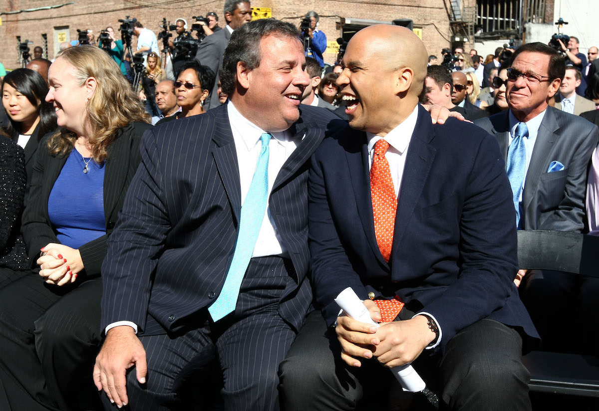
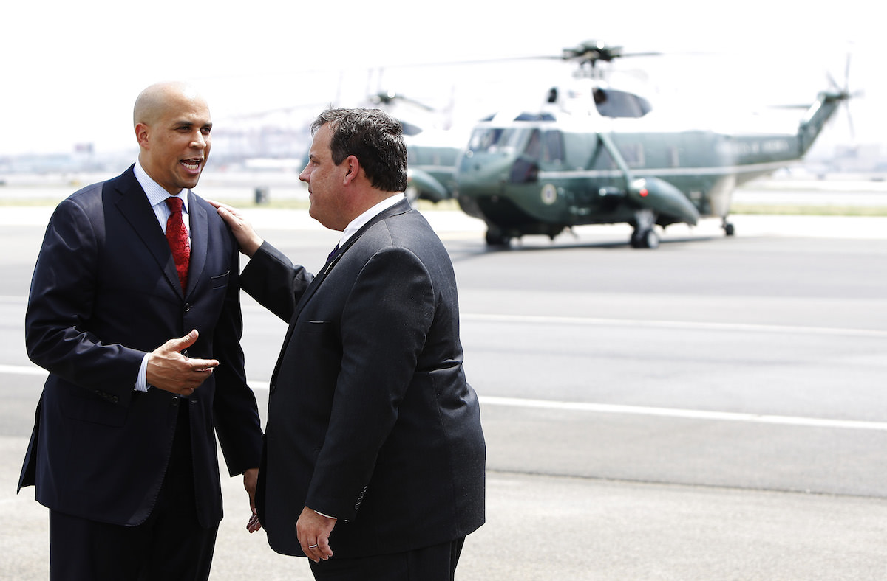
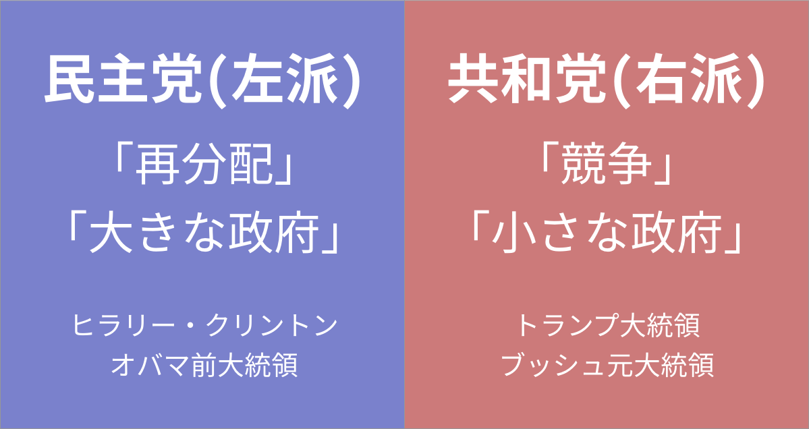

## 第四章: トランプのご褒美

<figure>
  
  <figcaption>
    ドナルド・トランプ(左)とクリス・クリスティー(右)。
    Gage Skidmore [<a href="http://creativecommons.org/licenses/by-sa/3.0">CC BY-SA 3.0</a>], <a href="https://commons.wikimedia.org/wiki/File%3ADonald_Trump_by_Gage_Skidmore.jpg">via Wikimedia Commons</a> / By Michael Vadon (Own work) [<a href="http://creativecommons.org/licenses/by-sa/4.0">CC BY-SA 4.0</a>], <a href="https://commons.wikimedia.org/wiki/File%3AChris_Christie_April_2015_(cropped).jpg">via Wikimedia Commons</a>
  </figcaption>
</figure>

— お前はクビだ!

ドナルド・トランプ大統領は、彼が司会を務めたテレビ番組「[アプレンティス](https://ja.wikipedia.org/wiki/%E3%82%A2%E3%83%97%E3%83%AC%E3%83%B3%E3%83%86%E3%82%A3%E3%82%B9)」で人気を博した。参加者がトランプの部下見習いとして課題に取り組み、トランプ氏が毎回一人ずつ決め台詞を言ってクビにし、最後まで生き残った者が勝者となる。

2016年のアメリカ大統領選でトランプ氏が勝利したとき、ゴール目前で「お前はクビだ!」と言われた手下がいた。2010年から、ニューアーク市があるニュージャージー州の知事を務めている、クリス・クリスティーである。

クリスティーもトランプと同じく共和党から大統領選に出馬したが、[早々に脱落した](https://www.nytimes.com/2016/02/11/us/politics/chris-christie.html)。その後クリスティーはトランプ陣営につき、選挙中はトランプの右腕となる。トランプのスピーチ中になぜか、彼の後ろで一言も発さずに突っ立っていたこともあった。

<blockquote class="twitter-tweet" data-lang="en">
UPDATE: Chris Christie is still standing motionless and expressionless behind Trump <a href="https://t.co/E4Wyc9Mmvf">pic.twitter.com/E4Wyc9Mmvf</a>
&mdash; NowThis (@nowthisnews) <a href="https://twitter.com/nowthisnews/status/704859667244191745">March 2, 2016</a></blockquote>

クリスティーは恥も外聞も捨ててトランプに忠誠を尽くしたが、トランプは大統領当選後、クリスティーに何もご褒美を与えなかった。クリスティーは、一時は政権移行チームのトップを任されたがすぐ解任され、[長年の夢](http://www.vanityfair.com/news/2017/01/chris-christie-trump-administration)だった司法長官のポストも与えられず、事実上のクビになった。

なぜトランプの逆鱗に触れたのかは諸説あるが、以前クリスティーが起こしたスキャンダル問題が再燃したこと、権力を手にしたトランプの娘婿・クシュナー氏といざこざがあったことが[理由に挙げられている](http://www.vanityfair.com/news/2017/01/chris-christie-trump-administration)。

### ブッカーとクリスティー

ここで、第二章で紹介したコーリー・ブッカーの話に戻る。

同じくニュージャージー州の政治家であるブッカーは、2016年の大統領選挙中、ヒラリー・クリントンの[右腕的存在](http://www.nj.com/politics/index.ssf/2016/07/who_is_cory_booker_a_hillary_clinton_vp_finalist_f.html)だった。

<blockquote class="twitter-tweet" data-lang="en">
A quick stop for lunch in Cedar Rapids with <a href="https://twitter.com/CoryBooker">@CoryBooker</a> yesterday. <a href="https://t.co/XjWH665VPP">pic.twitter.com/XjWH665VPP</a>
&mdash; Hillary Clinton (@HillaryClinton) <a href="https://twitter.com/HillaryClinton/status/691647730884702208">January 25, 2016</a></blockquote>

当然ながら、トランプの右腕のクリスティーと、クリントンの右腕のブッカーは、選挙中に互いを[批判し合っていた](http://www.nj.com/politics/index.ssf/2016/07/booker_calls_out_christie_for_his_attacks_on_clint.html)。トランプ当選後も、クリスティーはトランプを[擁護し続け](http://thehill.com/homenews/sunday-talk-shows/317974-christie-trump-deserves-credit-for-reversing-course-on-original)、ブッカーはトランプを「嘘つきだ」と[批判し続けた](http://www.cnn.com/2017/01/26/politics/cory-booker-donald-trump-cnntv/)。

しかし、二人は仲が昔から悪かったわけではなかった。むしろ、大統領選挙がはじまる少し前まで、クリスティーとブッカーは党派を超えた盟友だった。

<figure>
  
  <figcaption>
    2013年9月25日。クリス・クリスティー・ニュージャージー州知事(左)とコリー・ブッカー・ニューアーク市長(右)。(<a href="http://www.state.nj.us/governor/media/photos/2013/20130925a.shtml">Governor's Office/Tim Larsen</a>)
  </figcaption>
</figure>

2010年から2013年にかけて、クリスティーはニュージャージー州の知事、ブッカーはニュージャージー州最大都市のニューアーク市長として、二人はタッグを組んでいた。クリスティーは共和党、ブッカーは民主党に属していたが、二人の関係は良好だった。

そして2010年、ザッカーバーグがニューアークに1億ドルの寄付を決めたとき、彼が最終的にGOサインを出した理由のひとつに、クリスティーの存在があった。

言い換えると、ザッカーバーグを直接口説いたニューアーク市長のブッカーだけでなく、ニュージャージー州知事のクリスティーがいなかったら、ザッカーバーグは1億ドルの寄付を取り止めていたかもしれない。

なぜ、クリスティーがキーパーソンとなったのだろうか。

### 教職員組合の敵・クリスティー

2006年にニューアーク市長となったブッカーは、教育改革をしようにも孤軍奮闘だった。

なぜか。ニューアークと、ニュージャージー州の他地域の教育格差があまりにも大きすぎたため、1995年に司法が介入して教育に[州の補助金がついた](http://www.nytimes.com/1995/04/14/nyregion/judge-orders-a-state-takeover-of-the-newark-school-district.html)。この補助金の代償として、ニューアーク市の教育行政の権限の大部分が、市から州に委譲された。つまり、ニューアークの教育を変えようにも、ニュージャージー州知事が首を縦に振らなければいけなかったのだ。

しかし、2006年から2010年までの州知事は、教育改革に消極的だった。彼は民主党・左派、すなわち「労働者の味方」側の人間で、教職員組合を[票田としていた](https://goo.gl/B7k68n#0pLbLynt)。だから、既得権益側である組合が嫌がるような改革はできなかったのだ。

ブッカーも同じ民主党員だが、彼はもう少し中道寄りで、「必要な改革を既得権益が拒むのはおかしい」という立場を取っていた。

そんな中、2010年に共和党・右派のクリスティーが州知事になる。

「企業の味方」を党是とする共和党員として、クリスティーは選挙期間中から[教職員組合を叩きまくった](https://goo.gl/B7k68n#h2CIT8Zc)。教職員組合はニューアーク最大の集票装置だったが、カリスマ弁護士として芸能人並に名を馳せていたクリスティーにとっては、組合の抵抗は痛くも痒くもなかった。どこか、弁護士出身である橋下氏時代の大阪を彷彿させる話だ。

あらたにニューアークの教育行政の権限を手にしたクリスティーは、既得権益の組合と真っ向から対峙することを厭わない。ブッカーにとって、ニューアークの教育を変える千載一遇の[チャンスがやってきた](https://goo.gl/B7k68n#0pLbLynt)。

<figure>
  
  <figcaption>
    2010年7月28日。コリー・ブッカー・ニューアーク市長(左)とクリス・クリスティー・ニュージャージー州知事(右)と。(<a href="http://www.state.nj.us/governor/media/photos/2010/20100728.shtml">Governor's Office/Tim Larsen</a>)
  </figcaption>
</figure>

### アメリカの教育と政治イデオロギー

ここで、アメリカの教育と政治イデオロギーについて、もう少し深く説明する。

アメリカは二大政党制を採用していて、大雑把に言うと、「再分配を大事にし、大きな政府を求める民主党」と、「競争を大事にし、小さな政府を求める共和党」がある。

<figure>
  
</figure>

ここで質問なのだが、「アメリカの初等・中等教育レベルを上げるにはどうすれば良いか」と民主党・共和党それぞれに問うたとき、どのような答えが返ってくるだろうか。ちなみに、「初等 = 小学校」「中等 = 中学・高校」という意味である。

「再分配を大事にし、大きな政府を求める民主党」は、おそらくこう答えるだろう。

— 貧しい家庭や、苦しい学校への支援を充実させるべきだ。

では、「競争を大事にし、小さな政府を求める共和党」はどう答えるか。アメリカはよく「自己責任の国」と言われるから、以下のような返事が返ってきてもおかしくない。

— 子どもの教育は親の自己責任。良い教育にはカネがかかって当然。 
— というわけで、学費も高いが質も高い私立学校をもっと増やすべきだ。 
— 私学だけでは足りないかもしれない。ならば、日本の東大理IIIの[合格者の6割以上を占める](http://president.jp/articles/-/17359)塾「鉄緑会」のように、質の高い塾をもっと増やすべきだ。

しかし、実際は共和党は次のように答える。

— 学費無償の私立学校をたくさん作り、学校間の競争を促進すべきだ。

共和党が、教育において大事にする「競争」とは、「教育熱心な親同士が、私立校や塾に子を入れたりと、金にものを言わせて競争する」という意味の競争ではない。「学校同士が、無償というルールのもとで、民間・公立ともに競争する」という意味での競争なのだ。

すなわち、民主党も共和党も、「初等・中等教育においては、良い教育を無償で受けられるべき」と考えているのだ。

<figure>
  
</figure>

### 日本のほうが「教育費は自己責任」

アメリカにおいて、「初等・中等教育においては、良い教育を無償で受けられるべき」という考え方は、大戦後に世論を味方につけ、1965年の「[初等中等教育法](https://en.wikipedia.org/wiki/Elementary_and_Secondary_Education_Act)」成立以後は普遍的な価値観となった。(再度言うが、「初等 = 小学校」「中等 = 中学・高校」という意味である。)

これは、日本より遥かに早い。

日本の場合、「初等・中等教育においては、良い教育を無償で受けられるべき」という価値観が政治で争点になったのは、大戦後、[2009年の衆議院選挙が初めて](https://goo.gl/B7k68n#h2CIT8Zc)だ。そう、自民党から当時の民主党へと「政権交代」が起きたときである。

この政権交代で、悪名高い「子ども手当」とセットで、公立高校が無償化された。アメリカに半世紀遅れでようやく価値観が追いついたのだ。ちなみに、いまでも日本の高校の[約4校に1校](http://www.mext.go.jp/a_menu/koutou/shinkou/main5_a3.htm)は私立校だが、アメリカだと有償の私立高校の割合は[約12校に1校](https://nces.ed.gov/programs/digest/d15/tables/dt15_205.10.asp?current=yes)である(生徒数でみた場合)。

日本のほうがアメリカよりも「教育費は自己責任」という価値観が強いと思われる理由は他にもある。

(need to be careful - 日本の教育投資は義務教育には多め)

http://tmaita77.blogspot.com/2015/11/blog-post_29.html

たとえば、諸外国では当たり前だった

初等・中等「良い教育を無償で」という世論に達するのに、日本は時間がかかった。 → 衆議院選挙の争点

there are private schools - 10% are private schools in the US https://nces.ed.gov/fastfacts/display.asp?id=55

余談だが、大学をみてみると・・・最近は給付型奨学金が話題になったが・・・日本のほうがよっぽど・・

Page 11 - 12 of the book

「無償ありき」で良くしようとした場合、民主党は貧困や就学前教育のほうにいくが、
