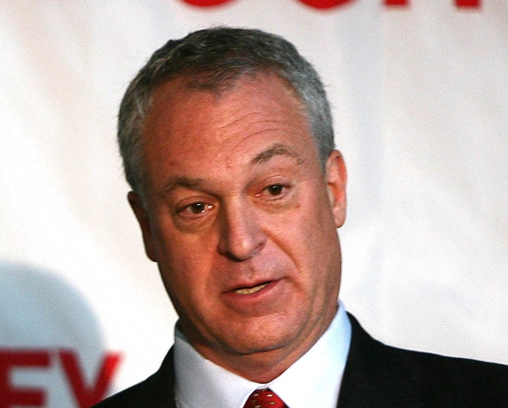

## 第五章

<figure>
  
  <figcaption>
    シェリル・サンドバーグ・フェイスブック最高執行責任者。By World Economic Forum from Cologny, Switzerland [<a href="http://creativecommons.org/licenses/by-sa/2.0">CC BY-SA 2.0</a>], <a href="https://commons.wikimedia.org/wiki/File%3ASheryl_Sandberg.jpg">via Wikimedia Commons</a>
  </figcaption>
</figure>

シェリル・サンドバーグ。フェイスブックの最高執行責任者(COO)としてザッカーバーグCEOを支える女性で、「[リーン・イン](https://www.amazon.co.jp/dp/B00KAUXBNS?tag=chibicode-22)」を著したフェミニストとしても世界的に有名だ。

そのサンドバーグは、「ニューアークへの、1億ドル寄付プラン」を読んだとき、ザッカーバーグに[こう指摘した](https://goo.gl/B7k68n#zyp85jtu)。

— マーク(ザッカーバーグ)、このプランには、「1億ドルは、現場の学校や生徒には直接渡しません」と書いているけれど・・・ 
— そうです。わたしがやりたいのは「教育の仕組み改革」だから、寄付金は学校や生徒の支援には使わないつもりです。仕組みを変えれば、最終的には学校や生徒の状況も良くなると思う。 
— でも、現場は貧困の悪影響で苦しんでいるんでしょう?だったら、なぜ現場の学校や生徒にお金を使わないのか、きちんと説明しないと向こうは納得しないと思いますよ。 
— なるほど。 
— そもそも、このプランからは、地域の協力をどのように得るかがすっぽりと抜け落ちています。このままでは、地域の反発は免れないと思いますよ。 
— わかりました。まず、われわれの取り組みを地域に説明する活動からはじめようと思います。

彼女が感じた不安は、のちに現実のものとなった。

### 住民集会

ザッカーバーグが1億ドルを寄付したニュースは全米を駆け巡り、ブッカーは連日テレビに[引っ張りだこになった](https://goo.gl/B7k68n#vf7UnKbj)。

一方、ニューアークの住民に寄付のことはあらかじめ知らされておらず、みなテレビを通じて[はじめて知った](https://goo.gl/B7k68n#vf7UnKbj)。「寝耳に水」状態だった住民への説明に、ブッカーは急いで取りかかった。

ブッカーはまずPRコンサルタントたちを雇い、コンサルタントたちは地域の社会活動家を雇い、社会活動家たちは住民を集会に連れてきて寄付の説明をし、[意見を求めた](https://goo.gl/B7k68n#G6Rc8mRx)。

「寄付金を使えるなら、ニューアークの教育をどう変えたいですか?」社会活動家たちは、集会で住民にこう聞いた。[最も多かった意見](https://goo.gl/B7k68n#HM8NSnEg)は、「子どもの心のケアを充実させてほしい」というものだった。住民の一人は集会で[こう語った](https://goo.gl/B7k68n#HM8NSnEg)。

— わたしはニューアークで育ち、幸運にも奨学金で大学に行くことができ、今は弁護士として働いています。一時期、ニューアークでも特に貧しい地域の学校で教師をしていたのですが、クラスの問題児はみな、わたしの昔の同級生の子どもたちでした。昔の同級生はみなギャングになっていて、子どもの教育にも無関心だったのです。ある日その子たちに、わたしが運転している高級車を見せてこう言いました。「どうだ、ギャングが持ってるのより良いクルマだろう?サツに取り押さえられることもない。勉強して、成功して、自分の金で買ったやつだからな」と。

貧困や犯罪が子どもたちに及ぼす影響は本物で、それを解決するには、ひとりひとりに心のケアを施し、勉強の大切さを語りかけないといけない。住民たちは、彼の言葉に深く共感した。

### 金持ちの集会

時を同じくして、ニューアーク中心街のオフィスビルでは、住民の裏で「もうひとつの集会」が行われていた。

<figure>
  
  <figcaption>
    ニューアーク中心街のオフィスビル。 By Paul Sableman [<a href="http://creativecommons.org/licenses/by/2.0">CC BY 2.0</a>], <a href="https://flic.kr/p/mR61JK">via Flickr</a>
  </figcaption>
</figure>

そこに集まったのは、ブッカーと、ザッカーバーグの代理人と、ビル・ゲイツ財団をはじめとする、ニューアークに数百万ドル規模の寄付をした団体の[代表たち](https://goo.gl/B7k68n#1uo1EFjG)。ニューアークに金を出した人たちが、その金の使い道に口を出す集会だった。

その代表を務めたのは、クリストファー・サーフ教育長官。クリスティーに任命された、州の教育行政のトップである。ブッカー・クリスティー・ザッカーバーグが夢見る教育改革を任された男だ。

<figure>
  
  <figcaption>
    クリストファー・サーフ。2010年にニュージャージー州の教育長官に<a href="http://www.nytimes.com/2010/12/18/nyregion/18cerf.html">就任</a>。(2011年11月16日撮影。<a href="http://www.state.nj.us/governor/media/photos/2011/20111116a.shtml">Governor's Office/Tim Larsen</a>)
  </figcaption>
</figure>

サーフは以前、教育のコンサルティング会社を興し、隣町のニューヨーク・マンハッタンで「教育の仕組み改革」に関与していた。富豪たちの前で、彼は[持論を展開する](https://goo.gl/B7k68n#1uo1EFjG)。

— ニューアークほど崩壊した教育システムを立て直す方法は、いままでの延長線上にはありません。現場は「国語の補習講師がもっと必要だ」とか「図書室を充実させねば」とか言いますが、そんなのでは良くて「最悪」が「まし」になるくらいでしょう。

では、[どうすればいいのか](https://goo.gl/B7k68n#1uo1EFjG)。

— 第一に、従来の公立校の数を大幅に減らし、かわりに無料の私学を増やし、民間の競争の原理を使って多様な学校を集めること。第二に、ビジネスの現場で使われている手法を導入すること。校長をCEOとして扱い、予算・採用・目標設定における権限を増やす。組合を弱体化させ、成果を出した先生には報酬を増やせるように、成果を出さない先生はすぐクビにできるようにする。生徒からは学習データを収集し、データに基づいた経営判断を行う、などです。そうすれば、全米から優秀な教職員が集まってくるでしょう。

そう語るサーフ教育長官は正義感に溢れていた。コンサル時代に比べ、給料は[10分の1](https://goo.gl/B7k68n#dSxHsqr9)になったと予想されるが、社会の欺瞞に虐げられている子どもたちに比べたら些細なことだ。

### 違和感と抗議
