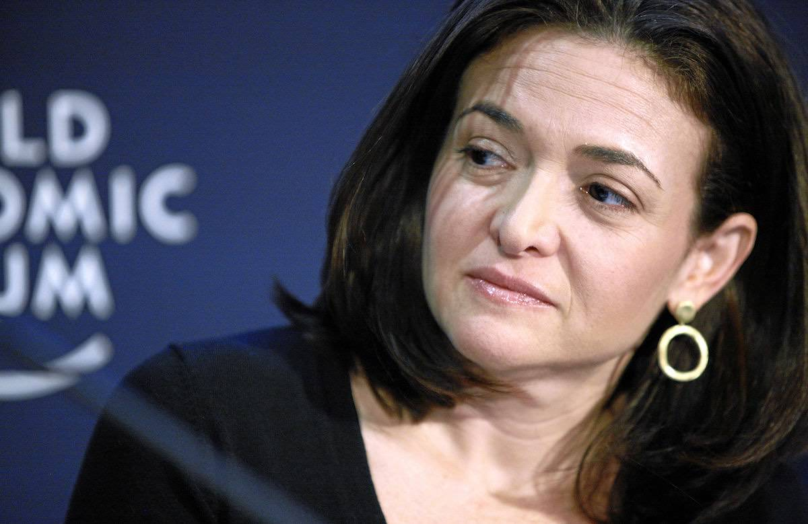

## 第五章

<figure>
  
  <figcaption>
    シェリル・サンドバーグ・フェイスブック最高執行責任者。By World Economic Forum from Cologny, Switzerland [<a href="http://creativecommons.org/licenses/by-sa/2.0">CC BY-SA 2.0</a>], <a href="https://commons.wikimedia.org/wiki/File%3ASheryl_Sandberg.jpg">via Wikimedia Commons</a>
  </figcaption>
</figure>

シェリル・サンドバーグ。フェイスブックの最高執行責任者(COO)としてザッカーバーグCEOを支える女性で、「[リーン・イン](https://www.amazon.co.jp/dp/B00KAUXBNS?tag=chibicode-22)」を著したフェミニストとしても世界的に有名だ。

そのサンドバーグは、「ニューアークへの、1億ドル寄付プラン」を読んだとき、ザッカーバーグにこう指摘した。

— マーク(ザッカーバーグ)、このプランには、「1億ドルは、現場の学校や生徒には直接渡しません」と書いているけれど・・・ 
— そうです。私がやりたいのは「教育の仕組み改革」だから、寄付金は学校や生徒の支援には使わないつもりです。仕組みを変えれば、最終的には学校や生徒の状況も良くなると思う。 
— でも、現場は貧困の悪影響で苦しんでいるんでしょう?だったら、なぜ現場の学校や生徒にお金を使わないのか、きちんと説明しないと向こうは納得しないと思いますよ。 
— なるほど。 
— そもそも、このプランからは、地域の協力をどのように得るかがすっぽりと抜け落ちています。このままでは、地域の反発は免れないと思いますよ。

サンドバーグの予想は、当たっていた。
