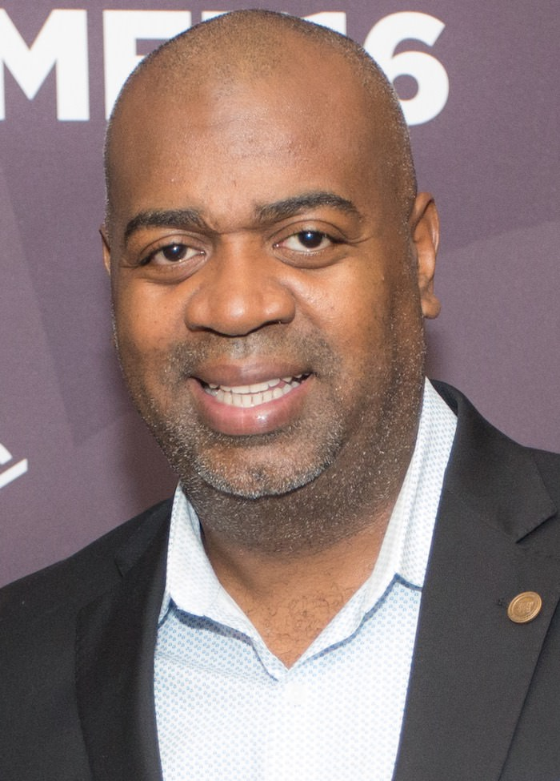

## 第七章: セントラル校

エイボン校から徒歩10分のところにあるセントラル・ハイスクール高校(以下、セントラル校)も、貧困にあえぐ公立校だ。この章では、セントラル校からはじまった「お涙頂戴」ではないストーリーを紹介する。

エイボン校と同じく、セントラル校の高校生も貧困に苦しんでいた。生徒の学力はおしなべて低く、女子生徒の妊娠も[日常茶飯事](#SD55giSK)。「友だちや家族が逮捕されたことはある?」とクラスに聞くと[半数](#fQwddWYg)が手をあげ、「友だちや家族が暴力の犠牲になったことはある?」と聞いても[半数](#fQwddWYg)が手をあげる。また、セントラル校のすぐ隣がギャングの抗争地域になっており、周辺の危険地帯を示すポスターを、Googleマップを使って作るという宿題が授業で[出されたりした](#SD55giSK)。

さらにエイボン校と同じく、セントラル校にも最近になって優秀な先生がやってきた。2008年に校長に就任した、ラス・バラカ氏である。

### バラカ校長

<figure>
  
  <figcaption>
    セントラル校のラス・バラカ校長。By Montclair Film Festival [<a href="http://creativecommons.org/licenses/by/2.0">CC BY 2.0</a>], <a href="https://commons.wikimedia.org/wiki/File%3ARas_J._Baraka.jpg">via Wikimedia Commons</a>
  </figcaption>
</figure>

彼が校長になった頃、州が規定する最低学力に達していた生徒は[1割程度](#HVdR3uz8)で、ほとんどの生徒が高校中退のリスクに晒されていた。

バラカは危機を脱するため、あらゆる[策を講じる](#kmJmSyh7)。募った補助金を財源に、授業時間を長くし、芸術教育を充実させ、教員支援のプロを雇った。テスト対策の授業枠も大幅に増やした。

以前までは、州の学力テストを受ける際、ほとんどの生徒は「どうせ落ちるだろう」とはじめから諦めていて、テスト開始と同時に寝る生徒が続出していた。しかしバラカが就任してから、先生は生徒に「やればできる」と鼓舞し続けた。生徒の士気を高めるべく、学力テストの前日には盛大な学園祭が[開かれた](#kmJmSyh7)。

その年の学力テストでは、寝る生徒は一人もおらず、全員が時間ギリギリまで問題を解いた。箱を開けてみると、州の学力テストを通過した生徒はなんと7割。結果発表の日、バラカは生徒全員を体育館に集め、通過した生徒をひとりずつ[表彰した](#kmJmSyh7)。

学力面だけでなく、精神面でもバラカは生徒の支えになった。父親がいない生徒のためにピザパーティーを開き、治安が悪化したと聞けば、先陣を切って通学路を生徒と歩いた。生徒のひとりがギャングに射殺された日には、全校生徒の前で涙ながらにスピーチを[行った](#IIbwBP46)。

— みなさん、いいですか、これが普通だと思ってはいけません。友だちが殺されること、通学路でギャングに襲われること、全ての授業で落第すること、ゴミ溜めのような家に暮らすこと、親同士が道の真ん中で喧嘩をはじめること、黒板に「安らかに眠れ」と書くこと・・・みなさんにとっては、普通のことかもしれません。しかし、ほとんどの社会では普通ではないのです。みなさんは、こういうことが普通でない社会に、なんとしても行かないといけません。

### バラカ校長の、もうひとつの顔

そんな名物校長は、もうひとつの顔を持っている。バラカはセントラル校の校長と、ニューアーク市の市議会議員の仕事を掛け持ちしていた。

ブッカーと同い年
