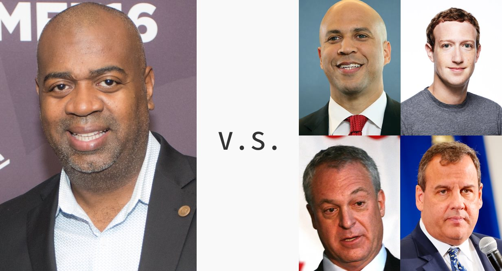
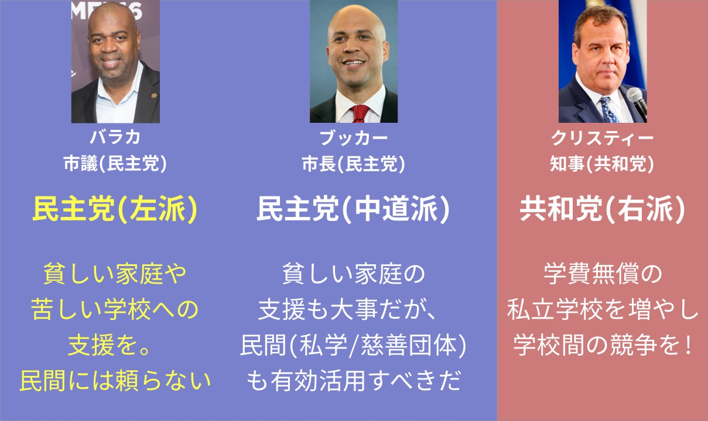

## 第七章: セントラル校

エイボン校から徒歩10分のところにあるセントラル・ハイスクール高校(以下、セントラル校)も、貧困にあえぐ公立校だ。この章では、セントラル校からはじまった「お涙頂戴」ではないストーリーを紹介する。

エイボン校と同じく、セントラル校の高校生も貧困に苦しんでいた。生徒の学力はおしなべて低く、女子生徒の妊娠も[日常茶飯事](https://goo.gl/B7k68n#SD55giSK)。「友だちや家族が逮捕されたことはある?」とクラスに聞くと[半数](https://goo.gl/B7k68n#fQwddWYg)が手をあげ、「友だちや家族が暴力の犠牲になったことはある?」と聞いても[半数](https://goo.gl/B7k68n#fQwddWYg)が手をあげる。また、セントラル校のすぐ隣がギャングの抗争地域になっており、周辺の危険地帯を示すポスターを、Googleマップを使って作るという宿題が授業で[出されたりした](https://goo.gl/B7k68n#SD55giSK)。

さらにエイボン校と同じく、セントラル校にも最近になって優秀な先生がやってきた。2008年に校長に就任した、ラス・バラカ氏である。

### バラカ校長

<figure>
  
  <figcaption>
    セントラル校のラス・バラカ校長。By Montclair Film Festival [<a href="http://creativecommons.org/licenses/by/2.0">CC BY 2.0</a>], <a href="https://commons.wikimedia.org/wiki/File%3ARas_J._Baraka.jpg">via Wikimedia Commons</a>
  </figcaption>
</figure>

彼が校長になった頃、州が規定する最低学力に達していた生徒は[1割程度](https://goo.gl/B7k68n#HVdR3uz8)で、ほとんどの生徒が高校中退のリスクに晒されていた。

バラカは危機を脱するため、あらゆる[策を講じる](https://goo.gl/B7k68n#kmJmSyh7)。募った補助金を財源に、授業時間を長くし、芸術教育を充実させ、教員支援のプロを雇った。テスト対策の授業枠も大幅に増やした。

以前までは、州の学力テストを受ける際、ほとんどの生徒は「どうせ落ちるだろう」とはじめから諦めていて、テスト開始と同時に居眠りをはじめる生徒が続出していた。しかしバラカが就任してから、先生は生徒に「やればできる」と鼓舞し続けた。生徒の士気を高めるべく、学力テストの前日には盛大な学園祭が[開かれた](https://goo.gl/B7k68n#kmJmSyh7)。

その年の学力テストでは、居眠りする生徒は一人もおらず、全員が時間ギリギリまで問題を解いた。フタを開けてみると、州の学力テストを通過した生徒はなんと7割。結果発表の日、バラカは生徒全員を体育館に集め、通過した生徒をひとりずつ[表彰した](https://goo.gl/B7k68n#kmJmSyh7)。

学力面だけでなく、精神面でもバラカは生徒の支えになった。父親がいない生徒のためにピザパーティーを開き、治安が悪化したと聞けば、先陣を切って通学路を生徒と歩いた。生徒のひとりがギャングに射殺された日には、全校生徒の前で涙ながらにスピーチを[行った](https://goo.gl/B7k68n#IIbwBP46)。

— いいですかみなさん、これが普通だと思ってはいけません。友だちが殺されること、通学路でギャングに襲われること、全ての授業で落第すること、ゴミ溜めのような家に暮らすこと、親同士が道の真ん中で喧嘩をはじめること、黒板に「安らかに眠れ」と書くこと・・・みなさんにとっては、普通のことかもしれません。しかし、ほとんどの社会では普通ではないのです。みなさんにはいつか、こういうことが普通でない社会に暮らしてほしい。

### バラカ校長の、もうひとつの顔

そんな名物校長は、もうひとつの顔を持っている。バラカはセントラル校の校長と、ニューアーク市の市議会議員の仕事を掛け持ちしていた。

ブッカー市長と同い年のバラカ市議は、裕福な家で育ったブッカーとは違い、ニューアークの社会活動家の息子として[育った](https://goo.gl/B7k68n#3Mz9kWZX)。彼の父は差別主義者の警官に袋叩きにされ、[妹](http://www.nytimes.com/2004/03/03/nyregion/man-indicted-in-two-killings-including-poet-s-daughter.html)は射殺され、[弟](http://continuumjournal.org/index.php/32-volumes/issues/vol-1-no-2-amiri-baraka-revaluation-and-appreciation/vol-1-no-2-content/articles-1-2/86-dramatizing-death-threats-amiri-baraka-s-nuyorican-trio)も頭に銃弾を打ち込まれて重度の障害者になった。若き頃から貧困や犯罪と戦い続けたバラカは人々の心をつかみ、気づいたら校長と市議会議員という二足のわらじを履いていた。

「温室育ちのやつらに好き勝手されるのは面白くない」という考えのもと、次第にバラカは市議会でブッカーとの対立を深めていった。「金持ちの集会」で決まった「公立校を多く閉鎖して無料の私立校を大量に作る」という計画が公になったときは、教育者として反対勢力を[牽引した](https://goo.gl/B7k68n#HWJwyJJm)。

<figure>
  
  <figcaption>
    バラカ市議対、ブッカー市長・ザッカーバーグ・サーフ(教育長官)・クリスティー知事の図。
  </figcaption>
</figure>

— 住民のみなさん、ブッカー・クリスティー・ザッカーバーグの計画は成功するわけがありません。ニューアークの生徒の学力が低い理由の根本的な原因は、貧困にあります。かれらの計画は貧困の影響を完全に無視し、学校に全ての責任を押し付けている。「教育の仕組み改革」よりも「貧困の対策」を優先しない限り、何も変わらないでしょう。

そして陰謀論を振りかざし、みなの恐怖を[煽った](https://goo.gl/B7k68n#HWJwyJJm)。

— ブッカーやクリスティーは、あなたの子どもを金持ちというオオカミたちに売り渡すつもりです。オオカミたちは、ニューアークの10億ドルの教育予算をいただこうと腹をすかせて待っているんです。

### バラカ市議、教育委員会に刺客を放つ

住民の支持を得たバラカは、なんとかしてブッカーらの計画を止められないか画策した。そして一つの案にたどり着いた。ニューアークの教育委員会に、ブッカー反対派を送り込むのだ。

資金不足のニューアークは、州から教育の補助金を受け取る代わりに、教育行政の実権を失っている。だからこそブッカーは、教育行政の実権を持つ州知事のクリスティーと結託することによって、改革を進めようとしているのだ。

<figure>
  
</figure>

ニューアーク市に教育行政の実権がないということは、すなわちニューアーク市の教育委員会に実権が無いということだ。もう少し詳しく言うと、「ニューアーク市の教育委員会がどんな決断をしたとしても、州知事がそれを100%否決することができる」という仕組みになっている。

何を言っても否決されるなら、教育委員会は州知事の言いなりになってればいい、ということだ。実際に、クリスティーが州知事になってからは、教育委員たちは完全にクリスティーの言いなりに[なっていた](https://goo.gl/B7k68n#7mcfzSOI)。それでも教育委員会が存続していたのは、いちおう形だけでも「地域のご意見番」を残しておこうという配慮からだった。

そこで、バラカは[こう考えた](https://goo.gl/B7k68n#7mcfzSOI)。

ブッカー市長やクリスティー知事を止めるには、最終的には、二人を市長と知事の椅子から引きずり降ろさなければいけない。そのためには、二人の評判を落とす必要がある。評判を落とすには、「二人は、住民の言うことを聞こうとしない」ということが広まればよい。

そのために、教育委員会は役にたつのではないか。

ニューアークの教育委員は住民投票で選ばれる。「金持ちの集会」での決議が住民を怒らせてから2ヶ月後の[2011年4月](https://goo.gl/B7k68n#vZnAxoSn)、その投票が行われることになっていた。

その投票で候補者を立て、ブッカーらに反対する人間を教育委員会に送り込む。当選した教育委員たちに、「住民は賛成だが、ブッカー市長やクリスティー知事は嫌がること」を提案させる。そうすれば、クリスティー知事はその提案を否決するだろう。

それを繰り返せば、「ブッカーやクリスティーは、住民の言うことを聞こうとしない」というイメージを植え付けることができる。そうすれば、二人はいずれ失脚し、改革も頓挫するだろう。

あわよくば、わたしが市長に[なれるかもしれない](https://goo.gl/B7k68n#7mcfzSOI)。

### バラカの本音

「ブッカーやクリスティーが、教育を民営化しようとしている」と住民の恐怖を煽ったバラカ。やや事態を単純化しているようにも見えるが、彼のレトリックはあくまで票を稼ぐ手段だった。

たしかにバラカは、イデオロギー的には、民主党の中道派であるブッカーよりも左派に近い。

<figure>
  
</figure>

しかし、この記事のもとになった本「The Prize」の著者がバラカにインタビューしたとき、[彼はこう答えている](https://goo.gl/B7k68n#IHWUf0GZ)。

— ブッカーやクリスティーの言っていることが、根本的に間違っているとは思いません。むしろ正しいとさえ思っている。わたしは何年も校長として働きましたが、改善の余地がないほどのダメ教師もたくさん見てきました。組合のせいで、そういう教師をクビにできないのは問題です。また、指導力の良し悪しに関わらず、年功序列で教師の給料を上げるのも間違ってると思います。

ザッカーバーグが提唱する「教員の雇用改革」と、何ら変わりはない。その上で、バラカは[こう続けた](https://goo.gl/B7k68n#IHWUf0GZ)。

— しかし、公立校や組合といった、既存の枠組みで働いている者たちを端から敵扱いし、上から「この方法が正しいんだ」と押し付けるのはいかがなものか。ニューアークの人々に失礼ですし、「余計なお世話だ」と断られるのがオチだ。それよりもまずは、住民に寄り添うところからはじめるべきです。

バラカも、ブッカーも、クリスティーも、ザッカーバーグも、サーフも、他の誰にも悪気はない。みな、ニューアークの子どもたちの未来を憂いている。

しかし、物事には順序がある。貧困対策が先か、教育改革が先か。住民の合意が先か、一歩を踏み出すのが先か。同時にできれば言うことなしだが、そうでなければ片方は後回しになる。どちらを先にすべきかは場合によりけりだ。

ニューアークにとって、正しい答えは何だったのだろうか。それは、もうすぐ明らかになる。
