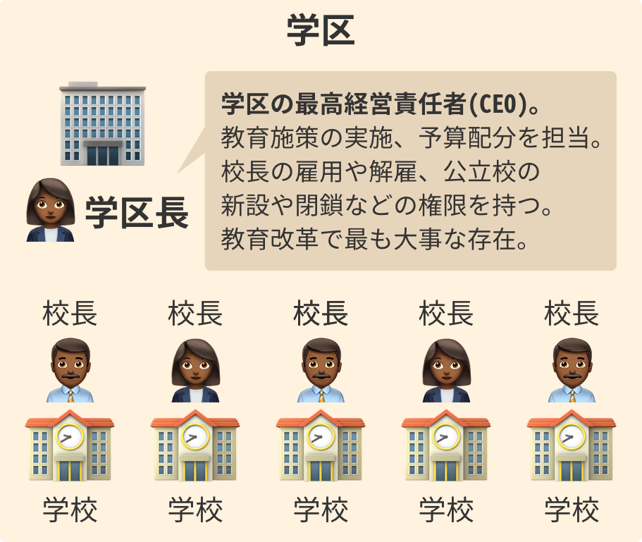
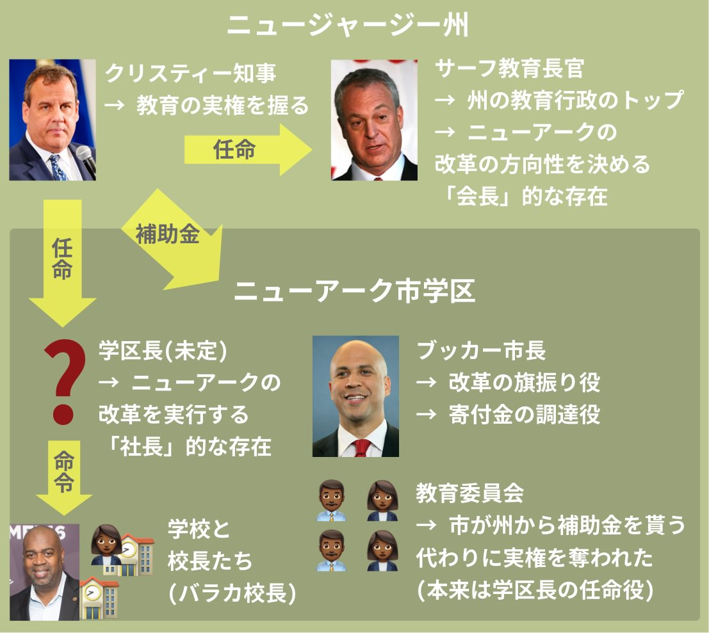

## 第八章: 学区長

ニューアークへの1億ドルの寄付を発表してから半年。ザッカーバーグは焦っていた。

<figure>
  
  <figcaption>
    By TechCrunch (4S2A2079Uploaded by indeedous) [<a href="http://creativecommons.org/licenses/by/2.0">CC BY 2.0</a>], <a href="https://commons.wikimedia.org/wiki/File%3ATechCrunch_SF_2013_4S2A2079_(9728625374).jpg">via Wikimedia Commons</a>
  </figcaption>
</figure>

彼がいてもたってもいられなくなった理由は、アメリカの教育改革で最も大事な役割を果たすとされる、新しい「学区長」がまだニューアークで見つかっていなかったからだ。

2011年4月、ザッカーバーグはブッカー市長をフェイスブック本社に[呼びつけた]()。ニューアークからシリコンバレーまで、片道5時間かかる飛行機でやってきたブッカーを、ザッカーバーグは問い詰めた。

— ブッカーさん、わたしが寄付を発表して半年もたったのに、まだニューアークの「学区長」が見つかってないんですか。このままでは、改革は前に進みませんよ。 
— 申し訳ない。すべてわたしの不徳の致すところです。 
— わたしは一社しか経営したことがありませんが、企業でも学区でも、経営には経営者が必要だと思っています。 
— わかっています。もう少し時間をください。

### 学区長とは何をする人か

アメリカには学校のまとまりである「学区」という行政区があり、その学区の代表が学区長である。

<figure>
  
</figure>

学区のそれぞれの学校を会社の「部署」に例えるなら、校長は「部長」で、学区長は「社長」となる。学区長は学区の最高経営責任者(CEO)として、教育施策の実施、予算配分、校長の雇用や公立校の設置・撤廃などに責任を持つ。学区全体の教育改革をするならば、学区長はキーパーソンとなる。

2011年4月時点でのニューアークの現状は以下の通りだ。かなり複雑に見えるが、キーポイントは2点しかない。

<figure>
  
</figure>

第一に、学区長がまだ決まっていないということだ。学区長はニューアークの改革を実行する「社長」的な存在で、適任が見つかっていない。いっぽう、ニューアークの改革の方向性を決める「会長」的な存在の州敎育長官は、「金持ち集会」で公立校の縮小、私立校の拡大を語ったサーフ氏がすでに務めている。

第二に、学区長はクリスティー州知事が任命することになっている。本来は学区長は教育委員会が任命するのだが、州はニューアークに補助金を出していて、その見返りとして州知事が実権を教育委員会から奪い取ったため、州知事が学区長を任命できるのだ。それ対してアメリカのたいていの学区では、首長ではなく、住民に選ばれた教育委員会が学区長を任命する仕組みになっている。

### ちなみに日本と比べると

アメリカの学区の学区長は日本でいうと、自治体の教育委員会の代表「教育長」にあたる。

日本の教育委員会には戦後から[2015年4月まで](http://www.yomiuri.co.jp/kyoiku/special/CO015552/20150508-OYT8T50101.html)、常勤の「教育長」と非常勤の「教育委員長」という二人の代表がいた。また、首長はこの代表ふたりの人事に口出しができなかった。

しかし、2011年に大津市でいじめ自殺問題が[起きたとき](https://ja.wikipedia.org/wiki/%E5%A4%A7%E6%B4%A5%E5%B8%82%E4%B8%AD2%E3%81%84%E3%81%98%E3%82%81%E8%87%AA%E6%AE%BA%E4%BA%8B%E4%BB%B6)、教育委員会は迅速な対応ができず批判を浴びたため、60年ぶりに制度が見直された。

まず、責任の所在を明確にするため、2015年4月にできた新制度によって、教育委員のトップは「教育長」に一本化された。この教育長はアメリカの学区長と同じく、自治体の教育のトップを務める。

さらに、自治体の首長が教育長の任命・罷免権を持ち、教育委員会に問題があれば首長が対応できるようになった。戦争に教え子を送った反省から、教育委員会は政治的に中立であるべきと考えられていたが、そのタブーは破られた。ニューアークのクリスティー知事が、学区長を任命する権利を教育委員会から奪ったのと似ているかもしれない。

### ニューアークの学区長候補1・キング氏
