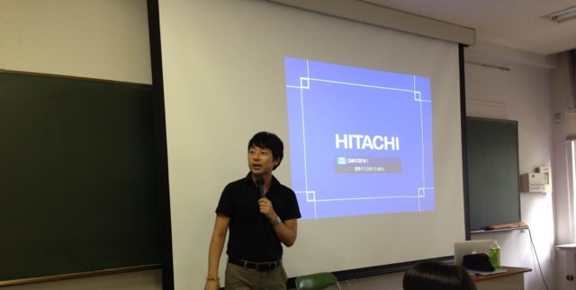
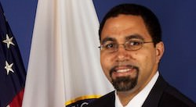
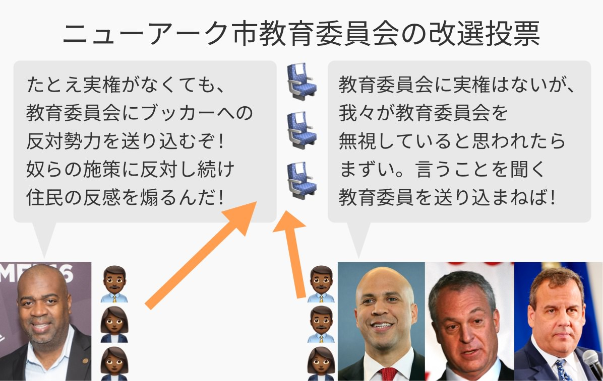
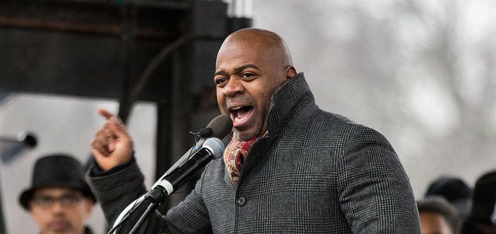
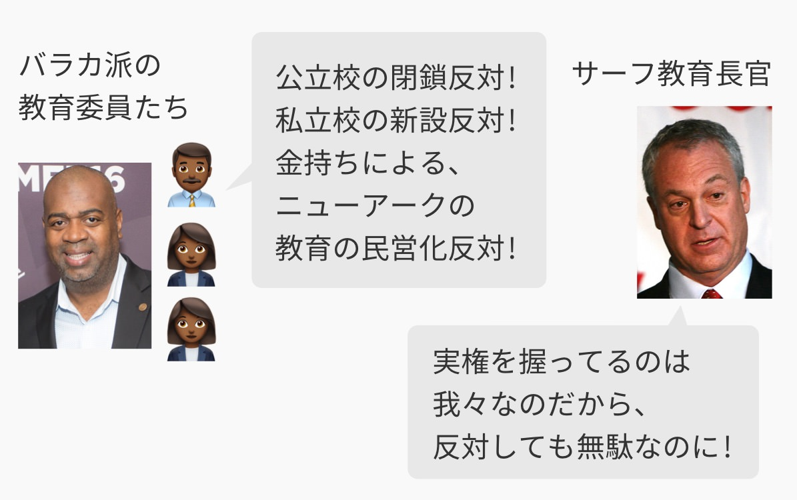

## 第八章: 学区長

ニューアークへの寄付を発表してから半年。ザッカーバーグは焦っていた。

<figure>
  
  <figcaption>
    By TechCrunch (4S2A2079Uploaded by indeedous) [<a href="http://creativecommons.org/licenses/by/2.0">CC BY 2.0</a>], <a href="https://commons.wikimedia.org/wiki/File%3ATechCrunch_SF_2013_4S2A2079_(9728625374).jpg">via Wikimedia Commons</a>
  </figcaption>
</figure>

彼がいてもたってもいられなくなった理由は、アメリカの教育改革で最も大事な役割を果たすとされる、新しい「学区長」がまだニューアークで見つかっていなかったからだ。

2011年4月、ザッカーバーグはブッカー市長をフェイスブック本社に[呼びつけた](https://goo.gl/B7k68n#g2lGaPuT)。ニューアークからシリコンバレーまで、片道5時間かかる飛行機でやってきたブッカーを、ザッカーバーグは問い詰めた。

— ブッカーさん、わたしが寄付を発表して半年もたったのに、まだニューアークの「学区長」が見つかってないんですか。このままでは、改革は前に進みませんよ。 
— 申し訳ない。すべてわたしの不徳の致すところです。 
— わたしは一社しか経営したことがありませんが、企業でも学区でも、経営には経営者が必要だと思っています。 
— わかっています。もう少し時間をください。

ブッカーがニューアークに戻ったとき、フェイスブックの社訓を綴ったポスターがザッカーバーグから届いていた。

<figure>
  
  <figcaption>
    筆者作成(<a href="https://unsplash.com/search/work?photo=1K9T5YiZ2WU">写真</a>)。実際のポスターは違うデザインである。
  </figcaption>
</figure>

### 学区長とは何をする人か

アメリカには学校のまとまりである「学区」という行政区があり、その学区の代表が学区長である。

<figure>
  
</figure>

学区のそれぞれの学校を会社の「部署」に例えるなら、校長は「部長」で、学区長は「社長」となる。学区長は学区の最高経営責任者(CEO)として、教育施策の実施、予算配分、校長の雇用や公立校の設置・撤廃などに責任を持つ。学区全体の教育改革をするならば、学区長はキーパーソンとなる。

2011年4月時点でのニューアークの現状は以下の通りだ。かなり複雑に見えるが、キーポイントは2点しかない。

<figure>
  
</figure>

第一に、学区長がまだ決まっていないということだ。学区長はニューアークの改革を実行する「社長」的な存在で、適任が見つかっていない。いっぽう、ニューアークの改革の方向性を決める「会長」的な存在の州敎育長官は、「金持ち集会」で公立校の縮小、私立校の拡大を語ったサーフ氏がすでに務めている。

第二に、学区長はクリスティー州知事が任命することになっている。本来は学区長は教育委員会が任命するのだが、州はニューアークに補助金を出していて、その見返りとして州知事が実権を教育委員会から奪い取ったため、州知事が学区長を任命できるのだ。それ対してアメリカのたいていの学区では、首長ではなく、住民に選ばれた教育委員会が学区長を任命する仕組みになっている。

### ちなみに日本と比べると

アメリカの学区の学区長は日本でいうと、自治体の教育委員会の代表「教育長」にあたる。

<figure>
  
  <figcaption>
    2013年7月19日、<a href="http://chibicode.com/osaka/">筆者が大阪府立天王寺高校で講演をしたときに</a>、わざわざ応援に駆けつけてくださった<a href="https://ja.wikipedia.org/wiki/%E4%B8%AD%E5%8E%9F%E5%BE%B9">中原徹・元大阪府教育長</a>。2015年3月、教育委員会制度が新しくなる一ヶ月前に不祥事を理由に辞職された。個人的には、ぼくは彼にはたいへんお世話になり、感謝している。
  </figcaption>
</figure>

日本の教育委員会には戦後から[2015年4月まで](http://www.yomiuri.co.jp/kyoiku/special/CO015552/20150508-OYT8T50101.html)、常勤の「教育長」と非常勤の「教育委員長」という二人の代表がいた。また、首長はこの代表ふたりの人事に口出しができなかった。

しかし、2011年に大津市でいじめ自殺問題が[起きたとき](https://ja.wikipedia.org/wiki/%E5%A4%A7%E6%B4%A5%E5%B8%82%E4%B8%AD2%E3%81%84%E3%81%98%E3%82%81%E8%87%AA%E6%AE%BA%E4%BA%8B%E4%BB%B6)、教育委員会は迅速な対応ができず批判を浴びたため、60年ぶりに制度が[見直された](http://www.yomiuri.co.jp/kyoiku/special/CO015552/20150508-OYT8T50101.html)。

まず、責任の所在を明確にするため、2015年4月にできた新制度によって、教育委員のトップは「教育長」に一本化された。この教育長はアメリカの学区長と同じく、自治体の教育のトップを務める。

さらに、自治体の首長が教育長の任命・罷免権を持ち、教育委員会に問題があれば首長が対応できるようになった。戦争に教え子を送った反省から、教育委員会は政治的に中立であるべきと考えられていたが、そのタブーは破られた。ニューアークのクリスティー知事が、学区長を任命する権利を教育委員会から奪ったのと似ているかもしれない。

### ニューアークの「学区長」候補その1・キング氏

ニューアークの話に戻ろう。

<figure>
  
  <figcaption>
    ジョン・キング氏。By United States Department of Education [Public domain], <a href="https://commons.wikimedia.org/wiki/File%3AJohn_B._King%2C_Jr.2015.jpg">via Wikimedia Commons</a>
  </figcaption>
</figure>

ザッカーバーグが寄付を発表する前、ブッカー市長はジョン・キング・ニューヨーク州教育長官代理に、「ニューアークの学区長になりませんか」と打診した。キング氏には、ボストンやマンハッタンの教育改革を成功させたという[実績がある](https://goo.gl/B7k68n#gPifvs42)。

しかし、キング氏はニューアークを視察したとき、[こう言って](https://goo.gl/B7k68n#gPifvs42)学区長の座を蹴った。

— ブッカー市長、あなたは5年でニューアークの改革をやるとおっしゃいましたか? 
— はい。ザッカーバーグさんの寄付金も、5年で使い切りたいと約束しました。 
— それはなぜですか? 
— われわれの最終的な目的は、ニューアークで改革を成功させ、それを全国展開させることだからです。5年でニューアークを立て直すくらいのスピード感でやらないと、全国展開など遠い先の未来になってしまいます。 
— なるほど。 
— それに、いまはクリスティー知事という良いパートナーに恵まれています。われわれ二人がいつ落選するかも分からないのに、5年以上も待てません。 
— ブッカーさん、単刀直入に申し上げて、5年でニューアークを立て直すのは無理です。現状があまりにひどすぎる。「仕組み」は5年で改革できるかもしれないが、「結果」が出るのはかなり先になるでしょう。悪いことは言いません。もっともっと長い時間をかけて取り組む見込みがついたら、わたしを呼んでください。

キング氏は[のちに](https://en.wikipedia.org/wiki/John_King_Jr.)、オバマ元大統領のもとでアメリカ教育大臣になった。

### ニューアークの「学区長」候補その2・ブリザード氏

ブッカーはその後しばらく候補者を見つけられなかった。そして半年後の2011年3月、「金持ち集会」の目論見が住民にバレたころ、目ぼしい人物が[見つかった](https://goo.gl/B7k68n#r3fggOpt)。

彼の名はジャン・クラウド・ブリザード氏。ニューヨーク州ロッチェスター市の学区長である。市の教職員組合と全面戦争に挑むほどの強硬派で、ブッカーらはその気概を[評価した](https://goo.gl/B7k68n#r3fggOpt)。

<figure>
  
  <figcaption>
    ジャン・クラウド・ブリザード氏。By <a href="https://web.archive.org/web/20111102191947/http://www.cps.edu/About_CPS/The_Board_of_Education/BoardBios/Pages/Jean-ClaudeBrizard.aspx">Chicago Public Schools</a>
  </figcaption>
</figure>

しかし、ブリザード氏を見つけたタイミングが悪かった。ちょうど一ヶ月後の2011年4月、市の教育委員の改選が行われることになっていた。バラカ校長・市議が、反ブッカー勢力を送り込もうとした投票である。

<figure>
  
</figure>

ニューアークの教育委員会に実権はない。ニューアーク市の教育委員会がどんな決断をしたとしても、州知事がそれを100%否決することができる。だから、今までの教育委員は州知事の言いなりになっていた。

そこでバラカ氏は、反ブッカー勢力を送り込み、「教育委員会 v.s. ブッカー市長やクリスティー知事」という構図を作ろうとした。うまくいけば、市長や知事から住民の求心力を奪うことができる。

この投票前に、ブリザード氏が学区長に就任するのはマズかった。ブリザード氏は強硬派で有名だから、彼が学区長になれば、バラカ氏率いる反ブッカー勢力が抵抗を増す。すると、教育委員会の住民投票で、反ブッカー勢力が勝ってしまうかもしれない。

そう考えたブッカーは、ブリザード氏に「教育委員会の住民投票まで待ってくれ」と[伝えた](https://goo.gl/B7k68n#r3fggOpt)。

そして4月末、住民が投票で判断を下した。

バラカ率いる、反ブッカー勢力が[勝利したのだ](https://goo.gl/B7k68n#Lw5FSKuN)。しのぎを削るとはこのことで、ひとりの候補者は得票数48票差で委員の椅子を手にした。

<figure>
  
  <figcaption>
  バラカ校長・市議。By Lorie Shaull from Washington, United States [<a href="http://creativecommons.org/licenses/by-sa/2.0">CC BY-SA 2.0</a>], <a href="https://commons.wikimedia.org/wiki/File%3ARas_Baraka%2C_Mayor_of_Newark%2C_We_Shall_Not_Be_Moved_Rally%2C_Washington_DC_(31499719893).jpg">via Wikimedia Commons</a>
  </figcaption>
</figure>

しかも、住民投票を待っている間に、ブリザード氏はニューアークの誘いを断ってしまった。投票直前に、全米で3番めに大きいシカゴ市学区が「学区長にならないか」と彼にアプローチし、彼はそれを[受諾してしまったのだ](https://goo.gl/B7k68n#OWlO55Fd)。

踏まれたり蹴られたりとは、まさにこのことである。ブッカーは、目の前が真っ暗になった。

### 学区長の肌の色

バラカの手先が教育委員になったことで、教育委員とブッカーらの対立は激化した。もちろん、教育委員に実権はないのだけれども、対立を煽れば煽るほど、ブッカーやクリスティーの支持率が下がる可能性があった。

その後、ブッカーら改革勢力は、成績がもっとも悪い公立校を閉鎖する計画を前進させようとした。住民の反対を避けるため、ブッカーらはまたコンサルタントを雇い、とくに閉鎖反対が多い公立校はどこか調べさせ、その公立校の閉鎖を[取りやめた](https://goo.gl/B7k68n#GprZ365K)。

そして改革勢力は、いくつかの公立校を閉鎖する代わりに、あたらしく6つの私立学校を無償で開くことにした。財源は税金だが、初期投資は、ザッカーバーグら「金持ち集会」のメンバーの寄付金で賄われる。どれも、日本の予備校のような「チェーン店」型の私立学校で、ニューアーク以外の貧困地域で生徒の学力をアップさせた成功事例[ばかりだった](https://goo.gl/B7k68n#GprZ365K)。

はじめは懐疑的だった住民も「無償で、しかも良い学校ならうちの子を行かせてもいいかも」と興味を持ち、説明会が行われたあと、600組の親子が6つの学校に[願書を出した](https://goo.gl/B7k68n#GprZ365K)。

しかし、バラカ派に傾いた教育委員会は予想通り、私立校の新設それに反対する。「公立校を守れ」「教育の民営化を止めろ」というのが委員の[言い分だった](https://goo.gl/B7k68n#I5bclgYG)。

<figure>
  
</figure>

クリスティー知事にかわって州を代表するサーフ教育長官は、実権を行使し、教育委員の反対を否決した。つまり、公立校は閉鎖され、無償の私立校は3つともオープンする。彼は怒りに任せてこんな捨て台詞を[吐いた](https://goo.gl/B7k68n#jeqUZNGE)。

— もう我慢の限界です。「先に住民の意見を聞け」とみなさんは言いますが、あなたたちの意見は本当に子どもたちのためになっているんですか?われわれが新設しようとしているチェーン型の私立校は、閉鎖しようとしてる公立校よりずっと、他の地域で成功しているんですよ。事実を無視し、陰謀論に走り、合議制でものごとを決めようとしたら、教育は良くなりません。何と言われようと、子どもたちにとって正しいことをやるのがわたしの仕事です。

そして、最後に一言、サーフ教育長官は余計なことを[言ってしまった](https://goo.gl/B7k68n#jeqUZNGE)。

— ちなみに、ニューアークの新しい学区長は「白人」になる予定です。そこんとこ、よろしく。
