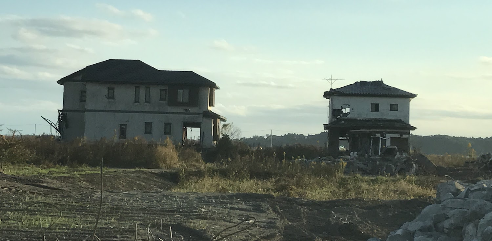
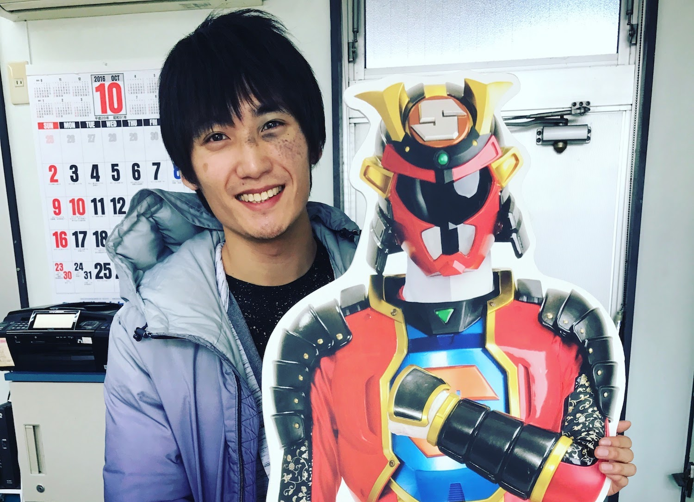
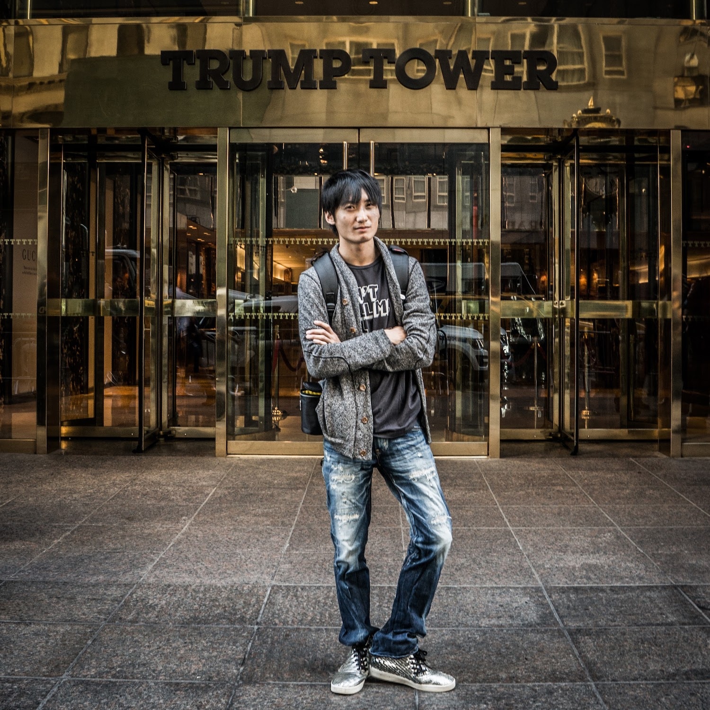

#### 誰にも悪気は無かった話 — 「貧困の連鎖を止めようとしたら、子どもの学力が下がりました」「働き方から変えよう、地方から変えようとしたら、何も変わりませんでした」

# 第一章・「ヒーロー」

— 震災後にここに戻ってきたときは、生まれて初めて、解けない問題に直面したような感じでした。

原発10キロ圏内にある福島県・浪江町を案内してくれた友人は、車を走らせながらそう言った。震災から5年半が経った今でも、津波の爪痕がまざまざと残る。すれ違うのは工事のトラックばかり。ぼくが訪れた2016年11月の時点では、いまだに居住禁止のゴーストタウンとなっている。

<figure>
  
  <figcaption>浪江町。撮影:上杉周作。以後、ぼくが著作権を持っている画像はその旨の表記を省きます。</figcaption>
</figure>

友人は浪江町のすぐ北にある福島県・南相馬市出身。上京して超一流大学に進学し、超一流企業に入社し、誰もが羨むようなキャリアを歩んでいた。そんな最中に東日本大震災が起き、10mを超える津波が南相馬を襲った。彼はすぐさま故郷に戻り、泥だらけの遺体の処理から、ガソリンスタンドへの給油作業まで、できることは何でもやった。

それから5年半。まだ30代前半の彼は現在、南相馬復興のリーダー的存在となっていて、東京と福島を月に何度も行き来しながら活動している。

## ここは未来の日本

— 南相馬には東京の方々も視察に来るのですが、その人たちには「ここは未来の日本なんですよ」って言ってます。

震災前の2010年、南相馬の65歳以上人口は26.6%と、日本全体でみると2015年に到達した数字だった。しかし、震災後に南相馬の高齢化は一気に進み、2015年には65歳以上人口が33.6%になった。これは日本全体でみると2035年に到達するであろう数字である。本来20年かかる高齢化が、南相馬にはたった5年でやってきたのだ。<a href="#">※</a>

— 介護の現場はそうとう大変なんでしょうね。 
— 仰るとおり、ベッドも人手もまったく足りてませんよ。

南相馬の20年後はどうか。推計によれば、2035年には65歳人口が44.9%になり、15~64歳人口の46.2%と並ぶ。

もしぼくが今日、南相馬に生まれたとしたら、そのぼくが大学に進学するころには、市の約2人に1人が高齢者になっている。

そんな街に、ぼくは希望を持てるのだろうか? 映画「君の名は。」に登場する、飛騨の田舎育ちの主人公・三葉のように、「もうこんな町いややー！こんな人生いややー！来世は東京のイケメン男子にしてくださーい！」と叫んだりしてしまうのだろうか。それとも、物心つくころにはなんとも思わなくなるのだろうか。

どちらにしろ、イケメンに生まれたかった人生ではあるが。

## 相双神旗ディネード

そんな南相馬で育つ子どもたちに、希望を届けている人たちがいる。

[フロンティア南相馬](http://frontier-minamisoma.org/)という、震災後に福島県で最初に認定を受けたNPOがある。設立メンバーは震災で集まったボランティアの有志たちで、子どもの支援・生活の支援・産業の支援を行っている。

このフロンティア南相馬は、ご当地ヒーロー「相双神旗ディネード」の立ち上げも支援した。ディネードは南相馬近郊を守る正義の味方で、ヒーローショーで悪と戦いながら、子どもたちを「震災や放射能に負けるんでねーど(福島弁)」と鼓舞している。実写映画化もされ、制作の様子はめざましテレビが全国に放映した。

<figure>
  
  <figcaption>「相双神旗ディネード」の<a href="https://www.youtube.com/watch?v=ooExRI4NSco">予告動画より</a>。<a href="images/denade-permission.png">転載の許可も頂いた</a>。</figcaption>
</figure>

悪役は、原発事故により、住んでいた海や山を汚された動物の化身という設定だ。人間によって、帰る場所を奪われたという点では、悪役たちも、ディネードを観る子どもたちも境遇は同じだ。

関係者の方はこう語る。

— とにかくお金が足りなくて、ヒーローショーを続けるのも大変なんですよ。コスチュームの維持費だってバカにならない。 
— そんなに大変なのに、なぜ続けてるんですか? 
— そりゃあ、好きだからですよ。そして、子どもたちは、ヒーローの言うことには耳を傾けるんです。 
— というと・・・ 
— たとえば「多様性を尊重しよう、相手の立場を理解しよう」って大人が口酸っぱく言うよりも、ディネードが悪役にたいして「きみたちが怒る理由も分かるよ」と言うほうが、子どもにとってはよっぽど説得力があるんですよ。

<figure>
  
  <figcaption>ぼくとディネード。</figcaption>
</figure>

ぼくも、アクションヒーローと共に育った。幼稚園の頃は祖父に連れてもらってウルトラマンのショーを観に行き、小学校1年生のときは、5人の色違いのヒーローが悪と戦う「スーパー戦隊シリーズ」の「[忍者戦隊カクレンジャー](https://ja.wikipedia.org/wiki/%E5%BF%8D%E8%80%85%E6%88%A6%E9%9A%8A%E3%82%AB%E3%82%AF%E3%83%AC%E3%83%B3%E3%82%B8%E3%83%A3%E3%83%BC)」を熱心に見ていた。

カクレンジャーはシリーズ18年目の作品なのだが、18年目にして初めて、5人のうち1人(鶴姫)が女性メンバーとなり、しかもその女性メンバーがチームリーダーを務めた。たまたまぼくが見た年が、スーパー戦隊シリーズにとって女性の社会進出元年だったのである。早計かもしれないが、カクレンジャーは、ぼくと同年代の男性が持つ「男女の価値観」に、少しばかり影響を与えたのではないか。

ちなみに、[フロンティア南相馬へはこちらから寄付できる](http://frontier-minamisoma.org/supports/index/)。

## 人はなぜヒーローの言うことを信じるのか?

しかし、ディネードに憧れる子どもたちも、もう少し背が伸びたら「誰かにとってのヒーローは、誰かにとっての敵役になる」と知る。そしてさらに大きくなる頃には、「ある大勢にとってのヒーローは、別の大勢にとっての敵役になる」と悟るだろう。

2016年は、ディネードが南相馬に現れたのと同じように、ぼくが住むアメリカにもドナルド・トランプというヒーローが現れた年だった。ぼくはトランプ氏を支持しなかったが、グローバル化に虐げられている白人低学歴層という「弱者」にとって、彼は紛れもない救世主なのだ。そして、べつの「弱者」である移民や他のマイノリティーにとっては、彼は敵役以外の何者でもなかった。

<figure>
  
  <figcaption>2016年9月、NYのトランプタワーにて。</figcaption>
</figure>

さらに、子どもたちは大人になるにつれ、「世の中にはいろんなタイプのヒーローがいる」ことに気づく。ディネードのように心優しい福島弁のヒーローもいれば、トランプ氏のように強い態度で権威を示し、一部の弱者を生贄にするヒーローもいる。

ここで素朴な疑問なのだが、それぞれの人が、違ったタイプのヒーローを待ち望むのはなぜだろう?

たとえば、トランプ氏のようなヒーローは政治学的に「権威主義的」なヒーローと呼ばれる。
