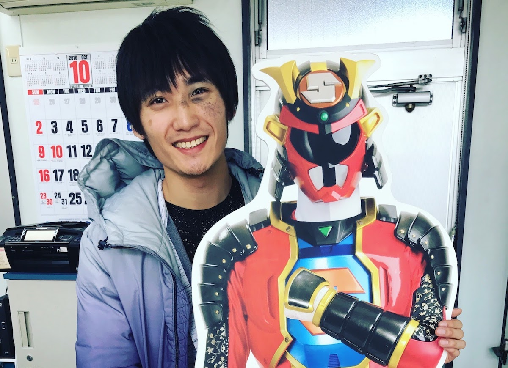

# 誰にも悪気は無かった話 — 貧困の連鎖を止めようとしたら、子どもの学力が下がりました。働き方から変えよう、地方から変えようとしたら、何も変わりませんでした。

— 震災後にここに戻ってきたときは、生まれて初めて、解けない問題に直面したような感じでした。

原発10キロ圏内にある福島県・浪江町を案内してくれた友人は、車を走らせながらそう言った。震災から5年半が経った今でも、津波の爪痕がまざまざと残る。すれ違うのは工事のトラックばかり。ぼくが訪れた2016年11月の時点では、いまだに人が住むことはできない。

<figure>
  
  <figcaption>浪江町。撮影:上杉周作。以後、ぼくが著作権を持っている画像はその旨の表記を省きます。</figcaption>
</figure>

彼は浪江町のすぐ北にある福島県・南相馬市出身。上京して超一流企業に入社し、誰もが羨むようなキャリアを歩んでいた。そんな最中に東日本大震災が起き、南相馬を津波が襲った。彼はすぐさま故郷に戻り、泥にまみれた遺体の処理から、ガソリンスタンドへの給油作業まで、できることは何でもやった。

それから5年半。まだ30代前半の彼は現在、南相馬復興のリーダー的存在となっていて、東京と福島を月に何度も行き来しながら活動している。

### ここは未来の日本

— 南相馬には東京の方々も視察に来るのですが、その人たちには「ここは未来の日本なんですよ」って言ってます。

震災前の2010年、南相馬の65歳以上人口は26.6%と、日本全体でみると2015年に到達した数字だった。しかし、震災後に南相馬の高齢化は一気に進み、2015年には65歳以上人口が33.6%になった。これは日本全体でみると2035年に到達するであろう数字である。本来20年かかる高齢化が、南相馬にはたった5年でやってきたのだ。<a href="#">※</a>

— 介護の現場はそうとう大変なんでしょうね。 
— 仰るとおり、ベッドも人手もまったく足りてませんよ。

南相馬の20年後はどうか。推計によれば、2035年には65歳人口が44.9%になり、15~64歳人口の46.2%と並ぶ。

もしぼくが今日、南相馬に生まれ、ここで育ったとする。そのぼくが大学に進学するころには、市のほぼ2人に1人が高齢者になっている。

老いていくそんな景色に囲まれながら、ぼくはどんな思いで育つのだろう。

映画「君の名は。」に登場する、飛騨育ちの主人公・三葉のように、「もうこんな町いややー！こんな人生いややー！来世は東京のイケメン男子にしてくださーい！」と叫んだりしてしまうのだろうか。それとも、物心がつくころにはなんとも思わなくなるのだろうか。

どちらにしろ、イケメンに生まれたかった人生ではあるが。

### 南相馬を脱出した

— ぼくはこんな田舎で育って、中学までサッカーしかしてませんでした。でも高校から猛勉強して東京の大学に合格し、南相馬を脱出したんです。ほとんど独学だったんですけど、数学は異常なまでに得意だったのでなんとかなりました。

彼が言う「脱出した」は、南相馬に暮らす人たちにたいして失礼な言葉かもしれない。けれど、東京との可能性の差を客観的に捉えた言葉だとは思う。東京の超一流大学に進学した彼には、なおさら当てはまる。

もちろん、理想は脱出を必要としないことだ。

地方再生の鍵を握るのはゆるキャラでもB級グルメでもふるさと納税でもなく、「補助金に頼らずに、地域の平均所得を上げること」が有識者の共通認識らしい。 <a href="#">※</a> 一度はここを脱出した友人は現在、南相馬で中小企業を経営していて、雇用を通して地域の所得向上につとめている。

また、彼が関わっているNPOは「相双神旗ディネード」というご当地ヒーローを誕生させた。ヒーローショーで悪と戦いながら、南相馬で育つ子どもたちに「震災に負けるんでねーど(福島弁)」というメッセージを送っている。

<figure>
  
  <figcaption>ぼくとディネード。ディネードはめざましテレビにも紹介された。</figcaption>
</figure>

南相馬で育つ子どもたちが、将来ここを脱出する必要がなくなれば、それに越したことはない。しかし、今の南相馬には不安要素のほうが多いことは確かだ。とくに、出生・死亡・移動だけで決まってしまう、人口の予測はまず外れない。

もしぼくが今日、南相馬に生まれ、ここで育ち、2020年~2030年代にかけて街の衰退や高齢化が止まらなかったら、ぼくはいずれ「ここを脱出したい」と思うだろうか。

もしそう思ったとして、ぼくだったら、ここを脱出できるのだろうか。
