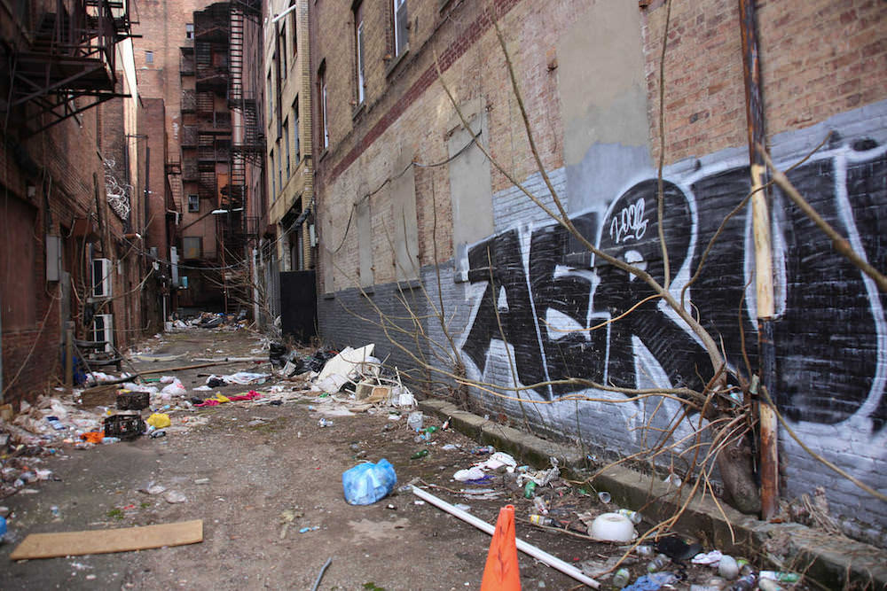
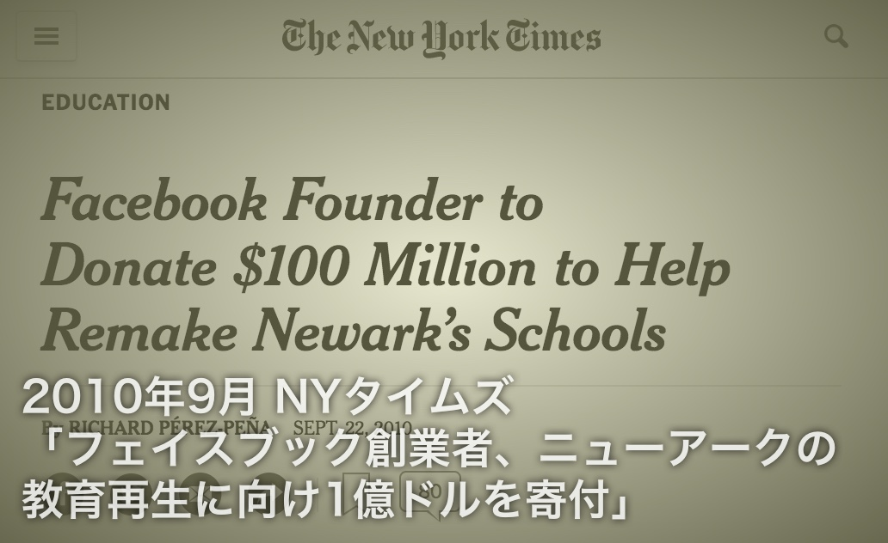

彼のヒーロー初体験は、ニューヨーク郊外にあるニューアークという市でのことだった。

<figure>
  
  <figcaption><a href="https://goo.gl/maps/j365KvLQqQL2">Google Maps</a></figcaption>
</figure>

ニューアークはニュージャージー州最大の都市でありながら、イースト・パロアルトと同じく、[以前は](http://www.pbs.org/pov/revolution67/background/)「赤の地域」だった。現在も、ニューアークは全米を代表するゲットーとして悪名高い。教育レベルも低く、貧困の連鎖が次々と起きていた。(ニューアークの貧困については、<a href="#chapter-3">第三章</a>で詳しく述べる。)

<figure>
  
  <figcaption>ニューアークの路地裏。 By Paul Sableman [<a href="http://creativecommons.org/licenses/by/2.0">CC BY 2.0</a>], <a href="https://flic.kr/p/mNcBWr">via Flickr</a></figcaption>
</figure>

そのニューアークの公立学校向けに、ザッカーバーグは2010年、1億ドルもの寄付を約束した。フェイスブックの上場よりも一年半はやく、弱冠26歳のザッカーバーグは個人での巨額寄付に踏み切ったのだ。

<figure>
  
  <figcaption><a href="http://www.nytimes.com/2010/09/23/education/23newark.html">当時のNYタイムスの記事。</a></figcaption>
</figure>

では、この1億ドルでニューアークはどう変わったのか。貧困にあえぐ子どもたちは、果たして希望を抱けるようになったのだろうか。

### ザッカーバーグの黒歴史

結論から言うと、ザッカーバーグのニューアークへの寄付は大失敗に終わった。後に詳しく話すが、1億ドルはニューアークの社会問題を解決するどころか、かえって悪化させてしまったのである。

<figure>
  
  <figcaption><a href="https://www.nytimes.com/2015/08/27/business/dealbook/the-melting-of-mark-zuckerbergs-donation-to-newark-schools.html">当時のNYタイムスの記事。</a></figcaption>
</figure>

ザッカーバーグのヒーロー初体験は、彼のこれまでの輝かしい経歴において最大級の黒歴史となった。後に彼は[インタビュー](http://www.edweek.org/ew/articles/2016/03/07/zuckerberg-talks-personalized-learning-philanthropy-and-lessons.html)で、「ニューアークでやったことは繰り返さないようにする」とも答えている。

いったい、ニューアークでどんな失敗が起きたのか。日本でよくある「政府のバラマキの失敗」のように、自治体が「いきなりお金をくれても、どう使えばいいか分からない」となり、結果的に無駄遣いに走ってしまったのだろうか。それとも、何か別のことが起きたのか。

今回の記事では、このニューアークでの出来事を深掘りしていく。
